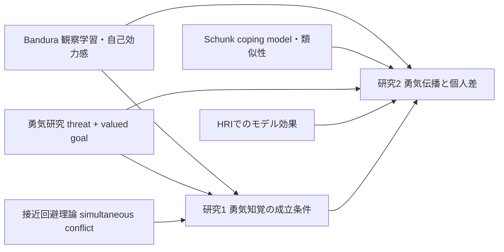

# ロボットの葛藤表現と勇気研究の序論設計

## Executive summary

本報告の結論は明確である。あなたの序論は、**観察学習は他者観察を通じて自己効力感と行動選択を変える**というBanduraの系譜、**困難や迷いを見せるcoping modelが特定条件で有効になる**というSchunkの系譜、**勇気は脅威や恐怖の不在ではなく、脅威下で価値ある行為へ向かう過程として定義される**という勇気研究、そして**ロボットも社会的モデルとして人の行動や規範に影響しうる**というHRI研究を接続して組み立てるのが最も強い。そうすると、本研究の新規性は「ロボットが見せる接近‐回避葛藤が、まず勇気として知覚される条件は何か、ついで観察者の勇気にどう伝播するか」を、**研究1＝勇気知覚の成立条件**、**研究2＝勇気伝播の機序と個人差**として分割して検証した点に置ける。 citeturn4search0turn18view0turn19view0turn19view3turn21view4turn23search5turn15view2turn20view0turn20view1turn15view3

また、ユーザー提示の研究アウトラインでは、研究1で「行動内容を固定したまま葛藤可視化の形式」を比較し、研究2で「事前勇気群×葛藤×行動」を要因化しているため、序論では**刺激選定の妥当性**と**群分けの理論的必然性**を先に説明しておく必要がある。以下では、そのための背景、限界、位置づけ、そして実験2の防御論理を簡潔に整理する。 fileciteturn0file0

## 背景に置くべき理論基盤

Bandura（1977, 1994）の社会的学習／社会的認知理論では、他者観察は単なる模倣ではなく、**代理経験**を通じて自己効力感を変える。とくに、モデルが自分に似ていると知覚されるほど、その成功や失敗は説得力を持ち、自己効力感に強く働く。さらに、自己効力感は「課題に近づくか避けるか」「どれだけ努力し持続するか」を左右するため、観察学習は挑戦行動そのものに直結する。 citeturn18view0turn26search1turn4search0

Schunkらはこの理論を、達成場面のモデル研究に具体化した。Schunk & Hanson（1985）は、同年代・同性のpeer modelの観察がteacher modelよりも高い自己効力感と成績を導くことを示した。他方で、coping modelの優位性は常に一様ではなく、1985年研究では差がなく、**先行成功経験が乏しいより困難な課題**を用いたSchunk, Hanson, & Cox（1987）では、coping modelがmastery modelより高い自己効力感・技能・訓練成績を導いた。さらにSchunk & Hanson（1989）は、観察者が**自分をcoping modelにより近い能力水準だと知覚する**ことを示している。これは、モデル効果が「完璧さ」そのものよりも**知覚された類似性**に依存することを示す。 citeturn19view0turn19view3turn19view2turn31search2turn30search2

勇気研究では、Rateら（2007）が「何を勇気と呼ぶか」は観察者の暗黙理論に依存すると示し、Woodard & Pury（2007）は勇気を**脅威に対して重要な目標のために行為へ向かうこと**として整理した。Norton & Weiss（2009）はこれを「**fearの経験にもかかわらず行動に接近すること**」として操作化し、下司ら（2023）はその日本語版CM-Jの一因子構造と妥当性を支持した。一方でHoward & Alipour（2014）、Howard & Murry（2020）は、CM系尺度は広義の美徳としての勇気というより、**persistence despite fear**を強く測っている可能性を指摘している。したがって、無指定の使用尺度がCM/CM-J系であるなら、個人差指標は「勇気そのもの」よりも**恐怖下での持続傾向**として慎重に位置づけるのが厳密である。 citeturn21view1turn21view4turn23search5turn15view1turn15view8turn22view0turn22view1

接近‐回避理論では、葛藤は**望ましい結果と望ましくない結果が同時に結びつく状態**、あるいは接近動機と回避動機が**同時に立ち上がる状態**として定義される。したがって、あなたが「葛藤」を可視化するなら、理論上もっとも忠実なのは、両動機の**同時共存**を表す表示である。加えてHRI研究では、社会的ロボットは教育場面でtutorやpeer learnerとして認知的・感情的成果を高めうると総説され、強く向社会的なロボットは子どもの共有行動と規範知覚を高め、成人も対話的なロボットの行動を模倣しうる。近年は、ロボットのモデリング効果が**social presence**や**identification**を介して生じることも示されている。つまり、「人間以外の他者」でも観察学習の担い手になりうる、という前提はすでにある。 citeturn15view7turn28view2turn28view1turn15view3turn15view2turn20view0turn20view1

## 先行研究の課題

第一に、Bandura–Schunk系の研究は主として**自己効力感・学習成績・達成行動**を扱っており、「その行為が観察者に**勇気あるものとして知覚される条件**」は十分に問われていない。だが、あなたの研究では、観察者がまずロボットのふるまいを「勇気」と読まなければ、勇気の伝播は理論上成立しない。ここが研究1の必要性である。 citeturn18view0turn19view0turn21view1

第二に、勇気研究は概念整理と尺度研究を進めてきたが、**観察対象の内的葛藤をどのように可視化すれば勇気知覚が立ち上がるか**という刺激設計の問題を、実験的にほとんど扱っていない。しかも尺度概念自体に議論がある以上、観察者の「このロボットは勇気がある」という判断を、独立に確かめる工程が必要である。 citeturn21view4turn23search5turn22view0turn22view1

第三に、HRIはロボットの模範行動が人間の学習・向社会行動・模倣に及ぶ影響を示してきたが、**ロボットが見せる接近‐回避葛藤そのもの**が観察者の勇気を変えるかは、ほぼ未検討である。さらに、HRIのモデル効果研究は平均効果を報告することが多く、BanduraやSchunkが重視した**モデル類似性と個人差による異質性**は、勇気文脈では十分に統合されていない。 citeturn15view2turn20view0turn20view1turn15view3turn18view0turn19view3

## 本研究の位置づけ

本研究の位置づけは、**勇気知覚の成立条件を先に確定してから、勇気伝播を検証する**という二段階設計にある。研究1は、固定した行動内容に対して内的状態の表示だけを変え、何が「勇気らしさ」を生むかを調べる。これは、勇気が行為の物理的結果だけでなく、観察者が読み取る**脅威・葛藤・価値ある接近**の構造に依存するというRateやWoodard系の議論と整合する。 citeturn21view1turn21view4turn24search2turn0file0

研究1で同時提示を採用する理屈は、「より勇気得点が高かったから」ではなく、**葛藤操作として最も構成概念妥当性が高いから**である。接近‐回避葛藤は定義上、接近と回避が同時に立ち上がる状態であり、逐次提示は“迷いの推移”を示せても、“共存”を弱めうる。したがって、研究2で独立変数として「葛藤の有無」を明確に操作するには、同時提示を選ぶのが理論的に自然であり、あなたの研究1でも同時提示が葛藤知覚をより強く成立させている。 citeturn28view2turn28view1turn0file0

研究2で葛藤と行動を切り分けるのも妥当である。Woodard & Pury（2007）の定義では勇気は**脅威**と**価値ある目標への行為**から成り、Norton & Weiss（2009）やRachman（1984）では「fearがあっても接近すること」が中核に置かれる。ゆえに、葛藤は脅威・回避側、行動は接近・遂行側に対応する。両者を束ねたままでは、観察者が勇気づけられたのが**内的葛藤への共感**によるのか、**行動遂行のモデリング**によるのか、それとも両方かを識別できない。Pury & Starkey（2010）のいう「courage as process」の観点からも、この分解は理論的に筋が通っている。 citeturn21view4turn23search5turn24search2turn29search7turn14search6turn0file0

したがって、本研究の新規性は、**勇気研究の概念枠組みをHRIの刺激設計へ落とし込み、ロボットの葛藤表現が勇気知覚を経て観察者行動へどう波及するかを、個人差込みで分解検証した点**にある、と整理できる。 citeturn21view1turn21view4turn15view2turn20view1turn0file0

## 実験2の群分けの正当化

実験2で事前勇気スコアにより群分けした理屈は強く防御できる。Banduraによれば、自己効力感が低い人ほど困難課題を**脅威として回避**しやすく、逆に似た他者の努力による成功は効力感を上げやすい。Schunk系研究でも、困難を経験している観察者では、初期の誤りや不安を示すcoping modelの方が有効になり、観察者は自分をそのモデルにより近いと知覚する。だから、観察者の事前勇気水準を無視して平均効果だけを見ると、理論上もっとも重要な**類似性依存の異質効果**を相殺してしまう。群分けは事後的な思いつきではなく、**モデル効果が観察者特性で変わる**というBandura–Schunk系理論の検証である。 citeturn18view0turn19view3turn19view2turn30search2

口頭試問や査読での説明文としては、次の形が使いやすい。**「本研究で事前勇気による群分けを行ったのは、ロボットの葛藤表現の効果が観察者に一様に生じると考えなかったためである。社会的学習理論では、代理経験の効果はモデルとの知覚的類似性に依存し、coping model研究では、困難や迷いを示すモデルは、同様の困難を抱える観察者にとってとくに有効になりうる。したがって、事前勇気の低い観察者ほど、葛藤するロボットを『自分に近いモデル』として受け取り、勇気づけが生じやすいという仮説は理論的に妥当である。ゆえに群分けは探索的ではなく、理論駆動のモデレータ設定である。」** なお、使用尺度がCM/CM-J系なら、その個人差は厳密には「勇気一般」よりも「fear下での持続傾向」を多く含む可能性があるが、脅威場面でのモデル効果の個人差を捉える指標としては十分に意味がある。尺度名は無指定。 citeturn18view0turn19view3turn22view1turn15view1turn15view8

## 文献引用候補

| 用途 | 原典 | 識別子 |
|---|---|---|
| 観察学習・自己効力感 | Bandura, A. (1977). *Self-efficacy: Toward a unifying theory of behavioral change* | 10.1037/0033-295X.84.2.191 |
| モデル類似性・代理経験 | Bandura, A. (1994). *Self-efficacy* | 無指定 |
| peer model効果 | Schunk, D. H., & Hanson, A. R. (1985) | 10.1037/0022-0663.77.3.313 |
| coping model優位 | Schunk, D. H., Hanson, A. R., & Cox, P. D. (1987) | 10.1037/0022-0663.79.1.54 |
| 類似性知覚 | Schunk, D. H., & Hanson, A. R. (1989) | 10.1037/0022-0663.81.3.431 |
| 勇気の定義と尺度 | Woodard, C. R., & Pury, C. L. S. (2007) | 10.1037/1065-9293.59.2.135 |
| 観察者の勇気判断 | Rate, C. R., Clarke, J. A., Lindsay, D. R., & Sternberg, R. J. (2007) | 10.1080/17439760701228755 |
| fear下での接近 | Norton, P. J., & Weiss, B. J. (2009) | 10.1016/j.janxdis.2008.07.002 |
| 日本語尺度 | 下司忠大・吉野伸哉・小塩真司 (2023) | 10.4992/jjpsy.94.21234 |
| 接近‐回避動機 | Elliot, A. J., & Covington, M. V. (2001) | 10.1023/A:1009009018235 |
| HRI総説 | Belpaeme, T. et al. (2018) | 10.1126/scirobotics.aat5954 |
| ロボットの向社会的モデル効果 | Peter, J., Kühne, R., & Barco, A. (2021) | 10.1016/j.chb.2021.106712 |
| ロボット模倣 | Zanatto, D. et al. (2020) | 10.1145/3319502.3374776 |
| ロボットをrole modelとして扱う条件 | Xu, K. (2023) | 10.1016/j.tele.2023.101950 |

表の書誌情報とDOIは各原典メタデータ、抄録、出版社ページに基づいて整理した。Bandura（1994）は章文献のため識別子は無指定である。 citeturn26search4turn30search2turn31search2turn21view4turn14search5turn23search5turn15view8turn15view7turn9search17turn15view2turn20view0turn20view1