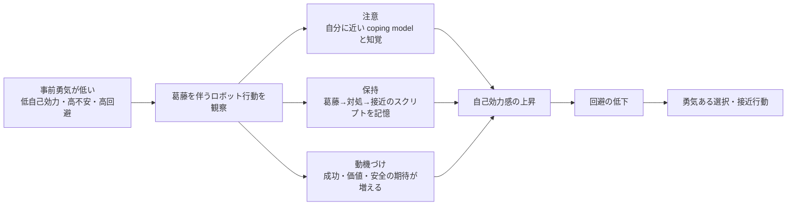

# 低勇気群における葛藤を伴うロボット観察効果の先行研究レビュー

## エグゼクティブサマリ

結論を先に言うと、仮説そのものを**直接**検証した研究は今回確認した範囲では見当たらないが、仮説を支える理論的・実証的な根拠の鎖はかなり明瞭に存在する。核になるのは、entity["people","Albert Bandura","psychologist"]の自己効力感理論と観察学習論、entity["people","Dale H. Schunk","educational psychologist"]の coping model 研究、そしてentity["people","Stanley Rachman","clinical psychologist"]およびentity["people","Peter J. Norton","clinical psychologist"]による勇気研究である。これらを接続すると、**もともと勇気が低い観察者ほど、困難や葛藤を示しつつ最終的に接近行動を達成するモデルから「自分にもできる」という手掛かりを得やすい**、という推論が最も自然になる。citeturn4view2turn7view2turn11view0turn41view0turn20view0turn19view0

さらに、モデルが人間でなくても、人工エージェント・アバター・ロボットが**社会的モデル**として機能しうることを示す研究がある。可視的で、類似性があり、役割づけが明瞭で、結果が見える人工エージェントほど、自己効力感・態度・行動意図・実行行動に影響しやすい。ロボットのふるまいが、その後の人間のふるまいへ伝播したことを示す研究まで出ているため、少なくとも「ロボットがモデルになれるか」という点には十分な先行根拠がある。citeturn44view0turn48view0turn29view0turn43view0

したがって本研究の新規性は、「モデルが他者一般に影響する」こと自体ではない。新規性は、**勇気という接近行動の変数**を扱い、**人間ではなくロボットをモデルに置き**、しかも**葛藤を伴う coping 型のロボットモデル**が、**低勇気群で選択的に強く効くか**を検証する点にある。少なくとも今回整理した文献群の中では、この三者を交差させた実証研究は未成熟であり、そこに明確な研究空白がある。

## 理論的根拠

本仮説の中核は、恐怖や不安による回避圧と、価値ある目標への接近圧が同時に走る **approach-avoidance conflict** を、観察された coping model が再編成するという点にある。Bandura によれば、他者観察は注意・保持・再生・動機づけの過程を通じて行動に作用し、とくに**自分に似た他者**の成功は自己効力感を上げる。Schunk の一連の研究では、最初から完璧な mastery model よりも、困難や否定的感情を示しつつ対処していく coping / coping-emotive model の方が、困難を抱える観察者の自己効力感を高めやすいことが示されている。Rachman と Norton は、勇気を「恐怖がないこと」ではなく「恐怖下での接近行動」と捉える。Lucas らの研究を合わせると、主観的に難しい状況では低自己効力の個体ほど他者の影響を受けやすくなる。ゆえに、**低勇気群＝低い coping efficacy・高い主観的困難・高い回避傾向を持つ群**ほど、葛藤を見せるロボットを「自分でも達成可能なモデル」として利用しやすい、というメカニズムが導ける。citeturn4view2turn7view2turn11view0turn41view0turn20view0turn19view0

以下の図は、この推論を文献ベースで最小限に図式化したもの。

## 候補文献一覧

### 社会的学習理論と個人差

| 引用情報 | 要旨の日本語要約 | 該当箇所の抜粋引用 | なぜ仮説を支持するか | 研究の限界や反証的知見 |
|---|---|---|---|---|
| Bandura, A. (1977). *Self-Efficacy: Toward a Unifying Theory of Behavioral Change*. *Psychological Review, 84*(2), 191–215. DOI: 10.1037/0033-295X.84.2.191. citeturn4view2turn14search16 | 自己効力感を行動変容の中心変数と位置づけ、成功経験・代理経験・言語的説得・生理的状態の四情報源を整理。とくに、自己能力が不確かな場面では、類似他者の成功観察が「自分にもできる」という期待を形成し、努力・持続・情動反応を変えると論じる。 | “Seeing or visualizing people similar to oneself perform successfully...” 「自分に似た他者が成功するのを見ることは…」(p. 197, 拙訳) | 低勇気群は低い coping efficacy を持つ可能性が高く、類似ロボットの成功観察が効きやすい | 勇気そのものは扱わず、モデルは主に人間想定 |
| Bandura, A. (1977). *Social Learning Theory*. Englewood Cliffs, NJ: Prentice Hall. DOIなし. citeturn7view2turn7view3 | 観察学習を、注意・保持・運動再生・動機づけの四過程で説明。何を見て覚え、実行に移すかは、モデルの結果や価値づけに強く依存するとする。観察された結果が価値あるものだと、注意と保持が高まり、行動化されやすくなる。 | “A person cannot learn much by observation if he does not attend...” 「注意しなければ観察から多くを学べない」(p. 6, 拙訳) | ロボットが葛藤と成功を可視化すると、低勇気群の注意と動機づけを引き上げうる | 一般理論であり、勇気・ロボットの直接検証ではない |
| Schunk, D. H., & Hanson, A. R. (1985). *Peer Models: Influence on Children's Self-Efficacy and Achievement*. *Journal of Educational Psychology, 77*(3), 313–322. DOI: 10.1037/0022-0663.77.3.313. citeturn9view0turn8search6 | 算数に困難を抱える子どもが、教師モデルよりも同年代同性の peer model を観察した方が、学習自己効力感・事後自己効力感・成績が高まった。類似性のあるモデルが「自分にもできる」という判断を促すことを示す基礎研究。 | “Observing a peer model led to higher self-efficacy...” 「仲間モデルの観察は、より高い自己効力感をもたらした」(Abstract, 拙訳) | 低勇気群には、専門家型より“自分に近い”モデルの方が効く可能性を示す | この研究では mastery と coping に有意差なし |
| Schunk, D. H., Hanson, A. R., & Cox, P. D. (1987). *Peer-Model Attributes and Children's Achievement Behaviors*. *Journal of Educational Psychology, 79*(1), 54–61. DOI: 10.1037/0022-0663.79.1.54. citeturn11view0 | 数学困難児を対象に、早く習得する mastery model と、徐々に習得する coping model を比較。coping model の方が自己効力感・技能・訓練成績を高め、観察者は coping model を mastery model より「能力面で自分に近い」と判断した。 | “Observing a coping model led to higher self-efficacy...” 「対処モデルの観察は、より高い自己効力感をもたらした」(Abstract, 拙訳) | 葛藤を見せるロボットは coping model に相当し、低勇気群で特に効く理屈に直結 | 課題は算数であり、恐怖や勇気の文脈ではない |
| Schunk, D. H., & Hanson, A. R. (1989). *Influence of Peer-Model Attributes on Children's Beliefs and Learning*. *Journal of Educational Psychology, 81*(3), 431–434. DOI: 未確認. citeturn11view0 | mastery, coping-alone, coping-emotive を比較した研究。最初に困難や否定的感情を示し、その後に対処して成功する coping-emotive model がもっとも高い学習自己効力感を生んだ。モデルの不完全さが、観察者の自己関連づけを強めたと読める。 | “Coping-emotive models led to the highest self-efficacy for learning.” 「感情を伴う対処モデルが最も高い自己効力感をもたらした」(Abstract, 拙訳) | 「葛藤を伴う」ロボット表現が有利という発想を最も直接に後押しする | 子どもの学習課題であり、成人HRIへの一般化は未検証 |
| Lucas, T., Alexander, S., Firestone, I. J., & Baltes, B. B. (2006). *Self-efficacy and independence from social influence: Discovery of an efficacy–difficulty effect*. *Social Influence, 1*(1), 58–80. DOI: 10.1080/15534510500291662. citeturn41view0 | 難しい課題になるほど他者影響への従属が増えるが、高自己効力感者はその影響から相対的に独立を保った。低自己効力感者は高難度条件でより他者の誤情報に従いやすく、主観的困難度がその媒介となった。 | “high self-efficacy participants remaining more independent than low self-efficacy...” 「高自己効力感者は低自己効力感者より独立を保った」(Abstract, 拙訳) | 低勇気群ほど、困難局面でモデルの影響を強く受けるという群差仮説の核心を支える | 観察学習というより同調研究で、勇気行動を直接扱わない |

### 勇気と接近回避

| 引用情報 | 要旨の日本語要約 | 該当箇所の抜粋引用 | なぜ仮説を支持するか | 研究の限界や反証的知見 |
|---|---|---|---|---|
| Rachman, S. (1984). *Fear and Courage*. *Behavior Therapy, 15*(1), 109–120. DOI: 10.1016/S0005-7894(84)80045-3. citeturn20view0 | 臨床実践の観察から、勇気は恐怖の欠如ではなく、恐怖を抱えたまま実行される行為として捉えるべきだと論じる。fearlessness と courage を区別し、勇気研究の出発点を「行為」へ置き直した古典的整理。 | “patients who are adversely affected by excessive fear are required to perform courageously” 「強い恐怖の影響下にある患者でさえ、勇敢に行為することがある」(Abstract, 拙訳) | 低勇気群でも、恐怖が残ったまま接近できれば「効果あり」と定義できる | 理論的論文であり、モデル観察やロボットは扱わない |
| Pury, C. L. S., Kowalski, R. M., & Spearman, J. (2007). *Distinctions between General and Personal Courage*. *The Journal of Positive Psychology, 2*(2), 99–114. DOI: 10.1080/17439760701237962. citeturn23view0 | 勇気を一般的英雄性ではなく、当人の困難・制約・恐怖に照らして評価すべきだと示した研究。personal courage は fear・struggle・personal limitations と結びつき、観察者一般にすごく見えるかより、当人にとってどれほど困難かが重要とされる。 | “Actions high in personal courage... involve acting despite fear, struggle, and personal limitations.” 「個人的勇気は、恐怖・葛藤・個人的制約にもかかわらず行為すること」(p. 31, 拙訳) | 低勇気群の変化は“大きな英雄行為”でなくても、本人基準の接近増加として捉えられる | 観察学習研究ではなく、主に概念整理と回顧的評定 |
| Norton, P. J., & Weiss, B. J. (2009). *The Role of Courage on Behavioral Approach in a Fear-Eliciting Situation: A Proof-of-Concept Pilot Study*. *Journal of Anxiety Disorders, 23*(2), 212–217. DOI: 10.1016/j.janxdis.2008.07.002. citeturn19view0 | 蜘蛛恐怖のある参加者に行動接近課題を行い、恐怖水準を統制しても courage scores が接近距離を予測した。勇気は単なる恐怖の低さではなく、恐怖下での行動接近を支える独立変数として働く可能性を示した。 | “courage scores were significantly associated with approach distance” 「勇気得点は接近距離と有意に関連した」(Abstract, 拙訳) | ロボット観察が効くなら、恐怖が残っていても行動接近で検出できることを示す | pilot study で標本が小さい。介入研究ではない |

### 人工エージェント・アバター・HRI

| 引用情報 | 要旨の日本語要約 | 該当箇所の抜粋引用 | なぜ仮説を支持するか | 研究の限界や反証的知見 |
|---|---|---|---|---|
| Rosenberg-Kima, R. B., Baylor, A. L., Plant, E. A., & Doerr, C. E. (2008). *Interface Agents as Social Models for Female Students: The Effects of Agent Visual Presence and Appearance on Female Students' Attitudes and Beliefs*. *Computers in Human Behavior, 24*(6), 2741–2756. DOI: 10.1016/j.chb.2008.03.017. citeturn44view0 | 若い女性の工学に対する態度と自己効力感に対し、視覚的に存在し、参加者に似たインタフェースエージェントが影響しうることを示した。人間社会モデル研究の知見が人工エージェントにも拡張できることを示す代表例。 | “visible agents reported significantly greater... self-efficacy...” 「可視エージェントは、より高い自己効力感をもたらした」(Abstract, 拙訳) | 人工エージェントでも social model になれる。類似性設計が鍵という点が低勇気群仮説に合う | STEM 態度文脈で、恐怖下の勇気行動ではない |
| Fox, J., & Bailenson, J. N. (2009). *Virtual Self-Modeling: The Effects of Vicarious Reinforcement and Identification on Exercise Behaviors*. *Media Psychology, 12*, 1–25. DOI: 10.1080/15213260802669474. citeturn48view0turn42search1 | 自分に似たアバターが運動し、報酬や罰の結果を示すと、参加者のその後の運動行動が増えた。単なる態度変化ではなく、人工的な自己／他者モデルの観察がオフライン行動まで変えうることを示す重要研究。 | “participants exercised significantly more when they viewed the VRS” 「自己表象アバターを見た参加者は有意に多く運動した」(site summary, 拙訳) | 観察された人工モデルが実行行動を変えるという点で、ロボット勇気伝播の実現可能性を支える | self-avatar 中心で、他者ロボットの葛藤観察とは異なる |
| Xu, K. (2023). *A Mini Imitation Game: How Individuals Model Social Robots via Behavioral Outcomes and Social Roles*. *Telematics and Informatics, 78*, 101950. DOI: 未確認. citeturn29view0 | social cognitive theory を HRI に適用し、ロボットが示す行動結果、social presence、identification、専門性、役割づけが、人間の modeling behavior を媒介すると示した。ロボットを human role model のように扱う条件を明確化した点が重要。 | “users do transfer interpersonal learning scripts to HRI and treat social robots as if they were human role models.” 「人は対人学習スクリプトをHRIへ移し、ロボットを人間の役割モデルのように扱う」(p. 10, 拙訳) | ロボット観察から人の模倣傾向が生じることを明示。役割・同一化設計が効く | 勇気や恐怖課題ではなく、一般的 modeling tendency の研究 |
| Higashino, K., Kimoto, M., Iio, T., Shimohara, K., & Shiomi, M. (2023). *Is Politeness Better than Impoliteness? Comparisons of Robot's Encouragement Effects Toward Performance, Moods, and Propagation*. *International Journal of Social Robotics, 15*, 717–729. DOI: 10.1007/s12369-023-00971-9. citeturn43view0 | 単調課題でのロボット励ましの効果を検証し、ロボットの丁寧／失礼な励まし方が、その後の参加者自身の励まし方へ伝播した。ロボットの社会的行動スタイルが、人間から人間への行動選択へ持ち越されることを示した直接的研究。 | “the robot's encouragement styles significantly influenced the participants' encouragement styles” 「ロボットの励まし方は参加者の励まし方に有意に影響した」(Abstract, 拙訳) | ロボット行動が観察者の後続行動へ伝播するという、最も直接的な HRI 証拠の一つ | 伝播したのは励ましスタイルで、勇気ある接近行動ではない |

## 総合評価

この仮説を最も強く支えるのは、Schunk の coping model 研究と Lucas らの個人差研究の接続にある。要するに、**困難を感じている観察者ほど、最初から完璧なモデルよりも、困難を抱えつつ対処していくモデルに自己を重ねやすい**。そして、課題が難しく感じられるほど、低自己効力の個体は他者影響を強く受けやすい。これを勇気文脈へ翻訳すると、**事前勇気が低い観察者ほど、葛藤を伴うロボットモデルから「自分でもできる」という自己効力情報を得やすい**という予測になる。citeturn11view0turn41view0turn4view2

次に重要なのは、勇気をどう定義するかである。Rachman と Norton の系譜では、勇気は fearlessness ではなく、**恐怖下での behavioral approach** と捉えられる。したがって、観察後に恐怖や不安がゼロにならなくても、回避が減り、接近や挑戦行動が増えれば、理論上は「勇気が高まった」と言いうる。これは、ロボット観察の効果を自己報告だけでなく、接近距離・選択・着手率・躊躇時間などの行動指標でとらえる設計と整合的である。citeturn20view0turn19view0

人工エージェント側の文献は、この仮説の実装可能性を補強する。Rosenberg-Kima は**類似性と可視的存在**、Fox と Bailenson は**自己同一化と代理強化**、Xu は**social presence・identification・役割づけ**、Higashino は**行動スタイルの伝播**を示した。つまり、ロボットは単なる刺激提示装置ではなく、適切に設計すれば「行動を見せる他者」として機能しうる。ここで重要なのは、ロボットを**完璧で超人的な mastery model** にするより、むしろ**わずかなためらい、負荷、自己調整、価値志向を見せる coping model** に寄せる方が、低勇気群における自己関連づけを強められる可能性が高い点である。citeturn44view0turn48view0turn29view0turn43view0turn11view0

一方で慎重に言うべき点もある。Schunk & Hanson (1985) では mastery と coping に差が出ておらず、coping model 優位は常に生じるわけではない。また、HRI 文献の多くは STEM 態度、運動、励まし、協働といった比較的低脅威の課題であり、恐怖や危険を伴う勇気行動へそのまま一般化はできない。したがって、あなたの仮説は**十分に文献整合的だが、現時点では「強い理論仮説」であって、既に直接実証された既知効果ではない**と位置づけるのが最も正確になる。citeturn9view0turn44view0turn48view0turn43view0

## 本研究への含意

先行研究を踏まえると、本研究の学術的新規性は三点に整理できる。第一に、社会的学習理論と自己効力感理論は豊富でも、従属変数を**勇気**に置いた研究は多くない。第二に、人工エージェント研究は態度・学習・運動で蓄積があるが、**葛藤を伴うロボットモデルが観察者の勇気行動を変えるか**は空白に近い。第三に、観察学習の個人差研究はあるものの、その軸を**事前勇気の高低**で切り、**低勇気群で選択的に効果が強まる交互作用**を検証する試みは未成熟である。したがって本研究は、Bandura 系の観察学習、courage 研究、HRI を橋渡しする位置にある。citeturn4view2turn11view0turn41view0turn19view0turn44view0turn29view0turn43view0

また、事前勇気の群分けに使う尺度としては、Norton & Weiss の Courage Measure が原型であり、日本語版 CM-J も作成されている。理論的一貫性を重視するなら、事前勇気を trait 指標として測った上で、観察後には state 的な勇気自己報告と行動接近指標の両方を置く構成が最も自然である。ここでロボット条件を「葛藤あり coping 型」と「葛藤なし mastery 型」に分ければ、Schunk 系研究との対応がはっきりし、序論でも新規性を明確化しやすい。citeturn19view0turn16search8turn11view0

以上を要約すると、序論で最も強く打ち出せる主張は次の形になる。**勇気は恐怖の欠如ではなく恐怖下の接近行動であり、その行動は自己効力感と観察学習によって変化しうる。しかも、困難を感じている観察者ほど、葛藤を伴う coping model から強い影響を受けやすい。人工エージェントやロボットも社会的モデルとして機能しうる以上、事前勇気の低い観察者に対して、葛藤を伴うロボット行動観察が勇気と行動変容をより強く促すという仮説には、十分な理論的妥当性がある。** citeturn4view2turn7view2turn11view0turn41view0turn20view0turn19view0turn44view0turn48view0turn29view0turn43view0