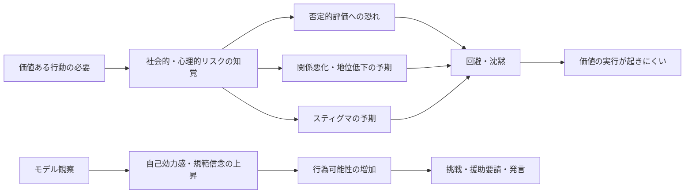

# 個人的勇気と観察学習に関する文献調査

## エグゼクティブサマリー

導入段落に最も使いやすい核は、**個人的勇気は「本人にとって強い恐れや限界がある状況でも、価値ある目標に向けて行為すること」を可能にする**、という点です。Puryらは、個人的勇気を「その人の通常行動や個人的制約に照らして勇気的であること」と捉え、**個人的勇気の高い行為ほど恐怖と困難を伴う**ことを示しました。さらにPury & Kowalskiは、勇気が**希望・親切・粘り強さといった他の価値を逆境下で実行に移す“鍵の徳”**として働くと論じます。Detert & Bruno の職場勇気レビューも、勇気を**「重要な価値・大義のために、本人が知覚する重大なリスクにもかかわらず行動すること」**として整理しています。 fileciteturn0file2 fileciteturn0file1 citeturn30search0turn30search2

他方で、人は価値ある行動へ常に向かえるわけではありません。職場では、上司への問題提起や異論表明はしばしば沈黙に置き換えられ、援助要請でも**公的スティグマや自己スティグマが相談意図を下げる**ことが示されています。これらを説明する主因は、**否定的評価への恐れ、地位・関係の悪化、スティグマ予期、自己像の損失回避**です。 citeturn25search1turn12search0 fileciteturn0file0

観察学習の接続点としては、Banduraの理論以降一貫して、**他者モデルの成功は「自分にもできる」という自己効力感や行為可能性信念を高める**とされます。運動学習では、同年齢モデルや自己モデルの観察が技能遂行を改善し、教育場面では同輩モデルが自己効力感・学業行動を押し上げます。ロボット活用の文脈では、**人やロボットの行為モデルを見せることで、観察者の「やってみることは可能だ」という感覚や規範信念を高めうる**、という理論的・初期実証的含意があります。 citeturn29search0turn30search0turn31academia0turn28academia1

## 選定基準

今回の選定では、導入文にそのまま使いやすいことを重視し、**定義の明瞭さ、価値ある行動との接続、恐れやリスクの明示、観察学習への橋渡しのしやすさ**を優先しました。特に、一次論文または著名な学術書、アクセス可能な受理稿、近年のレビューを優先し、日本語文献は探索したものの、**「personal courage」を正面から扱う一次研究は英語圏文献が中心**でした。 fileciteturn0file2 fileciteturn0file1

また、ソース比較では、**刊行年、実証/理論の別、対象集団、場面の生態学的妥当性、DOI/書誌情報の回収可能性**を見ました。観察学習については、スポーツ・動作系と、自己効力感・持続性・GRITに近いマインド系に分け、**理論の古典と、最近の応用研究の両方**を残しています。 citeturn26search0turn33search0turn31academia1

## 個人的勇気の意義を支える文献

### 主要文献の比較

| citation | type | sample | main finding | relevance to my points |
|---|---|---:|---|---|
| Pury, Kowalski, & Spearman, 2007, *Journal of Positive Psychology*, 2, 99–114. DOI: 10.1080/17439760701237962 fileciteturn0file2 | 実証 | 大学生250名 | 個人的勇気は「その人の通常行動や個人的限界に照らした勇気」で、**高い個人的勇気は高い恐怖・困難と結びつく**。 | 「恐れがあっても価値ある行動へ向かう」の定義づけに最重要。 |
| Pury & Kowalski, 2007, *Journal of Positive Psychology*, 2, 120–128. DOI: 10.1080/17439760701228813 fileciteturn0file1 | 実証＋理論 | 大学生298名 | 勇気的行為は**希望・親切・粘り強さ**を伴い、勇気は他の価値を逆境下で実行に移す**鍵の徳**として働く。 | 「個人的勇気の何がよいのか」を、希望や親切の実行という形で書ける。 |
| Detert & Bruno, 2017, *Academy of Management Annals*, 11(2), 593–639. DOI: 10.5465/annals.2015.0155 fileciteturn0file0 | レビュー | 職場勇気研究の統合 | 勇気は**worthy cause のために significant risk にもかかわらず行動すること**で、心理的・社会的リスクも含む。 | 発言、告白、援助要請、異議申し立て等を広く「勇気」へ接続できる。 |
| Putman, 1997, *Philosophy, Psychiatry, & Psychology*, 4(1), 1–11. DOI: 要原典確認 fileciteturn0file1 | 理論 | 概念論 | 心理的勇気は、破壊的習慣・不安・自己認識の困難に向き合い、よりよい自己へ向かう勇気。 | 個人的勇気を身体的英雄行為に限定しない補強線。 |
| Peterson & Seligman, 2004, *Character Strengths and Virtues*. OUP. ISBN: 9780195167016 citeturn21search2 | 理論書 | ― | 勇気は VIA の中核徳の一つで、**bravery, persistence, honesty, zest**から成る。 | 「粘り強さ」と勇気を接続しやすい。 |
| Bandura, 1977, *Psychological Review*, 84(2), 191–215. DOI: 10.1037/0033-295X.84.2.191 citeturn30search2 | 古典理論 | ― | 自己効力感の主要源の一つは**代理経験**であり、類似他者の成功観察は「自分にもできる」感覚を高める。 | 観察されたモデルが個人的勇気を後押ししうる理論的基盤。 |

### 導入に使いやすい注釈つき候補

**Pury et al. (2007)**  
日本語パラフレーズ: 「個人的勇気とは、他の人一般との比較ではなく、**その人自身の通常行動や個人的制約に照らして**どれほど勇気的かである。」（序論〜方法） fileciteturn0file2  
注釈: 個人的勇気を“英雄的行為”から切り離し、**本人にとって難しいが価値ある一歩**として定義しやすい。加えて、個人的勇気は恐怖や困難と正に関連するため、「怖さがあるからこそ勇気」という論点を支えます。 fileciteturn0file2

**Pury & Kowalski (2007)**  
日本語パラフレーズ: 「勇気は、希望や親切といった**他の強みを逆境下で行為へ変える主要な徳**として働く。」（Discussion） fileciteturn0file1  
注釈: 「個人的勇気の何が良いのか」を、**望ましい価値の実行可能化**として書けます。たとえば、怖くても助ける・正しいことを言う・新しい挑戦をする、という書き方に直結します。 fileciteturn0file1

**Detert & Bruno (2017)**  
日本語パラフレーズ: 「勇気は、行為者が知覚する重大なリスクがあっても、**価値ある大義のために行動すること**である。」（review definition） fileciteturn0file0  
注釈: 職場研究ですが、定義は汎用的で、**人前で話す、助けを求める、異議を唱える**など心理的・社会的リスク場面にも広げやすいです。 fileciteturn0file0

**Putman (1997)**  
日本語パラフレーズ: 「心理的勇気は、自己にとって痛みを伴う真実や変化に向き合うことで、より良い自己へ進む勇気である。」（概念論） fileciteturn0file1  
注釈: 「個人的勇気」を、身体的危険ではなく**自己変容・恐怖克服・援助要請**の側面から補強できます。Pury系文献と相性がよいです。 fileciteturn0file1

### この項目で引きやすい書き方

個人的勇気の意義は、単に恐怖に耐えることではなく、**恐怖や個人的制約がある状況でも、希望・親切・誠実さといった価値を行動に移せる点**にある、と整理できます。Puryらの区別では、個人的勇気は一般的に英雄的でなくとも成立し、むしろ**本人にとって「いつもの自分」を越える行為**に現れます。Pury & Kowalski はさらに、勇気が希望や親切を実行に移す“鍵の徳”だと示しており、Detert & Bruno も、重要な価値のために重大なリスクを引き受ける点を勇気の中心に置いています。 fileciteturn0file2 fileciteturn0file1 fileciteturn0file0

## 価値ある行動に向かえない場面とその理由

### 回避されやすい場面の例

価値ある行動へ向かえない場面としては、**上位者への発言・異議申し立て、助けを求めること、評価される場面での挑戦**が繰り返し報告されています。職場では、従業員はしばしば問題や懸念を上司に伝えず、**「安全な反応としての沈黙」**を選ぶと整理されています。 citeturn25search1

援助要請についても、相談行動は公的スティグマや自己スティグマの影響を受け、**「相談したいが、相談すると見下されるのではないか」という予期**が意図を弱めます。Vogelらの研究系譜は、**公的スティグマ → 自己スティグマ/態度 → 相談意図**という媒介を示した代表例です。 citeturn12search0turn5search1

Puryらの受理稿は、こうした日常的・非英雄的場面を「個人的勇気」の中心に置く点で重要です。論文中の典型例として、**学習障害のある子どもが大きなテストの日に登校すること**や、**PTSD の既往のため長年できなかったクリスマスプレゼント包装を初めて行うこと**が挙げられており、いずれも外からは小さく見えても、本人には高い恐怖と困難を伴う行為として描かれます。 fileciteturn0file2

### なぜそのような場面になるのか

Detert & Bruno の整理では、勇気が必要になるのは、行為の先に**地位・関係・評判・キャリア・帰属感**の損失可能性があるからです。とりわけ職場での voice は、権力差のある相手への挑戦になりやすく、心理的・社会的コストが高いため、沈黙が合理的に見えてしまいます。 fileciteturn0file0

### この項目で使える短い引用候補

| item | source | short annotation | useful Japanese paraphrase |
|---|---|---|---|
| 発言回避 | Milliken et al., 2003, *Journal of Management Studies* 40(6), 1453–1476. DOI: 要原典確認 citeturn25search1 | 職場で人は、問題を知っていても**上方へ伝えない**ことがある。導入では「人前での発言」「異議表明」の例として使いやすい。 | 「人は価値ある情報を持っていても、否定的に受け取られる恐れから沈黙を選ぶことがある。」 |
| 援助要請回避 | Vogel, Wade, & Hackler, 2007, *Journal of Counseling Psychology*, 54(1), 40–50. DOI: 10.1037/0022-0167.54.1.40 citeturn12search0turn5search1 | 相談行動は**スティグマ知覚**によって抑制される。助けを求めることを「勇気の必要な行動」と位置づけやすい。 | 「助けを求める行為は、公的・自己スティグマの予期によって差し控えられうる。」 |
| 個人的勇気の具体例 | Pury et al., 2007 fileciteturn0file2 | 外から小さく見える行動でも、本人の恐怖や制約を踏まえると高い個人的勇気が必要になる。 | 「個人的勇気は、学習障害児の登校や PTSD クライエントのプレゼント包装のように、本人の文脈内で理解される。」 |

## 観察学習から見たロボット活用への示唆

### 動作系

| citation | design | main result | relevance |
|---|---|---|---|
| Bandura, 1986, *Social Foundations of Thought and Action*. Prentice-Hall. ISBN: 9780138156145 citeturn26search0turn30search0 | 古典理論 | 観察学習は行動獲得の中心過程であり、**代理経験**は自己効力感の主要源である。 | ロボットや他者モデルの観察が「自分もできる」信念を高める理論的基盤。 |
| Weiss et al., “Observational Learning and the Fearful Child: Influence of Peer Models on Swimming Skill Performance and Psychological Responses,” 1998, 書誌詳細は要原典確認 citeturn29search0 | 実験的訓練研究 | 水泳恐怖をもつ子どもで、**同年齢の peer mastery / peer coping モデル**を見た群は、対照群より技能面で良好な再評価結果を示した。 | 不安が高い観察者でも、**似た他者の成功/克服過程**が行動可能性を上げることを示す。 |
| Chaisaen et al., 2020, “Decoding EEG Rhythms During Action Observation, Motor Imagery, and Execution for Standing and Sitting” citeturn27academia1 | ラボ実験 | 立ち座り動作の観察では sensorimotor ERD が現れ、AO+MI の分類精度は **82.73±2.54%**。 | 人型ロボットや映像モデルの**動作観察自体が運動表象を活性化**しうる。 |
| Nguyen et al., 2025, “Exploring EEG Responses during Observation of Actions Performed by Human Actor and Humanoid Robot” citeturn27academia0 | パイロット実験 | 少数例ながら、人とロボットの動作観察で**共通する sensorimotor 応答**が示唆された。 | ロボットモデルでも action observation を誘発しうる可能性。エビデンス強度はまだ低い。 |

### マインド系

| citation | design | main result | relevance |
|---|---|---|---|
| Bandura, 1977, *Psychological Review*, 84(2), 191–215. DOI: 10.1037/0033-295X.84.2.191 citeturn30search2 | 古典理論 | 類似他者の成功観察は自己効力感を高め、より大きな努力・持続を導く。 | 「観察されたモデル→自己効力感→行動化」という導入の橋渡しに最適。 |
| Schunk & Hanson, 1985, *Journal of Educational Psychology*, 77(3), 313–322. DOI: 10.1037/0022-0663.77.3.313 citeturn12search2 | 実験 | **peer model** が子どもの自己効力感と達成行動に影響する古典研究。 | ロボットを「少し先を行く近接モデル」と設計する示唆を与える。 |
| Dou et al., 2018, *Beyond performance metrics...* N=147 citeturn31academia0 | 縦断＋ソーシャルネットワーク | 相互作用ネットワークの **outDegree が vicarious learning experiences** と関連。 | 観察・相互作用が自己効力感の一部源泉になることを最近の教育データで補強。 |
| Dou et al., 2022, *Understanding the development of interest and self-efficacy...* N=221 citeturn31academia1 | 構造方程式モデル | **peer-to-peer interaction が self-efficacy に正の寄与**。 | モデル提示だけでなく、モデルとの関わりや社会的文脈が重要であることを示す。 |
| Credé et al. 系メタ分析の要約として参照可能な整理 citeturn33search0turn33search7 | メタ分析の二次要約 | GRIT 全体よりも、**perseverance of effort の側面**が成績・保持との関連を主に担う。 | 介入ターゲットは「情熱の一貫性」より、まず**努力の持続**を狙う方が妥当。 |

### 分析的含意

ロボットを使うなら、単に「正解動作」を見せるだけでなく、**観察者に近いモデル性**を持たせることが重要です。水泳研究の peer mastery / peer coping モデルが示唆するのは、完璧な達人より、**最初は難しがりつつもできるようになるモデル**の方が、不安の高い観察者には有効でありうるという点です。 citeturn29search0turn30search2

また、Bandura以降の自己効力感研究では、代理経験の効き目は**「自分と似ている」**と感じられるほど強くなるとされます。したがって、ロボットが個人的勇気を後押しするなら、超人的モデルより、**失敗・ためらい・再挑戦を可視化する“近接モデル”**として設計する方が、行為可能性信念を高めやすいと推測できます。これは厳密には本調査の文献からの**推論**ですが、Banduraの代理経験概念と peer model 研究の方向性には整合的です。 citeturn30search2turn12search2turn31academia0

さらに、ロボット観察に関する最近の初期研究では、**人型ロボットの動作観察でも sensorimotor 系の応答や規範信念の変化**が報告されており、少なくとも「人でなければ観察学習が働かない」とは言えません。ただし、ロボット直接証拠はまだ小規模で、**現状では理論的有望性 > 実証的確実性**です。 citeturn27academia0turn28academia1

## そのまま使える導入文と出典一覧

### 導入文候補

**個人的勇気の意義**  
- 個人的勇気とは、本人にとって恐れや大きな困難が伴う状況でも、それでも価値ある目標へ向けて行動することを可能にする性質である。Puryらは、個人的勇気をその人自身の通常行動や個人的制約に照らして理解すべきだと論じている。 fileciteturn0file2  
- 勇気は単に危険に耐えることではなく、希望や親切など他の価値を逆境下で実行へ移す“鍵の徳”として機能する。 fileciteturn0file1  
- Detert and Bruno は、勇気を「価値ある大義のために、重大なリスクにもかかわらず行動すること」と整理しており、この点は日常的な対人場面にも当てはまる。 fileciteturn0file0

**価値ある行動へ向かえない場面**  
- しかし人は、価値ある行動だと分かっていても、上位者への発言や援助要請のような場面ではしばしば沈黙や回避を選ぶ。 citeturn25search1turn12search0  
- とりわけ、他者からの否定的評価が懸念される場面では、行為の有益性よりも対人的コストが先行しやすい。 citeturn25search1turn5search1  

**なぜそのような場面になるのか**  
- その背景には、否定的評価への恐れ、関係悪化や地位低下の予期、さらにはスティグマの内面化がある。 citeturn12search0turn25search1  
- 職場勇気研究でも、挑戦的な発言には社会的・心理的リスクが伴うため、沈黙が“安全な選択”として機能しやすいことが指摘されている。 fileciteturn0file0

**観察学習との接続**  
- こうした状況で重要なのが観察学習であり、Banduraは類似他者の成功観察が自己効力感を高める主要な源泉の一つだと述べている。 citeturn30search0turn30search2  
- 実際、同輩モデルの観察は運動技能や学習場面の自己効力感に好影響をもたらしうる。 citeturn29search0turn12search2turn31academia0  
- したがって、行為モデルとしてのロボットは、観察者に「自分にもできる」という行為可能性信念を与える媒介となりうる。 citeturn27academia0turn28academia1turn30search2

### 出典一覧

| source | publication details | DOI / note |
|---|---|---|
| Pury, C. L. S., Kowalski, R. M., & Spearman, J. | 2007, *Journal of Positive Psychology*, 2, 99–114 | 10.1080/17439760701237962 |
| Pury, C. L. S., & Kowalski, R. M. | 2007, *Journal of Positive Psychology*, 2, 120–128 | 10.1080/17439760701228813 |
| Detert, J. R., & Bruno, D. R. | 2017, *Academy of Management Annals*, 11(2), 593–639 | 10.5465/annals.2015.0155 |
| Putman, D. | 1997, *Philosophy, Psychiatry, & Psychology*, 4(1), 1–11 | DOIは要原典確認 |
| Peterson, C., & Seligman, M. E. P. | 2004, *Character Strengths and Virtues*. Oxford University Press | 書籍 |
| Milliken, F. J., Morrison, E. W., & Hewlin, P. F. | 2003, *Journal of Management Studies*, 40(6), 1453–1476 | DOIは要原典確認 |
| Vogel, D. L., Wade, N. G., & Hackler, A. H. | 2007, *Journal of Counseling Psychology*, 54(1), 40–50 | 10.1037/0022-0167.54.1.40 |
| Shaffer, P. A., Vogel, D. L., & Wei, M. | 2006, *Journal of Counseling Psychology*, 53(4), 435–446 | 10.1037/0022-0167.53.4.435 |
| Bandura, A. | 1977, *Psychological Review*, 84(2), 191–215 | 10.1037/0033-295X.84.2.191 |
| Bandura, A. | 1986, *Social Foundations of Thought and Action*. Prentice-Hall | 書籍 |
| Schunk, D. H., & Hanson, A. R. | 1985, *Journal of Educational Psychology*, 77(3), 313–322 | 10.1037/0022-0663.77.3.313 |
| Dou, R., Brewe, E., Zwolak, J. P., et al. | 2018, peer interaction and self-efficacy in physics, N=147 | アクセス可能要約を参照 citeturn31academia0 |
| Dou, R., Brewe, E., Potvin, G., et al. | 2022, peer interaction and self-efficacy in active-learning physics, N=221 | アクセス可能要約を参照 citeturn31academia1 |
| Weiss et al. | 1998, “Observational Learning and the Fearful Child …” | 書誌詳細は原典再確認推奨 citeturn29search0 |

