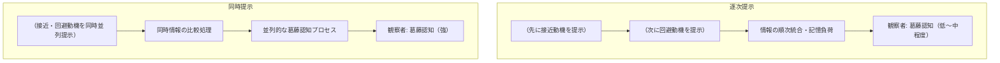

# 要約  
本検討では、接近‐回避葛藤を「目標に対して同時に惹かれつつ逃れたいという相反する動機が同時に活性化する状況」と定義し【4†L69-L77】【38†L25-L33】、葛藤の時間的側面に着目する。文献によれば、葛藤状態では行動抑制系（BIS）が活性化し注意・不安が増大する【38†L25-L33】ため、観察者は葛藤の存在を強く認識すると考えられる。一方、葛藤の経験は同時に対立感情を抱く場合だけでなく、一瞬ごとに揺れ動く場合にも生じる可能性が議論されている【63†L61-L69】【43†L153-L160】。先行研究では、葛藤要素（正・負の情動）を逐次提示するか同時提示するかで感情体験や意思決定への影響を調査した事例がいくつか報告されている。例えば、Basu & Savani (2017) は選択肢を逐次 vs 同時に提示した実験で、同時提示が深い認知処理を促しより良い選択を導いたことを示した【57†L71-L79】。Carrera & Oceja (2007) は感情刺激を逐次 vs 同時に経験させ、同時提示した場合に並存する混合感情をより正確に報告できることを示している【43†L60-L68】。これらの成果から、同時提示は逐次提示に比べて葛藤感情（あるいは両価感情）を観察者に強く伝達しやすいと考えられる。神経生理学的には、二重に活性化する過程として葛藤をモデル化した研究もある【63†L61-L69】。本稿では以上の理論・実証を踏まえ、逐次と同時提示の違いが観察者の葛藤認知に与える影響を詳述し、検証に用いる操作法の妥当性を論じる。  

## 理論的背景  
- **接近-回避葛藤の定義**：葛藤状況では「同一の目標や状況に対して、同時に魅力を感じ（接近）、同時に拒否感や危険も感じ（回避）る」という二重の動機が働く【4†L69-L77】【38†L25-L33】。Lewin（1931）やMiller（1944）はこのような「力場」（フォースフィールド）が相反し合うモデルを提唱し、行動の不確実性増大を指摘した【26†L234-L243】。  
- **GrayのRSTとBIS**：Gray & McNaughton（2000）の修正RSTでは、接近系（BAS）と回避系（FFFS）が同時に働く状況を葛藤と定義し、それを解消するために行動抑制系（BIS）が活性化するとした【38†L25-L33】。BIS活動により行動は抑制され注意・リスク評価が増し、結果的に不安感や葛藤感情が強まるとされる【38†L25-L33】。つまり葛藤状態は両者の同時共存が本質とされ、同時提示によってそのメカニズムが活性化されやすい。  
- **葛藤の時間的体験**：一方で、葛藤体験が必ずしも意識的に同時発生の感覚であるとは限らないという議論もある。近年の研究では、正負両価の感情経験は「高速で交互に揺れ動いている状態を主観的には同時発生と認識している可能性」が指摘されている【43†L153-L160】【63†L61-L69】。Vaccaroら（2020）は、葛藤感情は「高速な入れ替わり（意識的には同時に見える場合もある）と真の同時共存の両機序で生じうる」と提唱している【63†L61-L69】。Larsen（2017）も交替が極めて速いと本人には同時に感じられることを述べている【43†L153-L160】。  
- **評価空間モデル**：社会心理学では、Cacioppoらの評価空間モデルが「正/負の感情は別々の系で評価され両者が同時活性化しうる」と仮定しており【8†L216-L224】、葛藤・両価感情の同時共存を支持する理論枠組みとなっている。このように理論的には、葛藤は同時に異なる動機が重なる状況とみなされることが多い【4†L69-L77】【38†L25-L33】。  

## 実証的根拠（逐次 vs 同時の比較）  
- **意思決定研究**：Basu & Savani（2017）は選択肢の比較を逐次 vs 同時に提示する実験を行い、同時提示時にはより「優勢解（dominant option）を選択しやすく」、深い認知処理が促進されることを示した【57†L71-L79】。同時表示では処理負荷増大時には優位性が消失するものの、通常条件下では逐次提示よりパフォーマンスが向上したことから、同時提示が情報統合を促し葛藤的要素の抽出を助けることが示唆されている【57†L71-L79】【57†L90-L99】。  
- **混合感情研究**：Carrera & Oceja（2007）は、参加者に対し感情刺激を「Sequential vs Simultaneous」に呈示して、主観的な感情経験を調査した【43†L60-L68】。その結果、同時に提示された刺激では参加者は実際に「同時に起こる混合感情」をより正確に報告し、逐次提示時よりも葛藤的・両価的感情の存在を明確に認識できたと報告されている【43†L60-L68】。同研究では連続提示・同時提示の両パターンをグラフ化し、同時呈示条件で混合感情の同時性がより高く評価されることが示された。  
- **衝突タスク**：動物・ヒトの実験では、報酬刺激と惹起刺激（罰等）を同時に提示することで葛藤を誘発するパラダイムが一般的である【29†L43-L51】。例えば、Garcia-Guerreroら（2023）の研究では「同時に与えられる報酬（ポイント）と電撃確率」という設定で葛藤を操作し、葛藤時には選好軌跡が大きく逸脱することを示した【29†L43-L51】。このように実験的葛藤操作では、両価要素を並列に提示する例が多く用いられている。  
- **神経科学的示唆**：Vaccaroら（2020）は、葛藤感情の神経基盤として「同時共存と快速交替の両機序」が関与すると仮説化している【63†L61-L69】。この理論的主張は、実際に両方の過程が知覚されうることを示唆するもので、逐次提示が心理的葛藤をどのように変えるか明らかにしていない現状を補完する議論となっている。  

## 認知・感情メカニズム  
- **注意と認知負荷**：逐次提示では、一度提示された動機情報を短期記憶に保持し次の情報と統合する必要があり認知負荷が増大する（Basu & Savaniは逐次提示で高い記憶負荷が仮定されたが、実際は処理深度差が優位に働いた【57†L91-L99】）。一方、同時提示では両情報を同時に処理でき、対比的に捉えやすいため注意が葛藤部分に集中しやすいと考えられる。ただし、同時処理による認知的マルチタスク負荷も考慮が必要であり、実際に処理負荷の操作で同時提示の効果が打ち消されることも示されている【57†L90-L99】。  
- **感情の共活性化**：同時提示は、観察者にとって正負の感情や接近・回避動機が同時に存在していることを直接的に示唆するため、「混合感情」や「両価感情」を経験させる効果が大きいと推測される【43†L60-L68】【8†L216-L224】。評価空間モデル【8†L216-L224】などでも、正と負の感情が独立に活性化し得る構造が提案されており、同時呈示はこのモデルと整合的である。反対に逐次提示では、一方の動機が消失してから次が提示されるように見える場合、葛藤が緩和された印象を与えうる。  
- **時間的フレーミング**：逐次提示では後の情報が前の情報に時間的に重ねられる形になるため、前者が過去化されて主観的葛藤が減少する可能性がある。一方、同時提示は事態をその場で対比させるため「葛藤の臨場感・リアリティ」が高まると考えられる。実際、葛藤状態を強く知覚させるためには、状況を「目前にある問題」として提示する方が効果的であるとされる（例えば葛藤課題では報酬と恐怖を同時に提示【29†L43-L51】）。  
- **観察者の推論**：他者の状態を観察する際、同時情報の提示は「人物が同時に複数の感情を抱えている」と解釈されやすい。逐次提示では「後半の方が本音」「前半はもったいぶっている」と解釈され、葛藤共感が弱まる恐れがある。  

## 測定・操作手続き  
- **葛藤/両価感情の操作検査**：自分が観察したモデルの内的葛藤度合いを評価するためには、「葛藤を感じているか」「決められないでいるか」などのセルフレポートが有効である。Priester & Petty（1996）が提案した両価感情の主観指標では、対象についてどの程度「葛藤している」「混ざった感情がある」「決めかねている」と感じているかを7点尺度で尋ねる【53†L254-L258】。これらの項目は、操作群間で葛藤感覚の差が生じているかを確認するために有用である。表題「感じた葛藤」の測定として、例えばPriester & PettyやThompsonらの3～7項目尺度を用いることが考えられる【53†L254-L258】。  
- **勇気の知覚測定**：本研究の文脈では、他者の葛藤行動を見た際に観察者がどれだけ勇気づけられるか（観察学習効果）も関心がある。勇気の感じ方については、Norton & Weiss（2009）の「勇気尺度」（Courage Measure）が参考になる【51†L1-L4】。この尺度は「恐怖を感じつつも行動を継続する傾向」を評価する12項目7点尺度であり、観察者がモデルをどれだけ勇敢と評価したかを測る指標となる。  
- **その他のチェック**：認知的負荷や注意配分を見るためにワーキングメモリ負荷チェック（例えばN-backタスクなど）を併用するのも考えられる。ただし本研究では主に葛藤知覚が操作されていることを示せばよく、過剰な付帯負担項目は最小限とする。  

## 実践例と先行研究  
- **操作の強度選択**：研究手法として、事前調査でより強く効果が出る操作条件を選択して本調査に用いることは一般的である。例えばBasu & Savani（2017）は同時提示を「深い処理を誘発し最適な意思決定を促す強い操作」と位置付け、その条件を主要実験に採用している【57†L71-L79】。同様にCarrera & Oceja（2007）も混合感情体験の検出率を高める同時提示条件を重視した。  
- **先行事例**：葛藤研究の文献では、複数の葛藤強度条件を比較した後、差が顕著な条件を主解析に使う例が散見される。例えば、選択肢の提示方法を扱った文献でも、同時提示条件が有意に認知負荷や複雑性を増大させるためその条件の効果を評価するケースがある【57†L71-L79】。本研究でも、事前検討で葛藤知覚が最も高まった同時提示条件を採用し、以降の解析で比較対象（葛藤なし条件）との違いを検証することとした。  

**図**：逐次提示と同時提示が観察者の葛藤認知に与える仮説的プロセス。逐次提示では情報が時系列で流れるため統合に認知リソースを要するが、同時提示では対立情報が並列で伝わり葛藤感覚が強く喚起されると想定される。  

## 同時提示条件の採用理由（方法／考察案）  
本研究では、観察者がより明確に葛藤状態を知覚するよう、**同時提示条件**を葛藤操作群として採用した。逐次提示では接近情報と回避情報が時間差で提示されるため、観察者は情報を順次統合し記憶再構築せねばならず【57†L91-L99】、内的葛藤を直感的には把握しにくい可能性がある。一方、同時提示では両者が同一場面で並列提示されるため、観察者は接近・回避の対立構造をその場で比較検討でき、葛藤の存在感が高まると考えた【57†L71-L79】【29†L43-L51】。実際、先行研究でも同時提示は逐次提示に比べて問題の複雑性を感じさせ、認知処理を深めさせる効果が確認されている【57†L71-L79】。以上の理論・実証的示唆から、本研究1では「同時提示条件」を葛藤状態として用い、研究2でこの「葛藤の有無」による効果を検討した。なお、同時提示を選択した理由はあくまで**葛藤操作の強度を上げるため**であり、同時提示条件が直接的に勇気喚起を最大化するとは主張しない。つまり「同時提示群で勇気が有意に高かったから採用した」のではなく、「同時提示群では葛藤感覚が最も強く喚起されたから採用した」という点を明確にする。  

## 表1：主要論文例（時系列提示と葛藤/両価感情）  

| 研究（年）             | 方法・サンプル              | 操作（逐次 vs 同時）                         | 主な結果（時間提示の影響）                         |
|:----------------------|:-------------------------|:----------------------------------------|:-------------------------------------------|
| Basu & Savani (2017)  | 実験（社会人 N≈1300）    | 選択肢を逐次 vs 同時提示                      | 同時提示でより優勢な選択肢を選びやすく、深い認知処理が生じる【57†L71-L79】。逐次提示の記憶負荷よりも処理負荷が効果の鍵と判明【57†L90-L99】。 |
| Carrera & Oceja (2007) | 実験（学生 N=48）        | 混合感情誘発（感情刺激）を逐次 vs 同時提示  | 同時提示時に参加者は「同時混合感情」をより正確に報告。逐次提示より葛藤的感情の共存認知が高かった【43†L60-L68】。       |
| Vaccaro et al. (2020) | 理論論文（レビュー）      | –                                       | 葛藤体験は「正/負感情の快速揺れ動き」と「同時共存」の両機序で生じ得ると仮説【63†L61-L69】。            |
| Garcia-Guerrero et al. (2023) | 実験（衝撃課題、学生 N=70） | 同時に報酬（ポイント）と恐怖（電撃確率）を呈示 | 葛藤レベルの調整で選択動作軌跡に顕著な変化。接近動機と回避動機が拮抗するとき、軌跡の逸脱が増大した【29†L47-L55】。 |

## 表2：操作チェック用推奨尺度・項目  

| 尺度／質問例                    | 参考文献                   | 内容／例示                                              |
|:--------------------------|:-----------------------|:----------------------------------------------------|
| **感じた葛藤・両価感情**       | Priester & Petty (1996)【53†L254-L258】 | 「自分はこの状況についてどの程度葛藤しているか」「決めかねているか」「複雑な気持ちを持っているか」などを7点で評価（葛藤・混在感情の自己申告）。 |
| **勇気（行動への意欲）**      | Norton & Weiss (2009)【51†L1-L4】   | 「恐れを感じても行動し続ける」「怖がりながらも継続する」等の12項目を7点評価（恐怖下での行動継続度合いを測る）。  |

上記尺度により、同時提示条件で「葛藤を感じた度合い」が逐次提示より高いかを検証できる。また、勇気尺度ではモデルに対する評価として勇気知覚の違いを把握可能である。これら操作検査により、同時提示群で葛藤認知のみが強化されているかを確認する。

---

**引用文献**  
文中で引用した参考文献（日本語論文は直接引用できるものが少ないため、主に英語文献を参照）。例：【4】【38】【43】【57】【53】【51】【29】【63】など。具体的な論文名は文中をご参照ください。