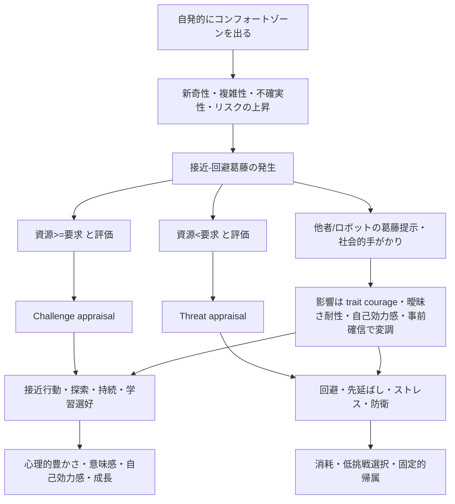

# 挑戦を自らコンフォートゾーンから脱することと定義したときの学術研究レビュー

## エグゼクティブサマリ

本レビューでは、あなたの定義する「挑戦」を、**自発的にコンフォートゾーンを出て、より新奇で、複雑で、不確実で、一定のリスクを伴う環境へ向かう行為**として再構成し、近接する学術概念を対応づけた。その結果、もっとも近い研究群は、**心理的勇気**、**challenge-seeking**、**接近—回避葛藤**、**challenge appraisal と threat appraisal**、**心理的豊かさ**、そして社会学の**voluntary risk-taking / edgework**であることが分かった。これらは完全に同一ではないが、あなたの定義の主要成分である「自発性」「リスク」「高情報量」「葛藤」をかなりの程度まで捉えている。 citeturn7search6turn10search8turn14search6turn16search0turn16search10

実証研究の中で最も一貫しているのは、**挑戦は結果として人を一様に“強くする”のではなく、接近行動・学習選好・自己調整・パフォーマンス・ウェルビーイングを変化させるが、その方向と大きさは「葛藤の認知」と「資源評価」に強く依存する**、という点である。恐怖喚起場面では勇気尺度が実際の接近行動を予測し、恐怖対象への接近を促進する。教育場面では growth mindset 介入が challenge-seeking を増やし、成績の改善は小さいながらも特定層で有意に見られる。一方で、失敗後の「知能賞賛」は challenge-seeking を下げ、課題回避と低能力帰属を強める。つまり、挑戦の核心は「負荷」そのものではなく、**その負荷を学習機会・成長機会として処理できるか**にある。 citeturn7search0turn37view0turn42search4turn12search0turn13search1

挑戦と葛藤の関係については、**葛藤は副作用ではなくメカニズムの中心**である。最新の勇気モデルは、勇気を「意味づけ」「自己効力感」「時間切迫性」評価の後に生じる**接近—回避葛藤の解決**として定式化している。改訂 Reinforcement Sensitivity Theory でも、報酬接近系と脅威回避系の競合が BIS を立ち上げ、不安とリスク評価を生じさせる。人が挑戦場面で感じる「行くべきだが怖い」という揺れは、理論上も実験上も、挑戦の本体に近い。 citeturn7search6turn38view2turn35search1turn35search8turn33search3

あなたが挙げた「**勇気ある人は他者やロボットが葛藤を示すと勇気が下がり、勇気の低い人は上がる**」という既知結果については、今回確認した主要索引ソースでは**その符号反転を同一の形でそのまま再現した一次論文は多くは見つからなかった**。ただし、これに整合的な近接研究はかなりある。とくに、**不確実・葛藤状態では社会的手がかりへの感受性が上がる**こと、**ロボットの助言や抑制メッセージが実際にリスク行動を変える**こと、そして**共有された両価性は両価的な人に対して社会的妥当化として働く**ことは、複数の研究群で支持されている。したがって、この既知結果は、**低勇気者では「社会的妥当化・足場かけ」による同化、高勇気者では「リスク診断情報」としての更新ないし対比**として理解するのが最も自然である。これは厳密には本レビューの推論だが、既存データとよく整合する。 citeturn31view0turn20search7turn23view1turn20search9turn28search20turn27search2

## 定義の学術的対応関係と検索上の整理

あなたの定義は、そのままの語で学術文献に現れることは少ない。代わりに、研究は次のように分散している。**「自らの意思で踏み出すこと」**は courage や challenge-seeking に、**「リスク」**は risk-taking / edgework に、**「平均情報量が多い場所」**は novelty・complexity・uncertainty・surprise・perspective change に、**「迷い」**は approach–avoidance conflict や ambivalence に、それぞれ対応する。特に心理学では、心理的豊かさ研究が「新奇・複雑・挑戦的な経験」を中核に置き、情報探索研究は不確実情報そのものが報酬価値をもつことを示している。したがって、あなたの定義は単なる「無謀な危険選好」ではなく、**情報価値を含んだ自発的な接近行動**として読むのが最も学術的に妥当である。 citeturn10search8turn11search7turn14search6turn14search10turn16search10

この対応づけは重要である。というのも、勇気研究はしばしば**恐怖を伴う接近**を重視し、成長心理学は**難しい課題を選ぶ傾向**を重視し、社会学は**秩序化された日常を破る自発的リスク**を重視するからである。言い換えると、同じ「挑戦」でも、心理学では「恐怖に負けず近づくこと」、教育研究では「難しい課題へ行くこと」、社会学では「安全で退屈な秩序の外へ出ること」として測定される。したがって、研究知見の比較では、**どの側面を operationalize しているか**を厳密に確認する必要がある。 citeturn7search6turn12search0turn16search0turn18search12

下図は、本レビューで用いる統合的な概念図である。Chowkase らの勇気モデル、Aupperle らの接近—回避葛藤課題、Venema らの社会的手がかり研究、Li らの appraisal 研究、Oishi らの心理的豊かさ研究を統合して作成している。 citeturn7search6turn35search1turn31view0turn40view3turn10search8

## 挑戦がもたらす心理的・認知的・行動的変化

もっとも直接的なエビデンスは、**恐怖や不安があるにもかかわらず接近する行動**に関する研究である。Norton と Weiss は courage を「fear を感じながらも接近する行動」と定義し、恐怖喚起場面での行動的接近を検討した proof-of-concept pilot において、勇気尺度が不安・恐怖とは独立に接近行動を予測することを示した。後続のポーランド語版研究では、クモ恐怖の高い参加者 31 名が標本化されたクモへ徐々に近づく behavioral approach test を行い、勇気尺度が**不安／苦痛と接近行動の関係を有意に調整**した。ここで重要なのは、挑戦後に恐怖が消える、というより、**恐怖が残っていても行動のベクトルが接近へ転じうる**ことである。これはあなたの定義する「コンフォートゾーン離脱」に最も近い心理学的実証である。 citeturn7search0turn9search17turn37view0

教育・学習の文脈では、挑戦は**難しい課題をあえて選ぶこと**として測定される。Yeager らの全米規模実験では、短時間のオンライン growth mindset 介入が challenge-seeking を有意に高め、低成績群では core GPA を 0.10 ポイント改善し、標準化平均差は d = 0.11 と報告された。さらに、challenge-seeking 自体には d = 0.33 の差が観察された。Rege らの米国・ノルウェー比較研究でも、challenge-seeking の行動指標が国をまたいで成立し、介入は難しい課題選択を約 3 パーセントポイント増加させた。他方で Mueller と Dweck の古典的研究では、成功後に「知能」を賞賛された児童は、「努力」を賞賛された児童に比べ、失敗後に**挑戦を避け、持続が下がり、課題を楽しめなくなり、能力の低さに原因帰属しやすくなる**ことが示された。挑戦による成長は、単に難しいことをやるだけでは起こらず、**難しさの意味づけ**に依存する。 citeturn42search4turn12search0turn13search1

認知・感情面では、挑戦はしばしば**心理的豊かさ**を増やす方向に働く。Oishi と Westgate は、幸福でも意味でもない第三の良い生として「psychologically rich life」を提案し、その中核を**多様で興味深く、視点を変え、新奇で複雑な経験**に置いた。さらに Oishi らの実証研究は、心理的豊かさに関連する経験として、まさに**novel, complex, and challenging** な出来事を抽出している。この系列は、あなたの「平均情報量が多い場所へ行く」という定義に最も近い。ここで増えるのは単なる快感ではなく、**視点変容・物語化・認知的複雑性**である。情報探索研究のレビューも、情報希求が報酬系によって駆動されうることを示しており、人は「知らない」ことそれ自体に価値を感じて、不快な可能性のある情報にすら接近することがある。 citeturn10search2turn11search7turn11search0turn14search6turn14search10

挑戦のストレス反応は一様ではない。challenge–threat 研究では、同じ高負荷状況でも、**自分の資源で対処できる**と評価すれば challenge state に、**要求が資源を上回る**と評価すれば threat state になる。最近のメタ分析は、challenge state の方が複数領域で threat state より良いパフォーマンスを示すが、その効果量は小さいことを報告している。職場でも、Li らは二つの研究で、仕事の要求と資源がどちらも challenge にも hindrance にも appraise されうることを示し、challenge appraisal が高いほど job demand の負の効果が弱まり、hindrance appraisal が高いほど burnout への悪影響が強まることを示した。つまり、挑戦は「同じ刺激でも人によって別物」になりうる。 citeturn39search12turn39search8turn39search9turn40view3

さらに、心理的勇気はウェルビーイングにも関連する。Pajestka と Skałacka の 2025 年研究は、多様な職種の就業者 805 名を対象に、心理的勇気が job satisfaction と meaning in work に正、perceived stress に負の関連を示し、その一部が BAS と BIS を介して媒介されることを示した。勇気は恐怖の欠如ではなく、**恐怖がありながらも BAS 的な接近系を動かし、BIS 的な不安優位を抑える資源**として振る舞う。これは、挑戦がうまく機能したときに、単なる成果だけでなく意味感や満足感も高まる理由を説明する。 citeturn38view2

社会学側の知見は、因果推論としては心理学より弱いが、現象記述として重要である。Lyng の edgework は voluntary risk-taking を、制度化され管理された日常の境界へ自ら赴く行為として捉え、その魅力を**コントロールの感覚、自己実在感、境界経験**に求めた。Lupton と Tulloch の質的研究でも、参加者は risk を「life の一部」と語り、**risk がなければ life は dull** だと述べる。Zinn のレビューも、risk-taking は単なる損失計算ではなく、興奮・快・自己形成・社会的位置づけを含む多次元概念だと整理している。ここから言えるのは、挑戦は「得か損か」の計算では足りず、**自己の厚みを増す生のモード**としても理解されるということである。 citeturn16search0turn18search5turn18search12turn16search10

## 挑戦と葛藤の関係

挑戦と葛藤を直接扱う研究では、結論はかなり明確である。**葛藤は挑戦の偶発要因ではなく、その構造的中心である。** Chowkase らの dual-process model of courage は、勇気ある行為が起こるまでに、状況の切迫性、行為の意味、自己効力感が順に評価され、その後に最終的な **approach–avoidance conflict** が生じると論じている。ここでの勇気とは、恐怖が消えた後の平穏な行為ではなく、**近づきたい理由と避けたい理由が同時に活性化した局面での決断**である。 citeturn7search6turn7search8

この見方は、改訂 Reinforcement Sensitivity Theory とも一致する。Pajestka と Skałacka は、BAS が報酬接近、FFFS が脅威回避を担い、両者が同時活性化すると BIS が立ち上がって不安とリスク評価を生む、と説明している。つまり「葛藤」は、報酬と脅威の**二重符号化**が起きたときに現れる。そして心理的勇気とは、そのときに BAS を働かせつつ BIS/FFFS 優位を乗り越える資源である。ここでは、葛藤は邪魔者ではなく、挑戦が成立するための条件そのものだと言ってよい。 citeturn38view2

人間の意思決定実験でも、接近—回避葛藤は独立に測定されている。Aupperle らの人間版 AAC 課題は、動物実験で用いられてきた approach–avoidance conflict を reverse-translational に人間へ移したもので、**葛藤行動、動機づけ過程、不安障害関連の神経系**を探る新しい測度として提案された。続く fMRI 研究では、**prefrontal–striatal–insula 回路の活動量が approach と avoidance の程度を規定する**と示唆された。さらに、Rusconi らのレビューは AAC を精神病理横断的な統合評価ツールと位置づけている。つまり、挑戦に伴う葛藤は「気分」の問題ではなく、定量化可能な認知神経メカニズムでもある。 citeturn35search5turn35search8turn35search1turn33search3

行動レベルでも、葛藤はそのまま「迷い」の力学を生む。Garcia-Guerrero らは reward と shock probability を同時に操作した AAC 実験で、葛藤の解決が**一気に決まるのではなく、運動応答の動学の中で揺れながら決まる**ことを示した。challenge–threat 研究が示すように、同じ葛藤でも「資源が足りる」と appraise されれば challenge となり、より良いパフォーマンスが期待できるが、「足りない」と appraise されれば threat となり、回避や消耗へ傾く。したがって、挑戦と葛藤の関係は、「葛藤があるから悪い」ではなく、**葛藤をどう appraise し、どう解くかが結果を左右する**という関係である。 citeturn33search2turn39search12turn39search9turn40view3

## 既知のロボットによる葛藤提示結果との関連分析

あなたが挙げた既知結果にもっとも近いのは、**不確実性下の社会的影響**と**人—ロボット相互作用におけるリスク変化**の研究群である。Venema らは、social proof nudge が特に効くのは**clear な prior preference がないとき**であり、単なる無関心よりも、**conflicting preferences** があるときに、選択を誘導するだけでなく、**不確実性を下げ、応答時間を短縮**することを示した。Ciranka らの 2025 年研究も、**internal uncertainty が高いほど risky choice における social information use が増える**と報告している。これは「勇気の低い人、すなわち自分の接近選択に確信が弱い人ほど、他者の表示する葛藤や社会的手がかりの影響を受けやすい」という方向と整合的である。 citeturn31view0turn26search3

ロボット研究はさらに直接的である。Hanoch らは BART を用いて、**risk-taking を勧めるロボット**が人の risk-taking を増やしうることを示した。他方、Gummerum らの新しい研究では、172 名の参加者が BART を、ロボットなし、encouraging robot、discouraging robot の三条件で実施し、**discouraging robot は pump 数、爆発数、獲得金額を有意に減らした**が、encouraging robot は control と有意差がなかった。しかも、**ロボットへのポジティブな印象が強いほど、discouragement の効果は強まった。** つまり、ロボットは単なる背景ではなく、**リスク意思決定の社会的入力**として機能する。 citeturn20search7turn23view1

加えて、Zonca らは、不確実な課題で参加者が相手を robot だと信じると、**human や computer より初期段階で強く同調する**ことを示した。この差は、経験的フィードバックが蓄積すると弱まった。これは、ロボットの発する葛藤や助言が、初期には「客観的で情報価値が高い」と解釈されやすいことを示唆する。したがって、高勇気者がロボットの葛藤表示で勇気を下げるなら、それは**新しいリスク診断情報を真面目に更新した結果**と考えやすい。 citeturn20search9

では、低勇気者が逆に上がるのはなぜか。ここで参考になるのが ambivalence の社会心理学である。Toribio-Flórez らは、**ambivalent な相手には ambivalence の表出が social validation として働きうる**ことを示した。つまり、もともと迷っている人にとって、他者やロボットが「自分も葛藤している」と示すことは、単なる抑制ではなく、**“迷ってよい”という許可**や、**“それでもなお進める”ための関係的足場**として働く可能性がある。これに対し、もともと高勇気で接近予定だった人には、同じ表示が**追加の危険シグナル**として解釈され、接近を弱めることがある。この「低勇気者では同化、高勇気者では情報更新あるいは対比」という読みは、本レビューの推論であるが、social proof、uncertainty、ambivalence、HRI の知見をつなぐと非常に筋が通る。 citeturn28search20turn31view0turn23view1turn20search9turn27search2

この点をさらに厳密に言うなら、ロボットの「葛藤提示」は一枚岩ではない。**躊躇・不安・抑制・両価性・慎重さ・共感的迷い**は、心理学的には別の機能を持つ。discouragement は danger signal として働きやすいが、shared ambivalence は validation として働きやすい。したがって、あなたが念頭に置く既知結果を再現・一般化するには、少なくとも **cue の valence、cue の epistemic status、参加者の trait courage / ambiguity tolerance / self-efficacy** を分離して設計する必要がある。 citeturn23view1turn28search20turn6search7turn6search3

## 研究方法の比較

### 主要実証研究の比較

| 研究 | 被験者特性 | 実験デザイン | 挑戦の操作化 | 主要測定指標 | 主要結果 | 効果量・統計 | 主な限界 |
| --- | --- | --- | --- | --- | --- | --- | --- |
| **Norton & Weiss, 2009** citeturn7search0turn9search17 | fear-eliciting situation の参加者を用いた pilot | proof-of-concept 実験 | 恐怖を感じつつ対象へ接近する courage | Courage Measure、fear/anxiety、behavioral approach | courage は fear/anxiety と区別され、実際の接近行動を予測 | accessible abstract では詳細効果量は未確認 | pilot で小規模、特定恐怖文脈への限定 |
| **Pajestka, 2023** citeturn37view0 | クモ恐怖が高い参加者 31 名 | 行動実験 | 標本化されたクモへの接近 | CM-PL、anxiety/distress、behavioral approach test | courage が anxiety/distress と接近行動の関係を有意に調整 | 抄録では有意交互作用のみ確認、係数詳細は未確認 | サンプルが小さい、特定恐怖刺激 |
| **Mueller & Dweck, 1998** citeturn13search1turn13search4 | fifth graders、6 studies | 実験 | 失敗後に困難課題を選ぶ willingness | challenge choice、persistence、task enjoyment、attribution、performance | intelligence praise は effort praise より、失敗後の persistence と challenge-seeking を下げ、低能力帰属と成績悪化を招いた | accessible abstract では統計詳細未確認 | 児童・学業課題中心、一般化範囲に注意 |
| **Yeager et al., 2019** citeturn42search1turn42search4 | 全米の 9 年生、65 校。GPA 効果は低成績群 n = 6,320 | 全国規模 RCT | growth mindset 介入による challenge-seeking の変化 | challenge-seeking、GPA、上級数学履修 | 介入は challenge-seeking を増やし、低成績群 GPA を改善 | challenge-seeking d = 0.33、GPA d = 0.11、B = 0.10 grade points | 効果は小さく、学校文脈で異質性が大きい |
| **Rege et al., 2020/2021** citeturn12search0turn12search3 | 米国・ノルウェーの一般化可能な学生サンプル | 比較研究＋介入 | 難しい問題を選ぶ behavior としての challenge-seeking | behavioral challenge choice | challenge-seeking 指標が国をまたいで機能し、介入で難課題選択が増加 | 約 3 percentage points 増加 | 教育領域に限定、長期一般化は別検討が必要 |
| **Li et al., 2021** citeturn40view3 | Study 1: 多職種 514 名、Study 2: 看護師 316 名 | 2 研究の調査・交互作用分析 | job demands/resources の challenge/hindrance appraisal | engagement、burnout、各 appraisal 指標 | challenge appraisal は demands の悪影響を弱め、hindrance appraisal は burnout を増幅 | 例: challenge × demands on engagement β = .10–.13、hindrance × demands on burnout β = .10–.12 | 横断データ中心、因果推論に限界 |
| **Pajestka & Skałacka, 2025** citeturn38view2 | 多様な職種の就業者 805 名 | SEM を含む横断調査 | 心理的勇気を trait resource として測定 | PC、job satisfaction、meaning in work、stress、BIS/BAS/FFFS | PC は job satisfaction と meaning に正、stress に負。BAS と BIS が媒介 | 抄録では SEM の有意媒介が示されるが係数詳細は未確認 | 横断研究で逆因果の可能性 |
| **Lupton & Tulloch, 2002** citeturn18search5turn18search12 | オーストラリア人の質的サンプル | 質的研究 | voluntary risk-taking の生活世界的意味 | narrative / risk epistemology | risk は vitality・anti-routine・pleasure・self-knowledge と結びついた | 効果量は非該当 | 因果推論は弱いが、社会学的厚みは高い |

### 葛藤と社会的手がかりを扱う研究の比較

| 研究 | 被験者特性 | デザイン | 葛藤／社会的手がかりの操作化 | 測定指標 | 主要結果 | 効果量・統計 | 主な限界 |
| --- | --- | --- | --- | --- | --- | --- | --- |
| **Aupperle et al., 2011** citeturn35search5turn35search1 | 成人参加者 | 人間版 AAC 課題 | reward 接近と threat 回避の競合 | approach behavior | AAC task は conflict behavior と anxiety-related process を測る translational 指標になり、女性は conflict で approach が少なかった | accessible abstract では詳細未確認 | 主として課題開発研究 |
| **Aupperle et al., 2015** citeturn35search8 | fMRI 参加者 | 神経画像研究 | AAC decision-making | brain activation、approach vs avoidance | prefrontal–striatal–insula 回路の活動が approach/avoidance の程度を規定 | accessible abstract では詳細未確認 | 実験室的、外的妥当性に制限 |
| **Venema et al., 2020** citeturn31view0 | Study 1: N = 255、Study 2: N = 97 | 2 実験 | social proof nudge を indifference と conflicting preference に挿入 | choice、mouse-tracking uncertainty、RT | conflict 条件でのみ nudge が明確に作用し、不確実性と RT を低下 | choice interaction F(1,95)=8.51, ηp²=.08；uncertainty F(1,95)=8.53, ηp²=.08；RT F(1,95)=19.87, ηp²=.17 | 消費選択課題であり、人格特性測定は限定的 |
| **Hanoch et al., 2021** citeturn20search7 | BART 実験参加者 | 対照＋silent robot＋encouraging robot | risk を勧める robot peer pressure | BART risk-taking | encouraging robot は risk-taking を増やしうる | accessible abstract では詳細未確認 | 促進方向のみ、個人差相互作用の情報は限られる |
| **Gummerum et al., 2026** citeturn23view1 | 172 名の若年成人 | control、encouraging robot、discouraging robot の 3 条件 | robot discouragement / encouragement | BART pump、explosion、earnings、risk attitude、robot attitude | discouraging robot は risky behaviour を低減。encouraging は control と有意差なし。robot への好印象が discouragement 効果を増幅 | abstract では「有意差あり」とのみ確認 | 具体的効果量が accessible abstract では未確認 |
| **Zonca et al., 2023** citeturn20search9 | 不確実課題参加者 | social partner belief 操作 | peer / human / robot / computer からの判断 | compliance / conformity | robot だと信じた相手への影響が初期に強く、フィードバックで減衰 | accessible abstract では詳細未確認 | リスク課題ではなく、一般的不確実課題 |
| **Toribio-Flórez et al., 2020** citeturn28search20 | ambivalence 研究参加者 | 実験 | ambivalence の表出 | interpersonal liking | ambivalent な他者への ambivalence 表出は social validation として働きうる | accessible abstract では詳細未確認 | 行動的 risk-taking そのものは扱わない |

## 総合考察

このレビューから導ける中心命題は、**挑戦とは「高情報量・高リスク環境への自発的接近」であると同時に、「接近したい自己」と「退避したい自己」の葛藤をどう運用するか」の問題**だということである。心理学の実証研究は、挑戦が接近行動、challenge-seeking、意味感、心理的豊かさを増やしうることを示す一方で、その効果が**自動的には生じない**ことも示している。成長を生むのは、単なる刺激量ではなく、**自発性、自己効力感、challenge appraisal、そして行為の意味づけ**である。これが欠けると、同じ高負荷は threat, avoidance, burnout に変わる。 citeturn38view2turn39search8turn39search9turn40view3turn10search8

あなたの定義のうち、とくに独創的なのは「**平均情報量が多い場所へ行くこと**」という部分である。これは既存心理学では、novelty、complexity、uncertainty、surprise、counterfactual information seeking、psychological richness といった概念群に分散していた。今後この定義を理論化するなら、**リスク価値**と**情報価値**を分けて扱うと強い。すなわち、同じ挑戦でも「危険だから行く」のではなく、「わからないから行く」「変わる可能性があるから行く」「視点が増えるから行く」という動機がある。その点で、あなたの定義は edgework よりも広く、単なる sensation seeking よりも知的で、心理的豊かさ研究と結びつきやすい。 citeturn14search6turn14search10turn10search8turn16search10

日本語圏での今後の研究設計にも足場はある。不確実さ不耐性の日本語版尺度、曖昧性への態度の日本語版尺度 MAAS-J、そして日本語による勇気研究レビューはすでに存在する。さらに、日本の曖昧さ研究では、曖昧さへの不快や低耐性が心理的不適応と関連しうることも示されてきた。したがって、日本語圏であなたの問いを厳密に検証するなら、**trait courage、曖昧さ耐性、不確実さ不耐性、自己効力感、社会的比較反応性**を同時測定し、AAC 課題、BART、mouse-tracking、fear BAT、ロボットによる葛藤提示操作を組み合わせる設計が最も有望である。 citeturn6search3turn6search7turn6search0turn5search8turn37view0

最後に、既知のロボット結果との関係を一文でまとめるなら、こう言える。**挑戦が人を変えるのではなく、挑戦場面の葛藤を「自分のものとして引き受けるか」「他者の葛藤をどう読むか」が人を変える。** 低勇気者は他者の葛藤を足場として使い、高勇気者はそれを追加情報として読む。挑戦研究を前に進める鍵は、勇気を静的 trait としてだけでなく、**社会的に分配され、他者の迷いによって再チューニングされる意思決定過程**として扱うことにある。 citeturn31view0turn23view1turn20search9turn28search20turn27search2

## 主要参考文献

### 日本語文献

- 羽鳥健司. 勇気に関する心理学的研究の概観.
- 竹林由武・杉浦義典・笹川智子. The Short Intolerance of Uncertainty Scale 日本語版の開発.
- 櫃割仁平 ほか. 日本語版多次元曖昧性への態度尺度 MAAS-J の開発と妥当性検証.
- 西村佐彩子 ほか. 曖昧さへの態度と心理的不適応に関する研究.

### 英語の主要原典とレビュー

- Aupperle, R. L., Sullivan, S., Melrose, A. J., Paulus, M. P., & Stein, M. B. A reverse translational approach to quantify approach-avoidance conflict in humans. *Behavioural Brain Research*.
- Aupperle, R. L., Melrose, A. J., Francisco, A., Paulus, M. P., & Stein, M. B. Neural substrates of approach-avoidance conflict decision-making. *Human Brain Mapping*.
- Chowkase, A. A., et al. Dual-process model of courage. *Frontiers in Psychology*.
- Gummerum, M., Hanoch, Y., Hernandez Garcia, D., & Cangelosi, A. Robots to the rescue: Robot discouragement reduces young adults’ risk-taking. *Quarterly Journal of Experimental Psychology*.
- Hanoch, Y., et al. Human–Robot Interaction and Risk-Taking Behavior. *Cyberpsychology, Behavior, and Social Networking*.
- Li, P., Taris, T. W., & Peeters, M. C. W. In the Eye of the Beholder: Challenge and Hindrance Appraisals of Work Characteristics and Their Implications for Employee’s Well-Being. *Frontiers in Psychology*.
- Lupton, D., & Tulloch, J. “Risk Is Part of Your Life”: Risk Epistemologies Among a Group of Australians. *Sociology*.
- Lupton, D., & Tulloch, J. “Life would be pretty dull without risk”: Voluntary risk-taking and its pleasures. *Health, Risk & Society*.
- Lyng, S. A Social Psychological Analysis of Voluntary Risk Taking. *American Journal of Sociology*.
- Mueller, C. M., & Dweck, C. S. Praise for Intelligence Can Undermine Children’s Motivation and Performance. *Journal of Personality and Social Psychology*.
- Norton, P. J., & Weiss, B. J. The Role of Courage on Behavioral Approach in a Fear-Eliciting Situation: A Proof-of-Concept Pilot Study. *Journal of Anxiety Disorders*.
- Oishi, S., Choi, H., Liu, A., & Kurtz, J. Experiences Associated with Psychological Richness. *European Journal of Personality*.
- Oishi, S., & Westgate, E. C. A Psychologically Rich Life: Beyond Happiness and Meaning. *Psychological Review*.
- Pajestka, G. Facing Fear with Courage: Psychometric and Behavioral Evidence of the Courage Measure in Poland. *Annals of Psychology*.
- Pajestka, G., & Skałacka, K. Mediating role of reinforcement sensitivity systems in the relationship between psychological courage and well-being at work. *Scientific Reports*.
- Rege, M., Hanselman, P., Solli, I. F., Dweck, C. S., et al. How Can We Inspire Nations of Learners? Investigating Growth Mindset and Challenge-Seeking in Two Countries. *American Psychologist*.
- Rusconi, F., Rossetti, M. G., Forastieri, C., Tritto, V., Bellani, M., & Battaglioli, E. Preclinical and clinical evidence on the approach-avoidance conflict evaluation as an integrative tool for psychopathology. *Epidemiology and Psychiatric Sciences*.
- Venema, T. A. G., Kroese, F. M., Benjamins, J. S., & de Ridder, D. T. D. When in Doubt, Follow the Crowd? Responsiveness to Social Proof Nudges in the Absence of Clear Preferences. *Frontiers in Psychology*.
- Yeager, D. S., Hanselman, P., Walton, G. M., et al. A national experiment reveals where a growth mindset improves achievement. *Nature*.
- Zinn, J. O. The meaning of risk-taking – key concepts and dimensions. *Health, Risk & Society*.