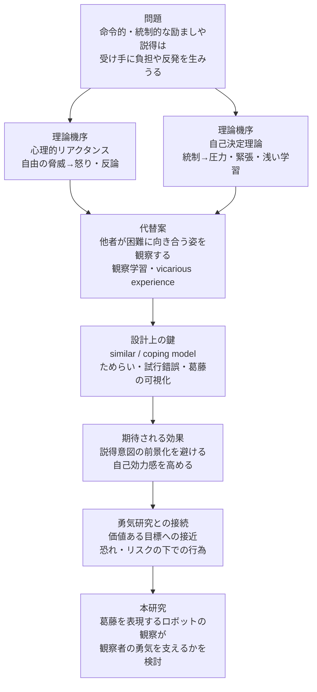

# 直接的な励ましの負担と観察による間接支援の可能性

## エグゼクティブサマリー

この問いに対して、最も堅い言い方は「**励まし・説得・指示そのものが常に悪い**」ではなく、「**命令的・統制的・自由を脅かす形の励ましや説得は、受け手に圧力や反発を生みうる**」である。心理的リアクタンス研究では、自由を制限する強い言語が怒り・反論・説得拒否を高めることが示され、自己決定理論では統制的文脈が圧力・緊張・浅い学習を招くことが整理されている。したがって、あなたのイントロでは「直接法が悪い」ではなく「**統制的な直接法にはコストがある**」と書くのが最も安全である。 citeturn10search5turn16view7turn36view0turn17view0

そのうえで、**観察による間接支援**は、説得意図を前面に出さずに自己効力感を喚起できる代替経路として位置づけられる。Bandura は自己効力感の主要な源の一つとして vicarious experience を位置づけ、Schunk らは、困難を経験している学習者にとって、類似した他者のモデリング、特に coping 的なモデルが自己効力感や成績を高めることを示した。さらに、ナラティブ研究では、露骨な説得よりも他者の経験をたどる形式の方が reactance を下げやすいことが示されている。 citeturn3search0turn18view0turn18view1turn23search4turn29view0turn29view1

ただし、**「他者観察の方が直接励ましより常に優れている」とまで言える直接比較研究は、現状では限定的／間接的証拠**である。したがって論文では、「観察に基づく支援は、直接的・統制的な働きかけが負担や抵抗を生む状況において、有望な代替手段である」と書くのが妥当である。とくに、**困難に向き合う他者**、すなわち coping model や弱いモデルに近い存在を観察することが有効であるという点は、あなたの「困難に向き合うロボットの観察」という発想と相性がよい。 citeturn18view0turn23search2turn29view0turn29view1

勇気の文献では、勇気はおおむね「**恐れや危険があるにもかかわらず、価値ある目標に向けて接近する行為**」として定義される。さらに、勇気は一般／個人的勇気、プロセスとしての勇気／称賛としての勇気、あるいは行為領域別のカテゴリーに整理されてきた。近年のモデルは、この状態を approach–avoidance conflict として明示的に記述しており、あなたが研究1で扱う「葛藤」と理論的に接続しやすい。 citeturn26search2turn28search1turn27search7turn6search2turn40search9turn39view2turn39view3

## 直接的な励まし・説得・指示が負担や逆効果になりうる文献

まず大前提として、**直接的な働きかけは「形式」によって効果が分かれる**。Bandura の自己効力感理論でも verbal persuasion は有効性の源の一つだが、自己決定理論やリアクタンス研究が示すのは、**押しつけ・命令・評価圧・自由制限を帯びた形**になると、それが支援ではなく圧力として機能しやすい、という点である。したがって、あなたの序論では direct support を一括否定せず、**controlling / freedom-threatening な direct support** に限定して批判するのが適切である。 citeturn3search0turn36view0turn16view7

**Rains, S. A. (2013). *The Nature of Psychological Reactance Revisited: A Meta-Analytic Review*. Human Communication Research, 39(1), 47–73. DOI: 10.1111/j.1468-2958.2012.01443.x.**  
要約: 20研究・約4,942名を統合したメタ分析で、心理的リアクタンスは「怒り」と「反論的認知」が結びついた構成として理解するのが最も適切だと示した。  
関連: 強い説得や命令が、受け手の内面で単なる「不快感」ではなく、説得への抵抗メカニズムを起動させることの基礎証拠になる。  
イントロ文例: 「命令的・押しつけ的な説得は、受け手の自由感を脅かし、反発やメッセージ拒否を生みうる。」 citeturn10search5

**Li, Z., & Shi, J. (2026). *Message effects on psychological reactance: meta-analyses*. Human Communication Research, 52(1), 38–?.**  
要約: 28論文・33研究・146効果量を統合した近年のメタ分析では、high freedom-threatening language は anger、negative cognitions、psychological reactance を一貫して増加させた。  
関連: 「must」「stop」「deny するな」のような強い指示語が逆効果を招きうることを、最新の総合証拠として補強できる。  
イントロ文例: 「とくに自由を脅かす強い言語は、怒りや反論を通して説得効果を損ないうる。」 citeturn10search2turn10search8

**Deci, E. L., & Ryan, R. M. (1987). *The Support of Autonomy and the Control of Behavior*. Journal of Personality and Social Psychology.**  
要約: 自律性支援は、より高い内発的動機づけ、興味、創造性、概念学習、行動変容の持続、健康と関連し、統制的文脈はより大きな pressure and tension、より rote-oriented な学習と関連すると整理した理論的レビューである。  
関連: 「直接に働きかける」こと自体ではなく、「統制する仕方で働きかける」ことが負担になるという、あなたの主張の理論的中核になる。  
イントロ文例: 「支援は、自律性を支える形では促進的に働く一方、統制的に提示されると圧力と緊張を高め、学習や行動変容の質を損ないうる。」 citeturn36view0turn36view1turn36view2

**Grolnick, W. S., & Ryan, R. M. (1987). *Autonomy in Children’s Learning: An Experimental and Individual Difference Investigation*. Journal of Personality and Social Psychology, 52, 890–898.**  
要約: 5年生91名を対象とした実験で、controlling な directed-learning 条件では、noncontrolling や nondirected 条件よりも pressure が高く、追跡時の rote learning もより悪化した。  
関連: 「指示して教える」ことが、内容理解よりも圧力感や表面的学習を生みやすいことを示す、非常に使いやすい原著である。  
イントロ文例: 「外的に方向づけられた学習は、行動を即時に整えることがあっても、圧力感や表面的処理を招く場合がある。」 citeturn17view0

**Assor, A., Kaplan, H., Kanat-Maymon, Y., & Roth, G. (2005). *Directly controlling teacher behaviors as predictors of poor motivation and engagement in girls and boys: The role of anger and anxiety*. Learning and Instruction, 15, 397–413. DOI: 10.1016/j.learninstruc.2005.07.008.**  
要約: 頻繁な指示、学習ペースへの干渉、批判的・独立的意見を許さないことなどの directly controlling teacher behaviors は、怒りと不安を介して poor motivation と engagement の低下を予測した。  
関連: 「励ます」「指導する」つもりでも、受け手がそれを直接統制として知覚すれば、情動的コストが生じることを示す。  
イントロ文例: 「学習者に対する直接統制的な働きかけは、怒りや不安を高め、学習への主体的関与を損なうことがある。」 citeturn34search0turn34search4

**Henderlong, J., & Lepper, M. R. (2002). *The Effects of Praise on Children’s Intrinsic Motivation: A Review and Synthesis*. Psychological Bulletin, 128(5), 774–795.**  
要約: 賞賛は一様に良いわけではなく、autonomy を支え、 controllable causes への帰属を促す場合には有益だが、統制的・不誠実・過度に評価的に知覚されると無効または有害になりうると整理したレビューである。  
関連: verbal encouragement の中にも「支援になる賞賛」と「圧力になる賞賛」があることを明示できる。  
イントロ文例: 「言語的な励ましは、その内容と提示様式によって、動機づけを高めることもあれば、統制として機能して逆効果になることもある。」 citeturn18view4

**Kamins, M. L., & Dweck, C. S. (1999). *Person Versus Process Praise and Criticism: Implications for Contingent Self-Worth and Coping*. Developmental Psychology, 35(3), 835–847.**  
要約: person/trait-oriented な praise や criticism は、子どもに「自分の価値が成績で決まる」という contingent self-worth を教え、挫折後の helpless 反応を増やしやすいことを示した。  
関連: 良かれと思った強い励ましや人物評価が、かえって失敗への脆弱性やプレッシャーを高める可能性を示す。  
イントロ文例: 「直接的な称賛ですら、人物評価として提示されると、失敗への脆弱性や無力感を強めることがある。」 citeturn18view5

**Slemp, G. R., Kern, M. L., Patrick, K. J., & Ryan, R. M. (2018). *Leader autonomy support in the workplace: A meta-analytic review*. Motivation and Emotion, 42(5), 706–724. DOI: 10.1007/s11031-018-9698-y.**  
要約: 72研究・83サンプル・32,870名を統合したメタ分析で、leader autonomy support は autonomous work motivation と強く正に関連し、controlled work motivation とは関連しなかった。  
関連: 仕事場面でも、圧をかけるより自律性を支える方が望ましいという、教育以外の領域からの強い裏づけになる。  
イントロ文例: 「対人支援の効果は、受け手を動かすことそれ自体よりも、どれだけ自律性を保ったまま動機づけられるかに左右される。」 citeturn20search2turn20search3turn20search5

**Sarmah, P., Van den Broeck, A., et al. (2022). *Autonomy supportive and controlling leadership as antecedents of work design and employee well-being*. Management and Labour Studies. DOI: 10.1177/23409444211054508.**  
要約: controlling leadership は guilt や shame を用いた pressure tactics を含み、統制的に知覚されるほど、従業員は psychological health や work satisfaction を報告しにくいと整理している。  
関連: 「圧をかける支援」がウェルビーイングを損なうという、職場領域の補助線として使える。  
イントロ文例: 「統制的な対人働きかけは、行動を促すどころか、相手の心理的健康や満足感を損なうことがある。」 citeturn19view2turn19view3

**Beutler, L. E., Harwood, T. M., Michelson, A., Song, X., & Holman, J. (2018). *Adapting psychotherapy to patient reactance level: A meta-analytic review*. Journal of Clinical Psychology. DOI: 10.1002/jclp.22682.**  
要約: 13の統制研究・1,208名を統合したメタ分析で、**highly reactant** な患者は、より less directive な治療でよりよい転帰を示した。  
関連: 直接的・指示的な働きかけの負担は、受け手の特性に依存し、とくに reactance の高い受け手では逆効果になりうることを示す。  
イントロ文例: 「直接的支援の効果は受け手特性に依存し、反発傾向の高い個人には less directive な関わりの方が適合する場合がある。」 citeturn31search0turn31search2turn31search11

**鈴木雅之（2026）「家庭での学習に対する親のかかわりが子どもの語彙力に与える影響」『心理学研究』。**  
要約: 日本の大規模縦断データに対する cross-lagged panel model で、parental autonomy support は語彙力を高めた一方、**parental control と direct instruction は語彙力を妨げた**。  
関連: 日本語文献として、「直接的に教える」「指示する」ことが常に良いわけではないという点を補強できる。  
イントロ文例: 「日本語圏の研究でも、直接的指導や統制は、学習成果をかえって阻害しうることが示されている。」 citeturn41view0turn18view7

## 観察・モデリング・ナラティブが代替支援となる文献

観察に基づく支援の文献が示しているのは、**他者を見せることが、受け手の自律性を侵害せずに「自分にもできる」という判断を変えうる**という点である。とくに重要なのは、完成された成功例だけでなく、**困難を抱えつつ対処していく他者**、すなわち coping / weak / similar model がしばしば効果的であることで、これはあなたの「困難に向き合うロボット」を理論的に正当化するうえで極めて使いやすい。 citeturn3search0turn18view0turn18view1turn23search4turn12search0

**Bandura, A. (1977). *Self-efficacy: Toward a unifying theory of behavioral change*. Psychological Review, 84(2), 191–215.**  
要約: 自己効力感は、perseverance や effort を左右し、その源泉として performance accomplishments、vicarious experience、verbal persuasion、physiological states の4つを挙げた。  
関連: 観察が「ただの情報提示」ではなく、自己効力感を通じて行動変化を生みうるという最上位理論になる。  
イントロ文例: 「他者の行動観察は、自己効力感を変化させる主要な経路の一つであり、挑戦行動の生起を支えうる。」 citeturn3search0turn17view2

**Schunk, D. H., & Hanson, A. R. (1985). *Peer Models: Influence on Children’s Self-Efficacy and Achievement*.**  
要約: 算数で困難を抱える子どもが、同年齢・同性の peer model を観察すると、teacher model や no-model 条件よりも self-efficacy と achievement が高くなった。観察対象が自分に近いことが重要である。  
関連: 「人ではなくロボットでも、観察対象の近さ・親近性・似ている感じ」が効く可能性を議論する足場になる。  
イントロ文例: 「困難を抱える学習者にとっては、熟達した指導者よりも、自分に近い他者の遂行を見る方が『自分にもできる』という判断を高めることがある。」 citeturn18view0turn21view2

**Schunk, D. H., Hanson, A. R., & Cox, P. D. (1987). *Peer-Model Attributes and Children’s Achievement Behaviors*. Journal of Educational Psychology.**  
要約: single/multiple coping model および multiple mastery model の観察は、single mastery model よりも高い self-efficacy、skill、training performance と関連した。  
関連: flawless な成功例より、過程や躓きを伴うモデルの方が、観察者にとって有効になりうるという、あなたの「葛藤を見せる」設計に近い証拠である。  
イントロ文例: 「完全無欠な成功例よりも、試行錯誤や対処過程を含むモデルの方が、観察者の自己効力感を高める場合がある。」 citeturn18view1

**Braaksma, M. A. H., Rijlaarsdam, G., & Van den Bergh, H. (2002). *Observational Learning and the Effects of Model–Observer Similarity*. Journal of Educational Psychology, 94(2), 405–415.**  
要約: argumentative writing の学習で、**弱い学習者は弱いモデル**から、**良い学習者は良いモデル**からより学ぶという similarity hypothesis を支持した。  
関連: 観察支援の効果は「誰を見せるか」に依存すること、特に low group には coping/struggling model が適しやすいことを述べられる。  
イントロ文例: 「観察学習の効果はモデルと観察者の適合性に依存し、未熟な観察者ほど、完成された成功例よりも自分に近い困難例から学びやすい。」 citeturn23search2turn23search4

**Moyer-Gusé, E., & Nabi, R. L. (2010). *Explaining the Effects of Narrative in an Entertainment Television Program: Overcoming Resistance to Persuasion*. Human Communication Research, 36, 26–52. DOI: 10.1111/j.1468-2958.2009.01367.x.**  
要約: 367名の実験で、dramatic narrative は nonnarrative message より reactance を下げ、character involvement や persuasive intent の低下を通じて抵抗を弱めた。  
関連: 「観察」や「物語」を介した間接的提示が、露骨な説得よりも受け手に圧を与えにくいことの直接証拠である。  
イントロ文例: 「他者の経験をたどるナラティブ形式は、説得意図を前景化しないぶん、直接的なメッセージよりも抵抗を生みにくい。」 citeturn29view0turn29view1

**Selzler, A. M., et al. (2020). *Coping Versus Mastery Modeling Intervention to Enhance Self-efficacy for Exercise in Patients with COPD*. Behavioral Medicine, 46(1), 63–74.**  
要約: COPD 患者を対象とした研究で、modeling intervention は self-efficacy を高め、**coping model の方が mastery model より complex task における capability beliefs に有利かもしれない**と結論づけた。  
関連: coping model の有用性が、子どもの学習だけでなく健康行動の成人サンプルでも再確認された点が重要である。  
イントロ文例: 「困難をどう乗り越えるかを示す coping model は、単に成功を見せる mastery model よりも、観察者の『できそうだ』という感覚を支えやすい。」 citeturn12search0turn12search4

## 勇気の分類と接近回避葛藤の文献

勇気研究は、「勇気とは何か」を一枚岩ではなく、**構成要素**、**行為類型**、**評価次元**、**心理過程**に分けて積み上げてきた。日本語では Courage Measure の邦訳版も作成され、少なくとも尺度研究の基盤は整ってきている。したがって、あなたの研究は新奇概念を扱うというより、既存の勇気研究を「他者観察」「ロボット」「葛藤表現」に接続し直す位置づけだと言える。 citeturn16view6turn13search7turn26search2turn28search1turn6search2

**Rate, C. R., Clarke, J. A., Lindsay, D. R., & Sternberg, R. J. (2007). *Implicit theories of courage*. The Journal of Positive Psychology, 2(2), 80–98. DOI: 10.1080/17439760701228755.**  
要約: 人々の素朴理論を調べた研究で、勇気は概ね、意図的で、熟慮され、重大なリスクを伴い、価値ある／高貴な目的を目指し、恐れがあっても遂行される行為として理解されていた。  
関連: 「恐怖＋価値ある目標＋行為」という、あなたの研究2で葛藤と行動を分ける際の上位枠組みになる。  
イントロ文例: 「勇気は単なる大胆さではなく、危険や恐れを伴いながらも、価値ある目標に向けて遂行される意図的行為として捉えられてきた。」 citeturn26search2turn26search1

**Woodard, C. R., & Pury, C. L. S. (2007). *The Construct of Courage: Categorization and Measurement*. Consulting Psychology Journal: Practice and Research, 59, 135–147.**  
要約: courage scale の再分析から、work/employment、patriotic/religion-based belief system、specific social-moral、independent/family based という4因子構造を報告した。  
関連: 勇気行動には複数の社会的・個人的領域があることを示し、勇気を一枚岩の trait としてのみ扱わない視点を与える。  
イントロ文例: 「勇気ある行為は単一のカテゴリではなく、仕事、信念、社会道徳、家族・自立といった複数領域にわたって現れる。」 citeturn6search8turn28search1

**Pury, C. L. S., Kowalski, R. M., & Spearman, M. J. (2007). *Distinctions between general and personal courage*. The Journal of Positive Psychology, 2(2), 99–114. DOI: 10.1080/17439760701237962.**  
要約: courage 評定には、「誰にとっても勇気が要る general courage」と、「その人にとって特に勇気が要る personal courage」という区別があり、general courage はより confidence が高く fear が低く、personal courage は fear や personal limitations と結びつきやすいことを示した。  
関連: 観察者の事前勇気水準や、その人にとっての困難さを考える際に有用である。  
イントロ文例: 「勇気は行為そのものの客観的困難さだけでなく、その行為が当人にとってどれほど困難かによっても評価が変わる。」 citeturn27search0turn27search7

**Pury, C. L. S., & Starkey, C. B. (2010). *Is Courage an Accolade or a Process? A Fundamental Question for Courage Research*. In *The Psychology of Courage: Modern Research on an Ancient Virtue*. DOI: 10.1037/12168-004.**  
要約: 勇気を、結果や社会的称賛としての “accolade courage” と、危険に直面して前進する内的過程としての “process courage” に分けて考えるべきだと論じた。  
関連: あなたが「葛藤」と「行動」を切り分けたい理由を、process の分解として正当化できる。  
イントロ文例: 「勇気研究では、勇気を称賛される結果としてではなく、危険に直面して接近を選ぶ心理過程として捉える視点が重要である。」 citeturn6search2turn6search14

**Rachman, S. J. (1984). *Fear and courage*. Behaviour Therapy, 15(2), 109–?**  
要約: 臨床的観察から、**frightened people can perform courageous acts** という逆説を論じ、courageous actors より courageous acts を分析すべきだと主張した。  
関連: 勇気を trait 的な「勇敢さ」よりも、「恐れの中でなされた接近行為」として捉える重要な原点である。  
イントロ文例: 「勇気は恐れの欠如ではなく、恐れを抱えたままでも遂行される行為として捉えるべきである。」 citeturn40search9

**Norton, P. J., & Weiss, B. J. (2009). *The role of courage on behavioral approach in a fear-eliciting situation: A proof-of-concept pilot study*. Journal of Anxiety Disorders, 23(2), 212–217. DOI: 10.1016/j.janxdis.2008.07.002.**  
要約: クモ恐怖の参加者を対象に、勇気を「fear despite behavioral approach」と定義し、恐怖水準を統制しても courage score が蜘蛛への approach distance を予測した。  
関連: 勇気を「行動指標を持つ接近傾向」として扱えることの、もっとも使いやすい実証研究である。  
イントロ文例: 「勇気は主観的美徳にとどまらず、恐れ喚起状況での実際の接近行動を予測する構成概念である。」 citeturn39view1turn39view2

**Chowkase, A. A., et al. (2024). *Dual-process model of courage*. Frontiers in Psychology.**  
要約: 近年のモデルは、勇気を approach motivation と avoidance motivation のせめぎ合いとして記述し、noble goal と perceived risk の交渉から行為が決まると論じる。  
関連: 研究1の「葛藤」を approach–avoidance conflict として整理し、研究2での葛藤表現の理論的意味づけを強化できる。  
イントロ文例: 「勇気の中心には、価値ある接近目標と脅威回避傾向が同時に立ち上がる approach–avoidance conflict がある。」 citeturn39view3

日本語補助文献として、**下司・吉野・小塩（2023）「日本語版勇気尺度の作成」** は Courage Measure の邦訳版の妥当性を検討し、日本語圏でも勇気研究の測定基盤が整いつつあることを示している。日本語文献を入れたい場合の有力候補である。 citeturn16view6turn13search7

## イントロに使うべき引用と慎重な書き方

あなたのイントロで最も使いやすいのは、次の8本である。第一段落で「直接法のコスト」を述べるなら、**Rains (2013)**、**Deci & Ryan (1987)**、**Grolnick & Ryan (1987)**、**Assor et al. (2005)** を中心に置くとよい。その上で、代替として **Bandura (1977)**、**Schunk & Hanson (1985)**、**Moyer-Gusé & Nabi (2010)** を置き、勇気概念の定義に **Woodard & Pury (2007)**、**Norton & Weiss (2009)**、**Pury & Starkey (2010)** をつなぐ構成が安定している。 citeturn10search5turn36view0turn17view0turn34search4turn3search0turn18view0turn29view0turn28search1turn39view2turn6search2

推奨する慎重な書き方は、次のようなものである。  
「**人を直接励ますことは有効な場合もあるが、命令的・統制的・説得的な働きかけは、受け手に自由の脅威や圧力として知覚され、反発や動機づけの低下を招くことがある。これに対し、困難に向き合う他者を観察する間接的な支援は、説得意図を前面化せずに自己効力感を喚起できるため、挑戦を促す有望な方法である。**」この文なら、過大主張を避けつつ、あなたの研究の必要性へ自然につながる。 citeturn16view7turn36view0turn17view0turn18view0turn29view0

さらに、あなたの研究により近い形に寄せるなら、次の一文が使いやすい。  
「**とくに、ためらいや困難を抱えながら前進する他者の姿は、完成された成功例よりも観察者に近く知覚されやすく、自己効力感や接近意図を喚起する可能性がある。**」これは coping model、weak model、similar model の文献に沿った言い回しであり、あなたのロボットの葛藤表現にも直結する。 citeturn18view0turn18view1turn23search2turn12search4

逆に避けた方がよいのは、「**直接的な励ましは受け手に負担を与えるため、観察支援の方が優れている**」という断定である。ここは head-to-head の直接比較がまだ十分ではないため、**限定的／間接的証拠**として扱い、「優れている」より「有望である」「負担を和らげる可能性がある」と書く方が査読で安全である。 citeturn29view0turn29view1turn18view0turn10search5

## 介入比較表と論理図

下表では、あなたのイントロに必要な比較だけを、できるだけ誇張なく整理した。なお、**「観察法は pressure を下げる」については、reactance を直接測った narrative 研究はあるが、observational modeling 一般で圧力知覚を直接比較した研究はまだ少ない**。そのため、観察法の「低圧性」は一部が**限定的／間接的証拠**である。 citeturn29view0turn10search5turn18view0

| 介入タイプ | 受け手が感じやすい圧力 | 自律性支援 | 自己効力感・行動への影響 | 典型的文脈 | 証拠の強さ |
|---|---|---|---|---|---|
| 命令的・統制的な直接介入 | 高い。自由の脅威、怒り、反論、pressure/tension が生じやすい。 | 低い。choice や volition を損ないやすい。 | 混合。短期的 compliance はあっても、reactant な受け手や統制知覚が強い場面では逆効果の可能性。 | 健康説得、学校指導、心理臨床、職場。 | 高い。メタ分析と古典実験がある。 citeturn10search5turn16view7turn36view0turn17view0turn34search4turn31search2 |
| 自律性支援的な直接介入 | 低〜中。言語的支援でも non-controlling なら圧力は下がる。 | 高い。choice、rationale、non-controlling language を伴う。 | 概して正方向。内発的動機づけ、engagement、自律的変化を支えやすい。 | 教育、医療、職場。 | 高い。ただし本研究の対比軸は「統制的 direct support」との区別が必要。 citeturn36view0turn37view1turn20search2 |
| 観察・モデリング・ナラティブによる間接支援 | 低い傾向。説得意図が前面化しにくく、reactance を生みにくい。 | 中〜高。受け手に自分で意味づける余地が残る。 | 自己効力感の向上に比較的強い。とくに similar / coping model で効果が出やすい。 | 学習、健康行動、メディアによる行動変容。 | 中〜高。自己効力感には強いが、pressure の直接比較は一部限定的。 citeturn3search0turn18view0turn18view1turn23search4turn29view0turn12search4 |

この文献群をあなたの研究の論理に落とすと、以下のようなフローになる。reactance と SDT の研究が「直接・統制的支援のコスト」を、Bandura / Schunk / narrative 研究が「観察による代替経路」を、そして courage 研究が「葛藤を含んだ接近行動」という到達点を支えている。 citeturn10search5turn36view0turn3search0turn18view0turn29view0turn39view3

以上を踏まえると、あなたの主張は次の一文に集約できる。  
**「直接的な励ましや説得は、統制的・命令的に構成されると受け手の自由感を損ない、反発や圧力を生むことがある。これに対し、困難に向き合う他者を観察する間接的支援は、自己効力感を喚起しつつ抵抗を抑えうるため、挑戦を促す有望な方法である。」** この形なら、先行研究に最も忠実で、かつあなたの研究にも最も接続しやすい。 citeturn10search5turn36view0turn18view0turn29view0turn39view2