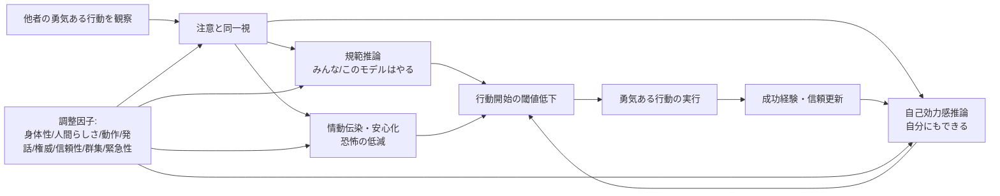

# 社会的学習理論の文脈における勇気の社会的伝播とロボット応用

## Executive Summary

本調査の結論を先に述べる。第一に、「他者の“勇気ある行動”の観察が観察者の勇気を高める」という現象を、そのままの名称で正面から扱う研究はまだ少ない。だが、その近接領域にはかなり強い蓄積がある。具体的には、援助行動のモデリング、同調・規範的影響、ロボットによる説得・服従、アバター／エージェントによるリスク行動変容の研究である。これらを総合すると、**観察者がモデルを「信頼できる・有能である・自分に関係がある・いまこの場の規範を示している」と知覚するとき、観察行動は実際の行動開始に波及しやすい**という一貫した構図が見える。援助行動のモデリングには中程度のメタ分析効果が報告されており、ロボット研究でも群れ・身体性・非言語手掛かり・信頼性が行動変容を左右している。citeturn34search11turn34search2turn18view0turn21view0turn33search16turn25view1turn23view0

第二に、ロボット応用の観点では、既存研究の多くは「勇気」そのものではなく、**援助、服従、寄付、リスク選択、課題継続、避難追従**を測っている。そのため、ロボットが勇気を“伝播”させるという命題は、現時点では直接実証よりも、近接エビデンスの統合として支持される段階にある。特に重要なのは、**身体をもつロボットは画面上のエージェントより unusual request への追従を高めやすい一方、緊急状況では過信も起こりうる**こと、そして**権威役よりも同僚役・ピア役の方が説得的になりうる**ことである。したがって、ロボットで勇気促進を目指すなら、「権威的に命じる」のではなく、「安全な範囲で先にやって見せる・一緒にやる・不確実性を明示する」設計が妥当である。citeturn26view3turn19search4turn19search10turn32search8turn29search6turn23view0turn25view0

第三に、研究デザイン上の核心は、**勇気を単なるリスク選好と混同しない**ことである。勇気は「怖さがあるのに、価値ある目的のために行動を開始すること」に近い構成概念であるのに対し、既存のロボット・アバター研究は、しばしば「より危険な選択をするか」を測っているだけで、恐怖・価値・行動開始を同時には測っていない。今後の本命研究では、**観察されたモデル行動**、**観察者の主観的恐怖**、**価値づけ**、**実際の行動開始**を同時測定する必要がある。citeturn3view2turn6view0turn9view0turn34search2

## 問題設定と概念整理

本テーマを厳密に扱うには、「勇気」を便宜的に操作的定義し直す必要がある。本報告では、勇気を**主観的な恐怖・不安・社会的コスト・身体的コストの存在下で、価値ある目標に向けて行動を開始または持続すること**として扱う。そのうえで、既存研究の多くがこの定義の一部しか測っていない点を明示しておく。たとえば、援助行動研究は「価値ある目標」と「行動開始」をよく捉えるが「恐怖」を必ずしも測らない。逆にリスク課題は「行動選択」を捉えるが、それが勇気なのか単なる高リスク選好なのかを分離しにくい。ロボット避難研究は「危険状況」と「追従行動」を含むが、そこでは勇気よりも服従や過信が前景化しやすい。citeturn34search11turn3view2turn19search4turn26view3

この整理を踏まえると、ロボット応用で狙うべき現象は、単なる「大胆化」ではない。むしろ、**恐怖やためらいで先送りされるが、実行した方が適応的で社会的に望ましい行動**──たとえば援助要請、初期避難、ハラスメント報告、対人場面での発話開始、軽度の不安場面への接近──を、観察を通じて始めさせることである。既存研究はこの方向を十分に言語化していないが、近接証拠の束としては整合的である。citeturn34search2turn19search4turn32search8turn21view0

上図は、今回収集した理論・実証研究を統合した作業モデルである。Bandura系の社会的学習の経路に、同調、情動伝染、信頼、社会的インパクトを重ねると、ロボット応用で検証すべき媒介変数と調整変数がかなり明瞭になる。citeturn21view0turn16search2turn16search9turn18view0turn25view0

## 主要理論と、ロボット観察への適用

Banduraの社会的学習理論／社会的認知理論の核は、**他者の行為観察が後続行動を変える**という命題にある。ロボット研究でもこの枠組みは明示的に援用されており、たとえば子どもがロボットの向社会的行動を学ぶかを問う研究は、理論的出発点としてこの系譜を前面に置いている。さらに、向社会的モデリングのメタ分析では 88研究・25,354名を統合し、観察された向社会的モデルが後続の援助行動を中程度に押し上げることが示されている。ロボットに置き換える際の直観的な翻訳は、**モデルが人間かロボットかよりも、観察者がそのモデルから「いま何が適切か」と「自分にもできる」を受け取れるか**にある。citeturn21view0turn34search2

同調と社会的影響の観点では、entity["people","Solomon Asch","social psychologist"]の古典以降、他者の判断が個人の判断を歪めることはよく知られている。ロボットでも同様の構図は再現されうる。3体のロボット集団が曖昧課題で人の最終判断を変えた研究では、実験条件の同調率が 29%、対照条件が 6% であり、信頼が失われると同調も低下した。つまり、ロボットは単なる刺激ではなく、**規範源・情報源・信頼対象**として作用しうる。citeturn18view0

entity["people","Bibb Latané","social psychologist"]の社会的インパクト理論は、この効果が**source strength（強さ）・immediacy（近接性）・number（数）**で変わると捉える。ロボット応用に引きつけると、権威づけ、物理的な近さ、共在するロボットや群衆の数が、観察者の「これは従うべきか」の閾値を動かす。大阪大学の 2024年フィールド実験で、会話ロボットが「他のロボットもそう言っている」といった implied proponents を会話に織り込むと、提案受容率が上がった一方、数の効果は限定的だった。この結果は、**群集の“量”よりも、規範の“存在感”の設計が重要**であることを示唆する。citeturn16search2turn25view0

情動ルートも無視できない。情動伝染理論では、他者の情動状態や表情・姿勢・声調が観察者に移り、評価や意思決定に影響する。ロボット研究でも、触覚的な抱擁が寄付額を増やしたり、アバターからのフィードバックが不確実な意思決定時の扁桃体応答と賭け行動を変えたりしている。したがって、勇気の伝播は「この行為は安全だ／適切だ」という認知的経路だけではなく、**恐怖の緩衝、落ち着きの共有、ためらいの低減**という情動経路でも起こりうる。citeturn16search9turn21view1turn9view0

最後に、ロボットに特有なのは、**信頼と権威がそのまま有効とは限らない**点である。身体性は服従を強めることがあるが、形式的な authority role は人間同士の説得研究の直観に反して逆効果になる場合がある。Science Robotics の研究では、ロボットは authority role より peer role の方が説得的であり、さらに penalty より reward を提示した方が有効だった。これは勇気促進ロボットを「命令する監督者」ではなく「一緒にやる仲間」「落ち着いて先にやって見せる先導者」として設計すべきことを強く示す。citeturn32search8turn32search10

## 実証研究の整理

本節では、「勇気の直接研究」は少ないため、**人間→人間**, **ロボット／エージェント→人間**, **アバター→人間**のうち、本テーマへの接続が強い研究を優先して整理する。効果サイズは、原著で報告されたものがある場合のみ記す。報告が見当たらないものは NR とした。

### 代表研究一覧

| 系統 | 代表論文 | 方法・被験者 | 操作変数 | 測定指標 | 主結果 | 効果サイズ | 限界 |
|---|---|---|---|---|---|---|---|
| 人間→人間 | Bryan & Test (1967)「Models and Helping」 citeturn34search11 | 自然場面の援助行動研究 | 援助モデルの有無 | 後続援助行動 | 援助モデルの存在で援助行動が有意に増加 | NR | 「勇気」ではなく援助一般。恐怖の直接測定なし |
| 人間→人間 | Prosocial Modeling メタ分析 (2020) citeturn34search2 | 88研究, N=25,354 | 向社会的モデル観察 | 後続の helping | 向社会的モデリングは helping を中程度に増加 | **g = 0.45** | 勇気固有ではない。研究間異質性あり |
| 人間→人間 | Asch 型同調研究のロボット実装との対照枠組み citeturn18view0 | 古典的には confederate 集団と知覚判断 | 多数派圧力 | 判断変更率 | ロボット研究に移植される規範的影響の基底理論 | 原著効果サイズはここでは未整理 | 勇気ではなく判断同調 |
| ロボット→人間 | Salomons et al. (2018) citeturn18view0 | between-subjects, N=30, 3体ロボット集団 | ロボットの事前回答が見える vs 見えない | 予備回答から最終回答への変更率 | 実験条件 29%、対照 6%。信頼喪失で同調低下 | NR | 曖昧課題での informational conformity。高コスト行動ではない |
| ロボット→人間 | Vollmer et al. (2018) citeturn33search2turn33search16 | Asch パラダイム; 成人と 7–9歳児の比較 | ロボット集団圧力 | 誤答への同調 | 成人はロボット圧力に抵抗、子どもは同調 | NR | 年齢一般化に限界。勇気より規範追従 |
| ロボット→人間 | Bainbridge et al. (2010) citeturn25view1turn26view3 | 3条件, N=65。身体ロボット vs live video vs augmented video | 身体性 | unusual request への服従、反応時間、距離 | 身体ロボットは「本をゴミ箱へ」の unusual request 追従を高めた | **η² = .52**（本を捨てた行動）, **η² = .56**（ゴミ箱への注意） | 勇気ではなく服従／信頼 |
| ロボット→人間 | Robinette et al. (2016) citeturn19search4turn19search10 | 模擬火災・避難 | 事前にロボットが不信頼と経験されるか | 緊急時にロボットへ追従するか | 26名全員が緊急時には追従。過信が示唆 | 天井効果, NR | 適応的勇気ではなく overtrust の危険も含む |
| ロボット→人間 | Chidambaram et al. (2012) citeturn23view0 | 4条件, N=32 | 非言語 cue（身体 cue / 音声 cue） | 提案への compliance | 非言語 cue 全体で compliance 増、特に身体 cue が有効 | **ηp² = .212**（nonverbal 全体）, **.306**（bodily vs none）, **.184**（bodily vs vocal） | 仮想状況課題。現実の高コスト行動に未検証 |
| ロボット→人間 | Hanoch et al. (2021) citeturn3view2turn4view0 | 4条件, N=249, BART | 物理的ロボット有無 × 口頭 encouragement 有無 | Risk propensity, 安全/危険選択 | 物理的存在だけでは変化せず、口頭 encouragement が risk-taking を増加 | NR | 勇気と risk preference を分離していない |
| ロボット→人間 | de Haas et al. (2021) citeturn21view0 | 1要因実験, 8–10歳児 N=61 | 強い向社会的ロボット vs 弱い向社会的ロボット | sticker 寄付量, 規範知覚 | 強向社会ロボットで寄付量増。descriptive norms も上昇 | NR | 子ども対象。援助であり恐怖は低い |
| ロボット→人間 | Shiomi et al. (2017) citeturn21view1 | 日本人成人, 約36–38名 | 抱擁の返報あり vs なし | 寄付額, 寄付有無 | 返報的ハグは寄付額を増やした | NR | 勇気ではなく prosociality。触覚要因が主 |
| アバター→人間 | Di Dio et al. (2023) citeturn6view0turn7view0 | 青年期対象, N=113, ギャンブル課題 | human profile / robot profile × 有益/有害 nudge | risk-taking, risk perception | nudge は risky decision を増やしたが、human vs robot profile 差は有意でない | NR | 助言観察であり、「勇気ある行動の観察」ではない |
| アバター→人間 | Tanaka et al. (2025) citeturn9view0turn10view0 | fMRI/行動実験 | avatar からの feedback | gambling behavior, 扁桃体応答 | avatar feedback は賭け行動を増加し、扁桃体の feedback uncertainty 応答を調整 | NR（有意確率は極めて小） | 神経機序は示すが、勇気ではなく risk-taking 調整 |

この表から見える重要点は三つある。第一に、**ロボット観察が実際の行動を変えること自体は、もはや争いにくい**。第二に、ただしそれが「勇気」か「服従」か「過信」か「単なるリスク選好」かは、測定設計次第でまったく異なる。第三に、**もっとも直接に“勇気の伝播”へ近いのは、援助モデル研究と、恐怖・不安のもとでの行動開始を測るデザインであり、現行HRIの中心的手法である BART や gambling task は代替指標としてはやや粗い**という点である。citeturn34search11turn34search2turn19search4turn3view2turn9view0

## 測定法の比較

### 測定法比較表

| 測りたい構成概念 | 実際に使われていた主な指標 | 妥当性上の長所 | 弱点 | ロボット研究での推奨 |
|---|---|---|---|---|
| 行動開始 | 援助行動の有無、寄付、有言実行、避難追従、最終回答変更、課題継続時間 citeturn34search11turn26view3turn18view0turn21view0 | 行動そのものを測るため外的妥当性が高い | 行為の意味づけが「勇気」以外にもなりうる | **主指標にすべき** |
| 恐怖抑制／ためらい低減 | 反応潜時、hesitation、approach/avoidance の観察、緊急時の初動 citeturn26view3turn19search4 | 勇気の“開始”に近い | 恐怖の主観を同時に取らないと解釈が揺れる | 主観恐怖とセットで使う |
| リスク選好 | BART, gambling rate, unsafe choice proportion citeturn3view2turn6view0turn9view0 | 統制が容易で感度が高い | 高リスク選好と勇気を混同しやすい | **単独では不十分** |
| 社会的影響 | 同調率、提案受容率、規範知覚、信頼喪失後の追従低下 citeturn18view0turn25view0 | 伝播メカニズムの検出に有効 | 行為の価値性・恐怖性を担保しにくい | 媒介・操作チェックに向く |
| 情動・神経反応 | 扁桃体反応、ストレス緩衝関連指標の導入可能性 citeturn9view0turn21view1 | 機序推定に有利 | コスト高、エコロジカル妥当性が低い | 第2段階研究で補助的に使用 |
| 自己報告 | 信頼、知覚リスク、主観的怖さ、自己効力感、規範知覚、説得性評価 citeturn18view0turn23view0turn21view0 | 媒介仮説を直接検証できる | 社会的望ましさ・需要特性の影響 | 行動指標の補助として必須 |

測定法に関する実践的結論は明確である。**勇気の伝播**を名乗るためには、最低でも  
**(a) 主観的な怖さ／ためらい**、  
**(b) 価値ある目標**、  
**(c) 実際の行動開始**  
の三点を同時に押さえる必要がある。したがって、最もよいデザインは、**行動指標を主、自己報告を媒介、副次的に生理指標を補助**とする三層構成である。既存HRI研究で一般的な risk task だけでは、勇気研究としては不十分である。citeturn3view2turn9view0turn26view3turn34search2

## ロボット特性・文脈による効果変動

ロボットの**身体性**は、影響力を押し上げる最も頑健な要因の一つである。物理的に共在するロボットは、ライブ映像や画面上エージェントよりも unusual request への服従を高め、より大きな personal space も引き出した。これは、勇気促進文脈では「実在性」「いまこの場の規範性」を高める可能性がある反面、危険な overtrust にもつながりうる。citeturn25view1turn26view3

**動作と非言語行動**も重要である。近接性、視線、ジェスチャ、姿勢といった bodily cues は、音声 cue だけよりも説得力と compliance を高めた。勇気伝播に引きつければ、ロボットは単に「勇気を出して」と言うより、**落ち着いた視線、ためらいの少ない先行動作、進行方向を示す身体運動**を見せた方が効きやすい可能性が高い。citeturn22view4turn23view0

**信頼性**は二面性をもつ。Salomons らの研究では、ロボットが誤答を出し始めて trust が落ちると同調も低下した。これは望ましい較正である。他方、模擬火災では、事前に不信頼と経験していても緊急時には全員がロボットに従った。つまり、**平時には信頼校正が働いても、切迫状況では authority/urgency が信頼校正を上書きする**おそれがある。ロボットで勇気を促す設計では、この切り替わりを前提にしなければならない。citeturn18view0turn19search4turn19search10

**社会的地位・役割**については、単純な「権威づけ」が最適解ではない。Science Robotics の結果では peer role の方が authority role より説得的であり、Haring らの要約でも human-likeness と embodiment の効果は弱く、人間コーチへの服従には及ばなかった。加えて、security guard ロボットのフィールド研究は、aggression, responsiveness, anthropomorphism, safety, intelligence が服従判断を左右したことを示している。総じて、**ロボットに高い地位を与えること自体より、役割に合った安全性・応答性・能力知覚を与えることの方が重要**である。citeturn32search8turn29search6turn30search0turn30search2

**群集・他者の存在**も効く。3体ロボット集団は人の回答変更を引き起こし、子どもはロボット集団圧力に同調した。さらに、直接目の前にいない「他のロボットが支持している」という implied proponents だけでも提案受容率は上がった。よって、勇気促進ロボットを単独で置くより、**“他の者もやっている”という記述的規範を慎重に付加した方が効果は高い**可能性がある。ただし、数の効果は限定的であり、過剰な群集演出は拒否感や操作感を生みうる。citeturn18view0turn33search16turn25view0

**支援要請と触覚的支援**については、向社会研究がヒントになる。ロボット自身が向社会的モデルを示すと子どもの寄付行動が増え、返報的なハグは寄付額を増加させた。よって、ロボットが「勇気を出して」と命じるより、**先に小さな向社会行動を示す、身体的安心を与える、支援関係を先に作る**方が行動開始に効く可能性が高い。citeturn21view0turn21view1

## 実験デザイン提案

以下では、ロボットによる「勇気の伝播」を直接に検証するための実験案を、既存研究の effect size 帯域と限界を踏まえて比較する。サンプルサイズは**実務的な目安**であり、最終的には目的効果量と除外率を見込んだ power analysis で再計算すべきである。中程度の効果は prosocial modeling の g=.45、robot bodily cue の ηp²≈.18–.31 などから期待できるが、勇気研究では効果が減衰しやすいので、追試可能性を優先してやや大きめに取る設計を推奨する。citeturn34search2turn23view0

### 推奨デザイン比較表

| 目的 | 介入条件 | 対照条件 | 主要指標 | 事前事後測定 | 操作チェック | 目安サンプル | 主要混同因子 | 倫理上の要点 |
|---|---|---|---|---|---|---|---|---|
| 低リスクの「行動開始」検証 | ロボットが先に安全だがためらいやすい行動を実演し、「一緒にやろう」と促す | ロボットが中立行動のみ / 人間モデル / 画面上アバター | 行動開始の有無、潜時、完了率 | 怖さ、自己効力感、知覚リスク、信頼 | ロボットを有能・安心・ピアと知覚したか | **各群40–60名** | 既存のロボット親和性、 trait anxiety、好奇心 | 欺瞞は最小化。 aversive だが安全な課題のみ |
| 「向社会的勇気」検証 | ロボットが先に援助・発話・通報・助けを求める行動を示す | 価値は同じだがロボットは行動しない / 口頭指示のみ | 援助実行、発話開始、通報率、潜時 | 道徳的妥当感、怖さ、規範知覚 | 「他者もそうするはず」という記述的規範知覚 | **総計150–240名** | 観察者の prosocial orientation、社会的望ましさ | 他者被害を伴う場面は使わず、 staged task に限定 |
| 緊急・群集文脈の検証 | ロボットが落ち着いて初動避難／支援行動を先行実演、必要なら他ロボット支持 cues を付与 | 中立誘導 / authority 指示のみ / reliability 低下条件 | 初動行動、追従経路、 hesitation、逸脱率 | 恐怖、信頼、責任感、危険知覚 | ロボットの信頼性・権威性・切迫性知覚 | **総計120–180名** | 過信、驚愕反応、消防訓練経験 | 実火災や強いパニック誘発は避ける。十分な debrief 必須 |
| 機序解明 | 上記いずれかに physiology / neuro を追加 | 同上 | 行動 + 生理 | 同上 | 同上 | **別枠で小規模精密** | 装置拘束の影響 | 不快負荷の上限設定が必要 |

### 具体的な設計指針

第一に、**介入は「命令」ではなく「先行実演＋共同遂行」**にするべきである。authority role は backfire しうる一方、peer role や bodily cue は比較的一貫して効く。ロボットは「君もやれ」ではなく、「私はこうした。危険はこの程度。必要なら一緒にやる」と示す方がよい。citeturn32search8turn23view0

第二に、**観察モデルの比較は最低でも human / robot / avatar の三群**を置くべきである。既存研究では human と robot avatar の差が小さい場合もあるが、物理ロボットの身体性は別に効く。したがって、画面上 avatar の肯定的結果だけで physical robot の効果を代替推定してはならない。citeturn6view0turn25view1

第三に、**主要アウトカムは実行行動**とするべきである。risk task の得点だけでは勇気研究にならない。推奨される一次アウトカムは、行動の有無、潜時、完了率、持続時間、必要な支援要請の実行などである。二次アウトカムとして主観的怖さ、自己効力感、信頼、規範知覚を置き、これらを媒介分析する。citeturn34search2turn19search4turn18view0

第四に、**潜在的混同因子**を事前に抑える必要がある。具体的には、ロボットへの既有態度、ロボット経験、trait anxiety、sensation seeking、向社会志向、文化的規範、年齢、性別、観察者がロボットを「命令者」と見たか「仲間」と見たかである。特に子どもは影響を受けやすい一方、成人はロボット集団圧力に抵抗しやすい。この年齢差は、対象領域を選ぶうえで非常に重要である。citeturn33search2turn33search16turn29search6

## 研究ギャップと実用化に向けた推奨

最大の研究ギャップは、**ロボットが“勇気ある行動を自ら示し、それを観察した人が勇気ある行動を取る”ことを直接測った研究がほとんどない**点である。現時点の証拠は、援助モデリング、同調、寄付、服従、リスクテイク、避難追従の断片をつないだものであり、恐怖・価値・行動開始を一つの枠で統合した研究は乏しい。ここが本テーマにおけるもっとも大きな空白である。citeturn34search2turn19search4turn3view2turn9view0

第二のギャップは、**適応的勇気と危険な過信の境界**が十分に検討されていない点である。緊急時ロボット研究は、人がロボットを信じすぎる危険を示している。勇気促進システムは、人をむやみに危険へ向かわせるものであってはならない。したがって、「怖さを減らす」ことよりも、「安全に、目的に照らして適切な行動を始めさせる」ことをデザイン目標に置く必要がある。citeturn19search4turn19search10turn32search7

第三のギャップは、**媒介メカニズムの同時計測不足**である。既存研究では trust、norm、risk、compliance のどれか一つを主に見ていることが多い。しかし勇気伝播の判断には、少なくとも自己効力感、主観的怖さ、記述的規範、ロボット信頼、役割知覚が絡む。今後はこれらを競合的に入れ、**何が本当に行動開始を媒介したのか**を検証する必要がある。citeturn18view0turn25view0turn23view0

実用化への推奨は以下である。  
ロボット設計の第一原則は、**権威的な命令者ではなく、能力のあるピア／伴走者としてふるまうこと**。第二に、**身体的共在・視線・ジェスチャ・進行方向提示**などの bodily cue を活用すること。第三に、**信頼の較正**を必須仕様にすること。具体的には、不確実性の明示、限界の説明、誤り時の修正、ユーザの opt-out を許す。第四に、**群集規範の設計を慎重に使うこと**。他ロボット・他者の支持は効くが、操作感が強すぎると逆効果になりうる。第五に、初期応用領域は、災害時の本番ではなく、**訓練・教育・支援的状況**から始めるのが安全である。たとえば、避難訓練、学校でのいじめ通報支援、医療現場での支援要請、対人不安場面での発話開始支援、就労場面での help-seeking 支援などが現実的である。citeturn32search8turn23view0turn25view1turn25view0turn19search4

日本語研究について補足する。日本語査読文献で「勇気の伝播」をロボット文脈で正面から扱う蓄積は、今回確認できた範囲では非常に限られている。他方で、「周囲の他者のふるまいが見知らぬ他者への援助行動に及ぼす」ことを問う日本語研究は出始めており、日本語圏でも伝播・規範・援助の接点は立ち上がりつつある。ロボット応用側では、日本の研究グループが抱擁ロボットや複数ロボットの規範提示など、設計要因を精密に扱う研究を蓄積しているため、今後は**日本語圏の援助行動研究 × HRI研究**の接続が有望である。citeturn34search15turn21view1turn25view0

## Open questions / limitations

本調査には限界がある。古典的な Bandura 系の恐怖低減モデリング研究は理論的に中核だが、今回の調査では原著全文への安定アクセスが限られ、表には高信頼で再確認できた論文を優先して載せた。そのため、**理論的中心性に比して、恐怖症・BAT 系列の古典論文の記述は控えめ**になっている。また、HRI 論文の一部は会議録・抽象レベルの情報しか得られず、**効果サイズが未報告**の行が残った。したがって、本報告は「勇気伝播」という新規応用テーマの設計・仮説生成には十分使えるが、厳密なメタ分析前段階のレビューと位置づけるのが適切である。citeturn34search2turn29search6turn30search0

## 主要原著・主要関連文献

### 英語主要原著

- Bryan, J. H., & Test, M. A. (1967). *Models and helping: Naturalistic studies in aiding behavior.* citeturn34search11
- Bainbridge, W. A., Hart, J., Kim, E. S., & Scassellati, B. (2010). *The Benefits of Interactions with Physically Present Robots over Video-Displayed Agents.* citeturn25view1
- Chidambaram, V., Chiang, Y.-H., & Mutlu, B. (2012). *How Robots Might Persuade People Using Vocal and Nonverbal Cues.* citeturn23view0
- Robinette, P., Li, W., Allen, R., Howard, A. M., & Wagner, A. R. (2016). *Overtrust of Robots in Emergency Evacuation Scenarios.* citeturn19search4
- Salomons, N., van der Linden, M., Sebo, S. S., & Scassellati, B. (2018). *Humans Conform to Robots: Disambiguating Trust, Truth, and Conformity.* citeturn18view0
- Vollmer, A.-L., Read, R., Trippas, D., & Belpaeme, T. (2018). *Children conform, adults resist: A robot group induced peer pressure on normative social conformity.* citeturn33search10turn33search16
- Hanoch, Y., et al. (2021). *Human–Robot Interaction and Risk-Taking Behavior.* citeturn3view2turn4view0
- de Haas, M., et al. (2021). *A social robot that models prosocial behavior increases children’s prosocial behavior.* citeturn21view0
- Saunderson, S. P., & Nejat, G. (2021). *Persuasive robots should avoid authority: The effects of formal and real authority on persuasion in human-robot interaction.* citeturn32search8turn32search10
- Di Dio, C., et al. (2023). *Virtual agents and social nudging in adolescents’ risk-taking.* citeturn6view0turn7view0
- Sakai, K., Ban, M., Mitsuno, S., Ishiguro, H., & Yoshikawa, Y. (2024). *Leveraging the Presence of Other Robots to Promote Acceptability of Robot Persuasion: A Field Experiment.* citeturn25view0
- Tanaka, Y., et al. (2025). *Feedback from an avatar facilitates risk-taking by modulating the amygdala response to feedback uncertainty.* citeturn9view0turn10view0

### 理論・レビュー

- Hatfield, E., Cacioppo, J. T., & Rapson, R. L. (1993). *Emotional Contagion.* citeturn16search9
- Latané, B. (1981). *The Psychology of Social Impact.* citeturn16search2
- Prosocial Modeling Review (2020). *Prosocial Modeling: A Meta-Analytic Review and Synthesis.* citeturn34search2

### 日本語関連文献

- 平山陽菜ほか（2025）「周囲の他者のふるまいが見知らぬ他者への援助行動に及ぼす…」J-STAGE 掲載論文。citeturn34search15
- 日本認知科学会関連発表（2024）「見知らぬ他者への援助行動は伝播するか？」関連予稿。citeturn34search16
- Shiomi, M. ほか（2017）日本の研究グループによる *A Hug from a Robot Encourages Prosocial Behavior*。日本人成人サンプルを用いた英語原著。citeturn21view1