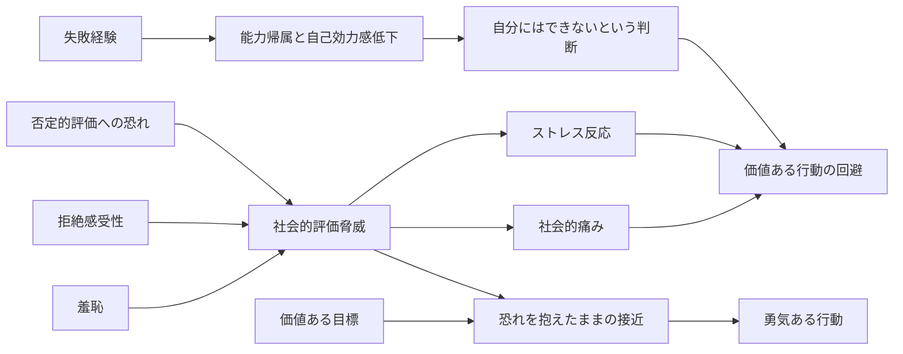

# 背景文を支える文献レビュー

## エグゼクティブサマリー

ご提示の背景文は、**観察学習そのもの**よりも、むしろ **自己効力感と学習性無力感**, **否定的評価への恐れ**, **拒絶・羞恥・社会的評価脅威による回避**, **社会的痛み**, そして **恐れを抱えながらも行動する勇気** の文献で、より強く裏づけられます。失敗は「能力がない」という自己判断を強め、以後の挑戦を回避させうること、また他者から否定的に評価されるかもしれないという予期は、実際に身体的危険が乏しい場面でも、強いストレス反応や回避を生むことが一貫して示されています。とくに rejection sensitivity、shame、social-evaluative threat、social pain の研究は、拒絶・恥・対人的摩擦が「主観的には十分に危険」であることを補強します。さらに勇気研究では、勇気は「恐れがないこと」ではなく、**恐れがあるにもかかわらず価値ある行為を遂行すること**として定義・測定されてきました。したがって、イントロは「能力不足」だけでなく、**社会的・心理的リスクを見積もる心的過程と、それでも行動を開始する勇気**を軸に構成すると、学術的適合性が高くなります。 citeturn17view0turn19view0turn21view0turn12view0turn41view0turn5view2turn40view0turn28search4turn25view0

## 背景文と支持文献の早見表

| 背景文 | 中核概念 | 代表的な支持文献 | そのまま使える本文内引用例 |
|---|---|---|---|
| 人は成長する過程で、失敗経験や他者評価への不安から、「自分にはできない」と判断し、価値ある行動であっても実行を避けることがある。 | 失敗経験→無力感・低自己効力感、否定的評価恐怖→回避 | Bandura, 1982; Dweck & Reppucci, 1973; Dweck, 1975; Schunk, 1981; Watson & Friend, 1969; 笹川他, 2004 | （Bandura, 1982; Dweck & Reppucci, 1973; Watson & Friend, 1969; 笹川他, 2004） |
| このような場面は、客観的には大きな危険を伴わない場合でも、本人にとっては失敗、拒絶、恥、対人的摩擦といった心理的・社会的リスクを伴う。 | 社会的評価脅威、拒絶感受性、羞恥、社会的痛み | Downey & Feldman, 1996; Tangney, 1990; Tangney et al., 1996; Dickerson & Kemeny, 2004; Dickerson et al., 2009; Eisenberger et al., 2003; Kross et al., 2011 | （Downey & Feldman, 1996; Tangney et al., 1996; Dickerson & Kemeny, 2004; Eisenberger et al., 2003） |
| したがって、コンフォートゾーンを越えて行動するためには、単に能力や知識だけでなく、恐れやためらいを抱えながらも行動に向かう勇気が必要になる。 | 勇気＝恐れの不在ではなく、恐れがあっても行動すること | Rachman, 1984; Norton & Weiss, 2009; Woodard & Pury, 2007; Howard et al., 2017; 下司他, 2023 | （Rachman, 1984; Norton & Weiss, 2009; Woodard & Pury, 2007; 下司他, 2023） |

上表の対応は、自己効力感・学習性無力感、社会的評価脅威、拒絶感受性、羞恥、社会的痛み、勇気研究という、互いに独立しつつ接続可能な文献群をもとに整理したものです。とくに、**「観察学習」だけではなく、自己判断・脅威知覚・感情・行動開始を結ぶモデル**として読むと、あなたのイントロ意図により適合します。 citeturn17view0turn21view0turn12view0turn41view0turn5view2turn40view0turn39search0turn28search4turn25view0turn24view0

## 注釈付き主要文献レビュー

**Bandura, A. (1982). *Self-efficacy mechanism in human agency*. *American Psychologist, 37*(2), 122–147.**  
DOI: `https://doi.org/10.1037/0003-066X.37.2.122`  
OA PDF: `https://dradamvolungis.com/wp-content/uploads/2012/01/s2-bandura-1982-self-efficacy-mechanism-in-human-agency.pdf`  citeturn16search7turn17view0

この古典的理論論文は、自己効力感判断が活動選択・努力・持続・情動反応を左右すると明示し、**人は自分の対処能力を超えると信じる活動を避ける**一方、遂行可能と判断した課題には取り組むと論じています。また、失敗経験に対する「諦め」や「意気消沈」も、自己効力感の枠組みで説明できると位置づけています。  
研究タイプ・サンプル・主要統計: 理論統合レビュー。単一サンプルではなく既存の因果実験を総合しており、本文では「自己効力感が高いほど遂行達成が高く、情動喚起が低い」とまとめています。  
関連度: **高**。あなたの文の「自分にはできないと判断し、行動を避ける」を最も直接に支える基本文献です。 citeturn19view0turn19view1turn19view2

**Schunk, D. H. (1981). *Modeling and attributional effects on children’s achievement: A self-efficacy analysis*. *Journal of Educational Psychology, 73*, 93–105.**  
OA PDF: `https://libres.uncg.edu/ir/uncg/f/D_Schunk_Modeling_1981.pdf`  citeturn15view0

Schunk は、**算数で反復失敗を経験してきた児童**を対象に、モデリングと努力帰属が自己効力感・持続・達成にどう影響するかを検討しました。導入部では、能力を過大評価した者は反復失敗で意気消沈し、逆に能力を過小評価した者は達成場面そのものを避けやすいと整理されており、発達のなかで失敗経験が自己判断と回避傾向を組織するというあなたの主張に合います。  
研究タイプ・サンプル・主要統計: 実験研究、**56名の児童**（約9～11歳）。取得できた範囲では詳細な効果量までは確認できませんでしたが、反復失敗児を対象にした点が重要です。  
関連度: **高**。とくに「成長過程で」「失敗経験から」低い能力判断が形成されうる、という文脈に適合します。 citeturn15view0

**Dweck, C. S., & Reppucci, N. D. (1973). *Learned helplessness and reinforcement responsibility in children*. *Journal of Personality and Social Psychology, 25*(1), 109–116.**  
OA PDF: `https://slatestarcodex.com/Stuff/dweck73_reinforcement.pdf`  citeturn21view0

Dweck と Reppucci は、成功と失敗が交錯する達成課題で、低い制御期待や能力帰属がどのように**ヘルプレスネス**を生むかを示しました。失敗を「努力不足」ではなく「能力の有無」に結びつける子どもほど、可解な課題に切り替わった後も遂行が崩れやすく、失敗経験が「自分にはできない」という自己信念に変わるプロセスを示しています。  
研究タイプ・サンプル・主要統計: 実験研究、**40名の5年生**。取得できた抄録では包括的な効果量は提示されていませんが、可解課題へ移行しても遂行低下が残ることが主要所見です。  
関連度: **高**。失敗経験が自己信念を介して行動開始や持続を阻害する、という最初の文を強く支えます。 citeturn21view0

**Dweck, C. S. (1975). *The role of expectations and attributions in the alleviation of learned helplessness*.**  
OA PDF: `https://slatestarcodex.com/Stuff/dw1975_attributions.pdf`  citeturn21view1

この研究は、ヘルプレスな子どもが失敗を能力不足として読むと、失敗がその後の失敗継続の合図になってしまうことを示し、**失敗の意味づけを変える再訓練**が持続の改善につながることを検討しました。著者は、単に失敗を消すのではなく、失敗をどう解釈するかが重要だと論じており、あなたの背景文にある「失敗経験から『自分にはできない』と判断する」という主張に非常に近いです。  
研究タイプ・サンプル・主要統計: 実験的介入研究、**極端にヘルプレスな児童12名**を中心に比較。取得できた範囲では効果量は未確認ですが、失敗帰属の再学習が改善に有効という点が重要です。  
関連度: **高**。失敗経験そのものよりも、**失敗が自己能力判断にどう翻訳されるか**を押さえたいときに非常に有用です。 citeturn21view1

**Watson, D., & Friend, R. (1969). *Measurement of social-evaluative anxiety*. *Journal of Consulting and Clinical Psychology, 33*(4), 448–457.**  
DOI: `https://doi.org/10.1037/h0027806`  
参照URL: `https://www.researchgate.net/publication/17374704_Measurement_of_social-evaluative_anxiety`  citeturn7search4turn12view0

Watson と Friend は Fear of Negative Evaluation という、**他者から否定的に評価されることへの不安**を測る古典的尺度を提案しました。彼らの要約によれば、高 FNE 者は評価場面で神経質になり、**不承認を避ける、あるいは承認を得るために行動する**傾向を示し、否定的評価への恐れが回避的・防衛的行動に結びつくことを示しました。  
研究タイプ・サンプル・主要統計: 尺度開発と妥当化研究、**358名の大学生**、**3つの実験**と相関研究を含む。効果量の細部は取得した範囲では確認できませんでした。  
関連度: **高**。あなたの背景文の「他者評価への不安から…実行を避ける」を支える最重要の古典です。 citeturn12view0

**笹川智子・金井嘉宏・村中泰子・鈴木伸一・嶋田洋徳・坂野雄二 (2004). 他者からの否定的評価に対する社会的不安測定尺度短縮版作成の試み. *行動療法研究, 30*(2), 87–98.**  
DOI: `https://doi.org/10.24468/jjbt.30.2_87`  
J-STAGE: `https://www.jstage.jst.go.jp/article/jjbt/30/2/30_KJ00008937980/_article/-char/ja/`  
PDF: `https://www.jstage.jst.go.jp/article/jjbt/30/2/30_KJ00008937980/_pdf/-char/ja`  citeturn10search0turn10search1turn10search9

日本語で FNE を扱うなら、この短縮版尺度論文は実用上とても有用です。項目反応理論に基づき、**高い社会的不安水準での測定精度が高い**短縮尺度を示しており、日本語圏で「否定的評価への恐れ」を導入する際の測定的正当性を与えます。  
研究タイプ・サンプル・主要統計: 日本語尺度開発・IRT 検証。取得した要約では標本数の詳細は確認できませんでしたが、**12項目5件法**で広い特性値範囲に安定した精度を持つと報告されています。  
関連度: **中〜高**。因果メカニズムの一次証拠ではありませんが、日本語で概念導入をする際の橋渡しとして重要です。 citeturn10search0turn10search1

**Downey, G., & Feldman, S. I. (1996). *Implications of rejection sensitivity for intimate relationships*. *Journal of Personality and Social Psychology, 70*(6), 1327–1343.**  
OA PDF: `https://psychology.columbia.edu/sites/default/files/2016-11/merp.pdf`  citeturn41view0

Downey と Feldman は rejection sensitivity を、**拒絶を不安に予期し、容易に知覚し、過剰反応する傾向**として定義しました。複数研究を通じて、拒絶感受性の高い人は曖昧な相手の振る舞いを拒絶として読みやすく、嫉妬・敵意・非支持的行動が関係満足を損ね、さらに**葛藤解決を妨げる**ことを示しています。  
研究タイプ・サンプル・主要統計: 複数研究を含む経験的論文。取得できた本文では、関係満足への経路で**標準化回帰係数 .39** が示されています。  
関連度: **高**。あなたの文の「拒絶」「対人的摩擦」といった**予期された社会的リスクが回避や防衛行動を生む**ことを強く支えます。 citeturn41view0

**Tangney, J. P. (1990). *Assessing individual differences in proneness to shame and guilt: Development of the Self-Conscious Affect and Attribution Inventory*. *Journal of Personality and Social Psychology, 59*(1), 102–111.**  
参照URL: `https://www.researchgate.net/publication/20941543_Assessing_Individual_Differences_in_Proneness_to_Shame_and_Guilt_Development_of_the_Self-Conscious_Affect_and_Attribution_Inventory`  citeturn6view0turn38view2

Tangney は羞恥と罪悪感を区別し、**羞恥は自己全体への否定的評価**、しかも内的・全般的・統制困難な帰属と結びつきやすいと整理しました。これは、失敗や社会的失態が単なる出来事ではなく、「自分そのものがだめだ」という形で受け取られうることを示し、行動回避の心理的基盤を与えます。  
研究タイプ・サンプル・主要統計: 尺度開発研究。**大学生3研究＋非大学成人1研究**を用いて信頼性・妥当性を検証。  
関連度: **高**。あなたの背景文にある「恥」を、単なる感情語でなく、自己評価と結びつく学術概念として導入できます。 citeturn38view2turn6view0

**Tangney, J. P., Miller, R. S., Flicker, L., & Barlow, D. H. (1996). *Are shame, guilt, and embarrassment distinct emotions?* *Journal of Personality and Social Psychology, 70*(6), 1256–1269.**  
参照URL: `https://www.researchgate.net/publication/14472467_Are_Shame_Guilt_and_Embarrassment_Distinct_Emotions`  citeturn4search10turn5view4

この研究では、羞恥・罪悪感・当惑の経験が比較され、羞恥はとくに**「小さくなりたい」「隠れたい」「消えてしまいたい」**という回避的行動傾向と結びつくことが示されました。つまり、恥は単なる不快感ではなく、対人場面からの撤退や回避を促す自己意識的感情です。  
研究タイプ・サンプル・主要統計: 回想法を用いた経験研究、**大学生182名**。詳細な効果量は取得範囲では未確認ですが、羞恥特有の行動傾向が主要所見です。  
関連度: **高**。ご提示文中の「恥」が回避を生むという点に、もっとも直接的に使えます。 citeturn5view4turn5view1

**Dickerson, S. S., & Kemeny, M. E. (2004). *Acute stressors and cortisol responses: A theoretical integration and synthesis of laboratory research*. *Psychological Bulletin, 130*(3), 355–391.**  
DOI: `https://doi.org/10.1037/0033-2909.130.3.355`  
参照URL: `https://www.apa.org/pubs/journals/releases/bul-1303355.pdf`  citeturn5view2

Dickerson と Kemeny は、**208件の急性ストレス実験**を統合し、最も強い cortisol 反応を引き起こすのは、社会的自己が脅かされ、しかも失敗結果が予期されるような **social-evaluative threat** だと示しました。ここで重要なのは、これらの状況がしばしば**物理的危険ではなく、評価・失敗・恥の可能性**で構成されている点です。  
研究タイプ・サンプル・主要統計: メタ分析、**208研究**。社会的評価と統制不能性を含む課題で cortisol 反応が特に強いという統合所見。  
関連度: **高**。あなたの第二文、「客観的には大きな危険がなくても、本人には心理的・社会的リスクが大きい」を支える最重要メタ分析です。 citeturn5view2turn34search6

**Dickerson, S. S., Gruenewald, T. L., & Kemeny, M. E. (2009). *Social-evaluative threat and proinflammatory cytokine regulation: An experimental laboratory investigation*. *Psychological Science, 20*(10), 1237–1244.**  
DOI: `https://doi.org/10.1111/j.1467-9280.2009.02437.x`  
PubMed: `https://pubmed.ncbi.nlm.nih.gov/19754527/`  citeturn34search0turn34search2turn34search8

この研究は、social-evaluative threat を **「他者から否定的に判断されうる文脈」** と定義し、そのような脅威が炎症性サイトカイン反応の亢進まで引き起こしうることを実験的に検討しました。つまり、**社会的評価の脅威それ自体が身体レベルのストレス反応を生む**ため、「大きな物理的危険はない」というだけでは本人にとって低リスクとはいえません。  
研究タイプ・サンプル・主要統計: 実験的ラボ研究。取得できた抄録範囲ではサンプル数と効果量の細部は未確認。  
関連度: **高**。第二文の「心理的・社会的リスク」を、主観報告だけでなく生理応答で裏づけます。 citeturn34search0turn34search2

**Schlund, M. W., et al. (2021). *Human social defeat and approach–avoidance: Escalating social-evaluative threat and threat of aggression increases social avoidance*. *Journal of the Experimental Analysis of Behavior*.**  
参照URL: `https://www.researchgate.net/publication/348025339_Human_social_defeat_and_approach-avoidance_Escalating_social-evaluative_threat_and_threat_of_aggression_increases_social_avoidance`  citeturn35search2

Schlund らは、負の評価確率が異なる仮想他者を用いた実験で、**social-evaluative threat や social aggression の脅威が高まるほど社会的接近よりも回避が増える**ことを示しました。これは、拒絶・対人的攻撃・評価不安が、実際に対人接触の回避を引き起こすことをかなり直接的に示すデータです。  
研究タイプ・サンプル・主要統計: 実験研究、**38名の成人**。詳細な効果量は取得範囲では未確認。  
関連度: **高**。あなたの第二文の「拒絶、対人的摩擦といったリスクが行動回避を生む」に非常に適合します。 citeturn35search2turn35search0

**Eisenberger, N. I., Lieberman, M. D., & Williams, K. D. (2003). *Does rejection hurt? An fMRI study of social exclusion*. *Science, 302*(5643), 290–292.**  
DOI: `https://doi.org/10.1126/science.1089134`  
OA PDF: `https://sanlab.psych.ucla.edu/wp-content/uploads/sites/31/2016/03/Eisenberger-Lieberman-Williams-2003-Science.pdf`  citeturn40view0

この有名な Cyberball 研究では、社会的排斥時に **dorsal ACC** が賦活し、その活動が主観的苦痛と正に相関すること、さらに **RVPFC** がその苦痛調整に関わることが示されました。著者らは、社会的排斥の苦痛は身体的痛みと機能的に類似する「社会的痛み」と位置づけており、**拒絶が“客観的には非身体的”でも心理的には強く痛い**ことを示しています。  
研究タイプ・サンプル・主要統計: fMRI 実験。取得できた本文断片では、排斥時の ACC 活動 **t = 3.36, r = 0.71, p < .005**、苦痛との相関 **r = 0.88 / 0.75**、媒介分析の Sobel **Z = 3.16, p < .005** が確認できます。  
関連度: **高**。第二文の「本人にとっては…社会的リスク」という部分の神経科学的基盤です。 citeturn40view0

**Kross, E., et al. (2011). *Social rejection shares somatosensory representations with physical pain*. *Proceedings of the National Academy of Sciences, 108*(15), 6270–6275.**  
DOI: `https://doi.org/10.1073/pnas.1102693108`  
参照URL: `https://www.pnas.org/doi/10.1073/pnas.1102693108`  
OA PDF: `https://sites.lsa.umich.edu/emotion-selfcontrol-psych/wp-content/uploads/sites/1322/2013/09/2011_3_Kross_etal_PNAS.pdf`  citeturn29search0turn29search4turn29search8turn37search14

Kross らは、最近の失恋経験を喚起したとき、**身体痛の感覚成分に関わる二次体性感覚野や後部島皮質**が活性化することを示しました。さらに、それらの活性部位が physical pain 研究に高い特異性を持つことが示され、社会的拒絶と身体的痛みの重なりは、単なる比喩ではないと示唆されました。  
研究タイプ・サンプル・主要統計: fMRI 実験。検索可能範囲では、活性部位の physical pain に対する**陽性的中率が最大 88%**と報告されています。  
関連度: **高**。あなたの第二文の補強として、社会的苦痛が「本当に痛い」ことをより強く示す神経科学的証拠です。 citeturn29search4turn29search8

**MacDonald, G., & Leary, M. R. (2005). *Why does social exclusion hurt? The relationship between social and physical pain*. *Psychological Bulletin, 131*(2), 202–223.**  
DOI: `https://doi.org/10.1037/0033-2909.131.2.202`  
PubMed: `https://pubmed.ncbi.nlm.nih.gov/15740417/`  citeturn29search2turn29search6turn29search10

MacDonald と Leary は、社会的排斥が痛みとして経験されるのは、社会的結びつきの断絶反応が身体痛システムの一部に媒介されるためだ、という包括的レビューを提示しました。心理学的・進化論的・神経行動学的証拠を束ねており、**「拒絶は身体的危険ではないのに、なぜこれほど回避されるのか」**という問いへの理論的な背骨になります。  
研究タイプ・サンプル・主要統計: 権威的レビュー論文。単一サンプルではなく、複数領域の研究を統合。  
関連度: **高**。第二文を単発研究ではなく理論的に支える文献として有効です。 citeturn29search2turn29search10

**Rachman, S. J. (1984). *Fear and courage*. *Behaviour Research and Therapy*.**  
参照URL: `https://www.sciencedirect.com/science/article/pii/S0005789484800453`  citeturn39search0turn39search20

Rachman は、恐怖治療の臨床パラドクスから、**恐怖の強い人がそれでも勇敢に行動しうる**ことに注目しました。彼は、勇気は「恐れがないこと」ではなく、**恐れが存在している状況での接近行動**として理解すべきだと論じており、これはあなたの第三文とほぼ同型です。  
研究タイプ・サンプル・主要統計: 理論・臨床的考察。単一効果量ではなく、臨床観察と理論整理が中心。  
関連度: **高**。第三文の定義づけに最も直接的です。 citeturn39search0turn39search20

**Norton, P. J., & Weiss, B. J. (2009). *The role of courage on behavioral approach in a fear-eliciting situation: A proof-of-concept pilot study*. *Journal of Anxiety Disorders, 23*(2), 212–217.**  
DOI: `https://doi.org/10.1016/j.janxdis.2008.07.002`  
参照URL: `https://www.sciencedirect.com/science/article/abs/pii/S0887618508001369`  
PubMed: `https://pubmed.ncbi.nlm.nih.gov/18692986/`  citeturn28search3turn28search4turn23search6

Norton と Weiss は、勇気を **「恐れを経験していても接近行動を取ること」** と定義し、これを測る Courage Measure を作成しました。蜘蛛恐怖を持つ参加者に行動接近課題を行わせたところ、**自己報告された勇気が、恐怖下でどこまで対象に近づけるかを予測**し、勇気が実際の行動開始と関連することを示しました。  
研究タイプ・サンプル・主要統計: 行動実験、**32名**の高蜘蛛恐怖参加者。取得した抄録では詳細な効果量までは確認できませんでした。  
関連度: **高**。第三文の「恐れやためらいを抱えながらも行動に向かう勇気」を、そのまま測定した代表研究です。 citeturn28search4turn23search0

**Woodard, C. R., & Pury, C. L. S. (2007). *The construct of courage: Categorization and measurement*. *Consulting Psychology Journal: Practice and Research, 59*(2), 135–147.**  
参照URL: `https://www.researchgate.net/publication/232442435_The_Construct_of_Courage_Categorization_and_Measurement`  citeturn25view0

Woodard と Pury は、勇気尺度を再分析し、勇気が物理的脅威だけでなく、**社会的脅威・情動的脅威・仕事や信念に関わる文脈**でも成立することを示しました。重要なのは、ここで勇気が「危険なら何でも」ではなく、**重要な目標のために脅威状況で行動すること**として整理されている点で、あなたの「価値ある行動」に結びつけやすいです。  
研究タイプ・サンプル・主要統計: 尺度再分析と再検証。Phase 1 は **47名**、Phase 3 は **162名**、原尺度作成データは **200名**。4因子解で**総分散の 31.4%〜37%** を説明。  
関連度: **高**。第三文における「勇気」の学術的定義と、**社会的リスクを含む勇気**の位置づけに有用です。 citeturn25view0

**Howard, M. C., Farr, J. L., Grandey, A. A., & Gutworth, M. B. (2017). *The creation of the Workplace Social Courage Scale*. *Journal of Business and Psychology, 32*(6), 673–690.**  
DOI: `https://doi.org/10.1007/s10869-016-9463-8`  
OA PDF: `https://mattchoward.com/wp-content/uploads/2015/04/howard_farr_grandey_gutworth_2016_jbp.pdf`  citeturn32search0turn32search2turn32search6

Howard らは、**social courage** を「意図的・熟慮的・利他的な行為で、他者からの評価や尊重を損なう社会的コストを伴いうるもの」と定義しました。これは、客観的な身体的危険がなくても、**面子の喪失、関係悪化、評価低下**を引き受けて発言・行動することが勇気であるという、あなたの第三文にかなり近いモデルです。  
研究タイプ・サンプル・主要統計: 尺度開発、**4研究7サンプル**。現在取得した要約では個別の効果量までは確認していません。  
関連度: **高**。特に「対人的摩擦や評価低下を恐れつつ、それでも動く」という**社会的勇気**を言語化したいときに強いです。 citeturn32search0turn32search2

**下司忠大・吉野伸哉・小塩真司 (2023). 日本語版勇気尺度の作成──項目反応理論を用いた尺度構成──. *心理学研究, 94*(1), 43–53.**  
DOI: `https://doi.org/10.4992/jjpsy.94.21234`  
J-STAGE: `https://www.jstage.jst.go.jp/article/jjpsy/94/1/94_94.21234/_article/-char/ja/`  citeturn24view0

日本語で勇気概念を導入するなら、この論文はきわめて便利です。Norton & Weiss の Courage Measure を翻訳し、**1因子構造・十分な測定精度・妥当性**を確認しており、日本語圏で「恐れがあっても行動する傾向」を扱える基盤を与えます。  
研究タイプ・サンプル・主要統計: 尺度適応研究。**Study 1: N = 1,000、Study 2: N = 366、Study 3: N = 200**。行動指標との基準関連妥当性も確認。  
関連度: **高**。日本語論文のイントロと今後の測定計画の双方に役立ちます。 citeturn24view0

## イントロとして使うときの統合解釈

ご提示の背景文を学術的に最も自然な形で支えるのは、**観察学習の枠外**にある次の連鎖です。まず、失敗経験や失敗の能力帰属は、ヘルプレスネスや低自己効力感を通じて「自分にはできない」という自己判断を強めます。次に、否定的評価への恐れ、拒絶感受性、羞恥は、客観的には高い身体的危険がない場面でも、社会的評価脅威として知覚され、ストレス反応や対人回避を引き起こします。最後に、勇気はそうした恐れが消えた後に必要なのではなく、**恐れが存在するままでも価値ある行動に着手するために必要**だと整理できます。 citeturn17view0turn21view0turn12view0turn41view0turn5view2turn40view0turn39search0turn28search4turn25view0

この意味で、あなたのイントロは Bandura の「観察学習」には限定されません。むしろ Bandura のなかでも **自己効力感** が鍵であり、そこに Dweck のヘルプレスネス研究、Downey の rejection sensitivity、Tangney の羞恥研究、Dickerson の social-evaluative threat、Eisenberger・Kross の social pain、そして Rachman / Norton の courage 研究を接続した方が、文意に合う構成になります。 citeturn17view0turn21view0turn41view0turn6view0turn5view2turn40view0turn29search8turn39search0turn28search4

より厳密に書くなら、「コンフォートゾーン」という一般語をそのまま押し出すよりも、**自己効力感の低下**, **社会的評価脅威**, **羞恥・拒絶の予期**, **恐れのもとでの接近行動としての勇気** という学術語に翻訳した方が、引用可能な研究群に直結します。とくに第二文は、単に「主観的に怖い」と書くより、**社会的・心理的リスクは身体的危険とは別種の脅威であり、それでも実在の苦痛と回避を生む**と表現すると、根拠の厚みが増します。 citeturn34search2turn5view2turn40view0turn29search4turn32search0

**限界と未解決点**  
「コンフォートゾーン」自体は、今回確認した主要心理学文献では中心概念ではありません。したがって本文では、その語を使う場合でも、実証的には **低自己効力感による回避**、**社会的評価脅威**、**社会的痛み**、**勇気** という概念に分解して論じる方が安全です。また、失敗経験から低自己信念に至る経路は、能力観・帰属・反すう・対人史など複数経路があり、単線的に断定しすぎない方が良いでしょう。 citeturn21view0turn21view1turn17view0turn41view0turn6view0

## 本文で使える引用表現と概念図

背景文を論文イントロとして少しだけ学術寄りに整えるなら、次のような引用の付け方が使いやすいです。

**第一文の推奨本文内引用**  
人は成長の過程で、失敗経験や他者から否定的に評価されることへの不安を通じて、自身の対処可能性を低く見積もり、「自分にはできない」と判断して価値ある行動を回避することがある（Bandura, 1982; Dweck & Reppucci, 1973; Watson & Friend, 1969; 笹川他, 2004）。 citeturn17view0turn21view0turn12view0turn10search1

**第二文の推奨本文内引用**  
このような場面は、客観的には重大な身体的危険を伴わない場合でも、拒絶・羞恥・否定的評価・対人的葛藤といった社会的評価脅威を含み、本人にとっては強い心理的・社会的リスクとして経験されうる（Downey & Feldman, 1996; Tangney et al., 1996; Dickerson & Kemeny, 2004; Eisenberger et al., 2003）。 citeturn41view0turn5view4turn5view2turn40view0

**第三文の推奨本文内引用**  
したがって、そうした状況で行動を開始するためには、能力や知識のみならず、恐れやためらいを抱えながらも価値ある行為へ接近する勇気が必要になる（Rachman, 1984; Norton & Weiss, 2009; Woodard & Pury, 2007; 下司他, 2023）。 citeturn39search0turn28search4turn25view0turn24view0

下の概念図は、今回の文献群を**イントロ用に統合した最小モデル**です。とくに Bandura／Dweck 系の自己信念、Tangney／Downey／Dickerson 系の社会的脅威、Eisenberger／Kross 系の社会的痛み、Rachman／Norton／Woodard 系の勇気を一枚でつなぐことを意図しています。 citeturn17view0turn21view0turn41view0turn5view2turn40view0turn29search4turn39search0turn28search4turn25view0

このレビュー全体からみると、あなたのイントロの核は、**「能力が低いから動けない」のではなく、「失敗・拒絶・恥という主観的に重大な社会的リスクを前に、自己効力感が低下し、回避が起きる。それでも行動するには勇気が要る」**という構図としてまとめるのが最も自然です。 citeturn17view0turn21view0turn41view0turn5view2turn40view0turn39search0turn28search4