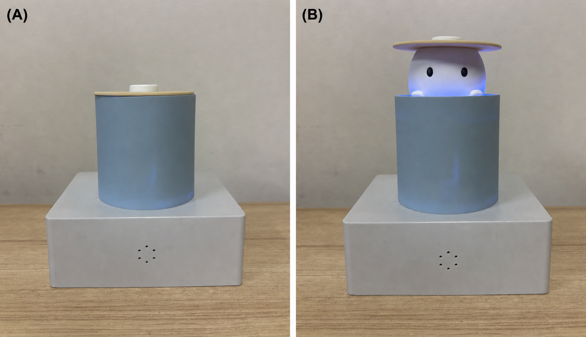
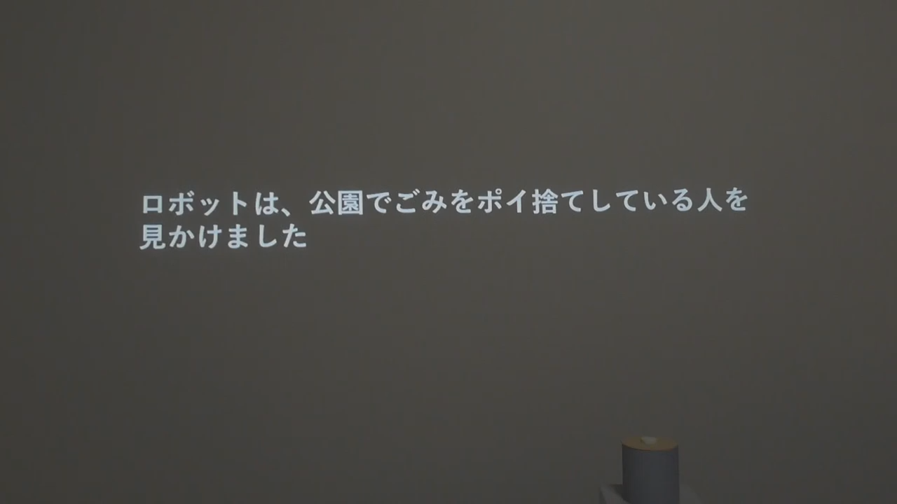
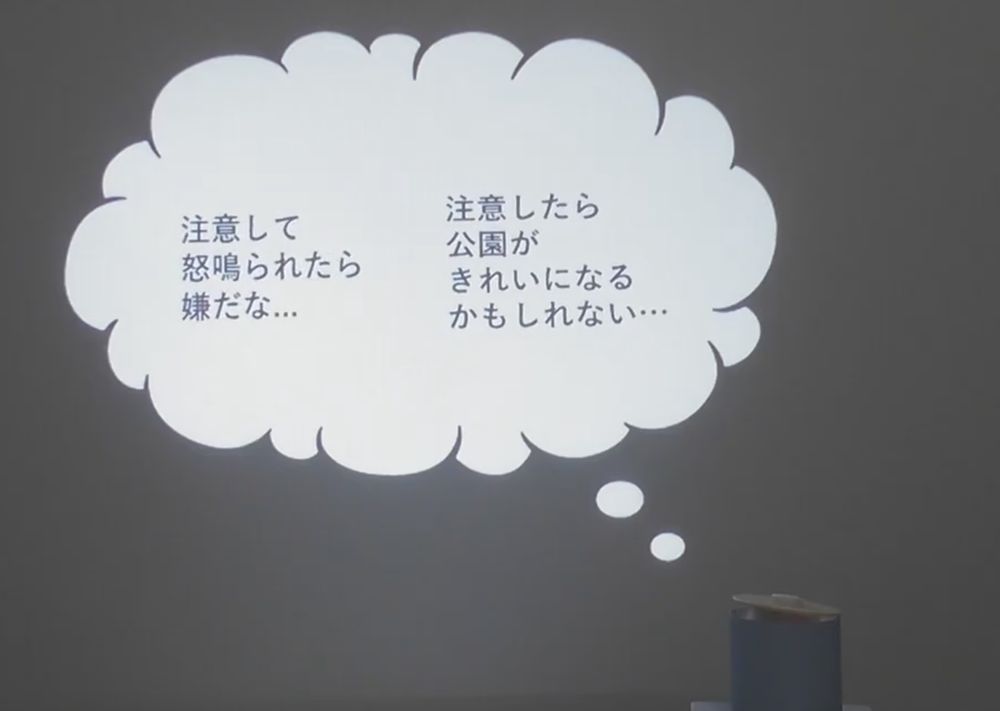
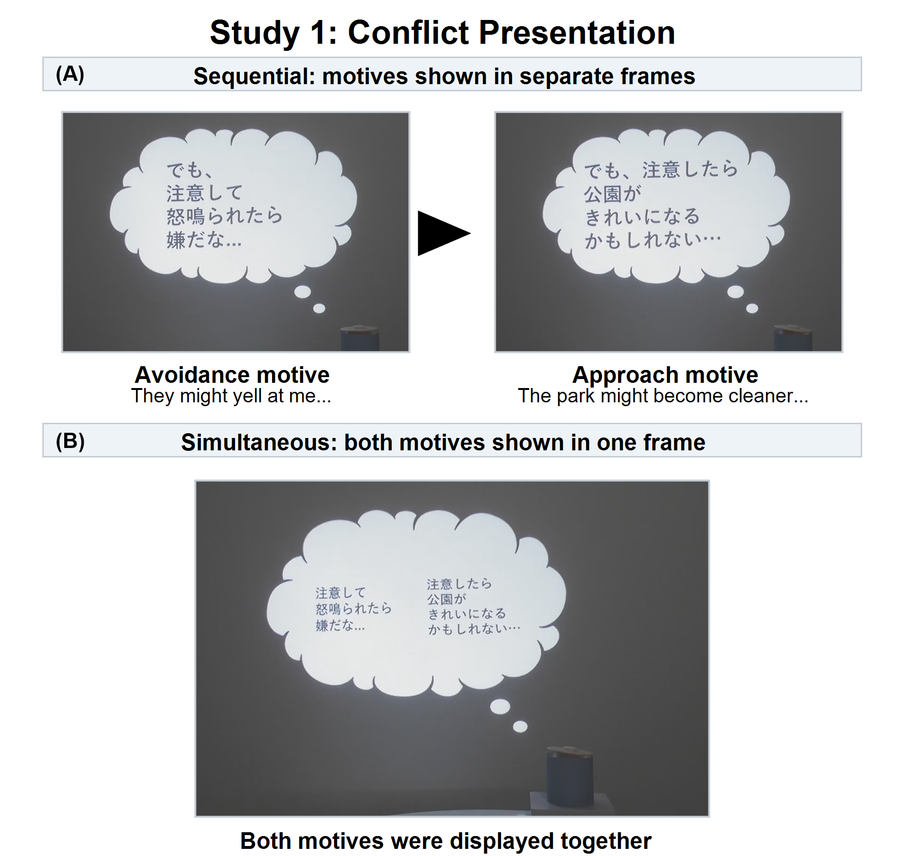
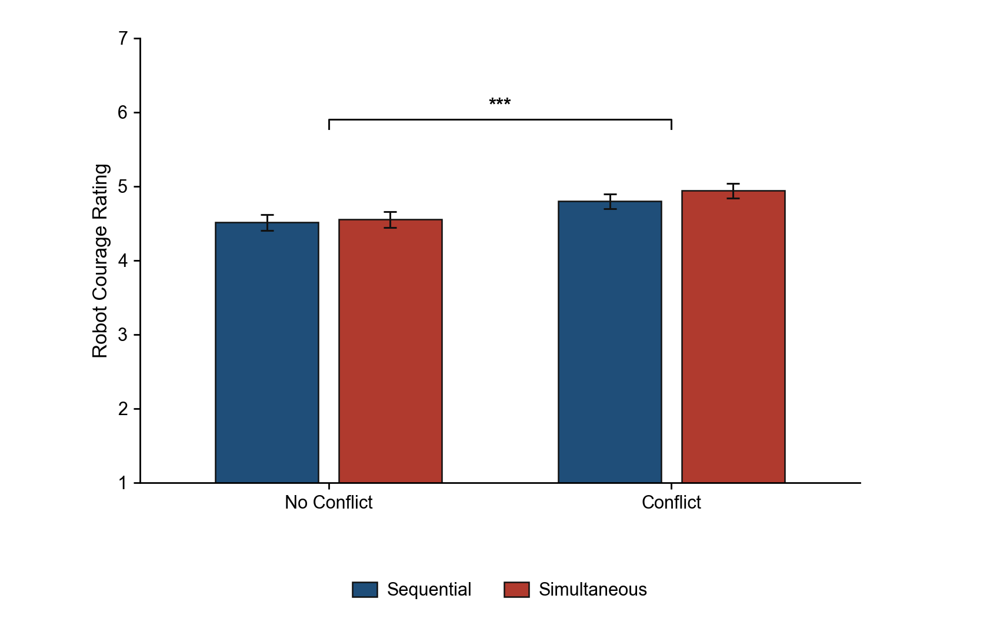
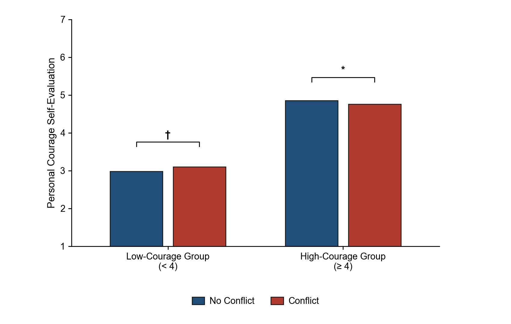

# 接近回避葛藤を表出するロボットの観察が観察者の個人的勇気の自己評価に及ぼす影響

Yuki Shimizu1,*、Midori Ban2、Hideyuki Takahashi3、Hiroshi Ishiguro1

1Department of Engineering Science, Osaka University, Osaka, Japan

2Kyoto Tachibana University, Kyoto, Japan

3Faculty of Science and Engineering, Otemon Gakuin University, Osaka, Japan

**\* 責任著者：** Yuki Shimizu simizu.yuki@irl.sys.es.osaka-u.ac.jp

**語数：6,254語**

**図表数：図7点、表5点**

**キーワード：** 個人的勇気、接近回避葛藤、観察学習、ヒューマンロボットインタラクション、内的状態、ロボット表現、社会的モデリング

## 要旨

ロボットは、行動前の内的状態を統制された再現可能な形で外在化できる。しかし、そのような状態を観察することが、恐怖があっても行動する自らの能力を人々がどのように評価するかに影響するかは明らかでない。本研究では、ロボットが行動前の接近回避葛藤を視覚的に外在化することが、観察者の個人的勇気の自己評価に及ぼす影響を検討した。公園でポイ捨てをする人物にロボットが遭遇する場面を用い、円筒形ロボットの頭部付近に吹き出しを投影して、接近動機と回避動機を提示した。研究1では、葛藤あり条件と葛藤なし条件、および逐次提示と同時提示を比較し、接近回避葛藤を表出するロボットが勇気ある姿として知覚されるかを検討した。研究2では、ロボットが一方向の動機のみを表出するか、接近・回避の両動機を表出するか、またポイ捨てをした人物に注意するかを操作し、刺激提示後の勇気の自己評価が観察者の事前勇気傾向によって異なるかを検討した。研究1では、葛藤あり条件の勇気評定と葛藤評定が葛藤なし条件より高かった。研究2では、予測した葛藤と行動の組合せによるパターンは支持されず、代わりに葛藤と事前勇気傾向との交互作用が認められた。低勇気群では葛藤あり条件で自己評価が高くなる有意傾向が認められた一方、高勇気群では葛藤あり条件において自己評価が低かった。注意行動による明確な効果は認められなかった。これらの結果は、ロボットが表出する動機葛藤が、観察者の事前特性に応じて異なる自己評価パターンと関連することを示している。方法論的には、本パラダイムは、人間モデルでは観察や標準化が難しい行動前の内的状態を外在化するための、統制された社会的モデルとしてロボットを利用できることを示している。

## イントロダクション

日常生活では、恐れや不安を伴う場合でも、価値ある行動へ向かわなければならないことがある。本研究では、このような能力を個人的勇気と呼ぶ。勇気は、恐怖がないことではなく、恐怖が存在する中で意味ある行動へ向かうこととして概念化されてきた（Rachman, 1984; Woodard and Pury, 2007）。個人的勇気は、行動の困難さを行為者自身の文脈の中に位置づける点で重要である。Puryら（2007）は、多くの人から勇気あるものと評価される一般的勇気と、その人の生活文脈や個人的制約に照らして勇気あるものとなる個人的勇気とを区別した。この観点からは、学習障害のある子どもが大きな試験の日に登校することや、心的外傷後ストレス障害の既往のため長年できなかったクリスマスプレゼントの包装を初めて行うことも、その人の文脈では強い恐怖と困難を伴う行為として理解できる（Pury et al., 2007）。さらに、発言、援助要請、問題の指摘といった行動は、本人や他者にとって価値がありうる一方、否定的評価や拒絶などの社会的・心理的リスクを伴う。そのため、これらは個人的勇気の観点から検討する意義のある対象である（Milliken et al., 2003; Vogel et al., 2007; Howard et al., 2017）。

しかし、行動に価値があると認識していても、人が常に行動するとは限らない。たとえば、人前で意見を述べることには、他者からどのように評価されるかという不安が伴いやすい（Watson and Friend, 1969; Dickerson and Kemeny, 2004）。他者に相談したり援助を求めたりすることにも、否定的に見られることへの懸念が伴いうる（Vogel et al., 2007）。職場では、多くの従業員が問題や懸念に気づきながら上司に伝えなかった経験を報告しており、その主な理由は、否定的に見られることや重要な関係を損なうことへの恐れであった（Milliken et al., 2003）。したがって、発言や援助要請は本人や他者に利益をもたらしうる一方で、否定的評価、関係の悪化、地位の低下、自己像の損傷といった社会的・心理的リスクを伴う。ゆえに、個人的勇気を支援するには、行動に価値があると理解させるだけでなく、知覚されたリスクがあっても行動へ向かう過程を支援する必要がある。

この過程を支援する一つの方法として、本研究は観察学習に着目する。観察学習では、他者の行動や成功を観察することで、自分自身が行動できる可能性についての期待が変化しうる（Bandura, 1977）。先行研究では、モデル観察後に外から観察可能な運動成績が変化すること（Weiss et al., 1998）に加え、行動観察中に運動関連の神経活動が生じること（Chaisaen et al., 2020）が示されている。観察学習はさらに、自己効力感や持続性などの心理過程にも影響しうる（Schunk and Hanson, 1985; Leonard et al., 2017）。とりわけ、成功する前に苦闘するモデルを観察することは、どのような行動が可能かだけでなく、困難を乗り越えられることも伝えうる。この可能性は、行動前の恐怖やためらいが中心的な意味を持つ個人的勇気に関係する。

しかし、恐怖やためらいは外から観察しにくい内的状態であり、人間モデルを用いて標準化された形で提示することは難しい。ロボットであれば、条件間で外見や顕在的行動を比較的一定に保ちながら、こうした行動前の状態を明示的に外在化できる。そのため、表出された葛藤と観察者の自己評価との関係を検討するための、統制された社会的モデルとなりうる。そこで本研究では、価値ある行動へ向かう動機と、そのリスクを避ける動機の併存として定義される、ロボットが表出する接近回避葛藤を観察することが、観察者の個人的勇気に関する直後の自己評価に影響するか、またその影響が観察者の事前勇気傾向に依存するかを検討した。

本研究では二つの研究を実施した。研究1では、接近回避葛藤を表出するロボットが、一方向の動機を表出するロボットよりも勇気ある姿として知覚されるかを検討し、研究2で用いる提示形式を選定した。研究2では、動機構造（単一方向／葛藤）と行動結果（注意あり／注意なし）を組み合わせ、得られる自己評価パターンが観察者の事前勇気傾向によって異なるかを検討した。二つの研究を通して、ロボットの行動前の葛藤を外在化することがその行動の知覚を変えるか、また観察者の反応が事前特性によって異なるかを検討した。この問題は、ためらいの表出がすべての利用者に一様な結果をもたらすとは限らないため、内的状態を表出する社会的ロボットの設計に関係する。

## 関連研究

### 個人的勇気と行動前の内的状態

勇気研究では、勇気は恐怖がないことではなく、恐怖を経験しながらも行動へ向かうこととして扱われてきた。Rachman（1984）は、強い恐怖を抱く人であっても勇気ある行為を行いうると論じた。NortonとWeiss（2009）は、恐怖を喚起する状況における行動接近と勇気との関係を検討した。WoodardとPury（2007）も、勇気を、脅威や恐怖を伴う状況において意味ある目的のために行動することを含む構成概念として捉えた。これらの研究は、勇気を単なる危険選好や恐怖の低さではなく、恐怖が存在する中での接近行動として理解する基盤を与えている。

この研究領域において、Puryら（2007）は、多くの人から勇気あるものと評価される一般的勇気と、その人の生活文脈や個人的制約に照らして勇気あるものとなる個人的勇気とを区別した。個人的勇気の高い行動は、恐怖、困難、個人的制約によって特徴づけられる。この区別によれば、同じ行動であっても、行為者が経験した恐怖や困難によって、勇気あるものにも、そうでないものにもなりうる。したがって、個人的勇気の研究では、外から観察可能な行動だけでなく、その行動に先行する内的状態も考慮する必要がある。

近年の勇気の過程モデルも、こうした行動前の内的状態に注目している。Chowkaseら（2024）は、勇気を、状況の知覚、価値または意味の評価、行動可能性の評価、行動決定を含む一連の過程として説明している。この過程では、価値ある行動へ向かう理由と、その行動に伴うリスクや不利益を避ける理由とが併存しうる。この併存は、接近動機と回避動機が同時に働く接近回避葛藤として理解できる（Lewin, 1931; Miller, 1944）。しかし、これらの研究は勇気の定義と過程を明らかにするものであり、他のエージェントの内的状態を観察することが、観察者自身の個人的勇気の自己評価を変化させるかを直接検討してはいない。

### 観察学習と観察者の事前特性への依存

モデルの最終的な行動だけでなく、結果に至る前に示される過程も観察学習を形づくりうる。

Schunkら（1987）は、最初から容易に成功する熟達モデルと、困難を示しながら徐々に対処していく対処モデルとを比較し、対処モデルの観察が自己効力感と課題遂行を高めることを示した。SchunkとHanson（1989）も、困難と否定的感情を表出しながら対処するモデルが学習者の自己効力感に影響することを示した。Leonardら（2017）は、成人が目標達成に向けて粘り強く試みる姿を観察した幼児が、成人が容易に成功する姿を観察した幼児よりも、その後の困難な課題で多く試行することを明らかにした。ただし、対処モデルが熟達モデルを常に上回るわけではない。SchunkとHanson（1985）では、仲間モデルを観察した子どもは、教師モデルを観察した子どもやモデルを観察しなかった子どもより自己効力感と成績が高かったが、徐々に課題を習得する対処モデルと、すぐに習得する熟達モデルとの間には有意差が認められなかった。以上から、困難と努力を含む過程の観察は、観察者の自己効力感と持続性を支えうる一方、対処モデルの相対的な優位性は一貫していない。

同時に、同じモデルでも、観察者の事前特性によって異なる解釈がなされうる。Braaksmaら（2002）は、観察学習において、モデルと観察者との類似性およびモデルの熟達度が重要であることを示した。Lucasら（2006）は、課題が難しい場合、人は他者の判断や行動を手がかりとして利用しやすい一方、自己効力感の高い人はそのような社会的影響を受けにくいことを示した。これらの知見は、観察学習を利用する際には、モデルの特性だけでなく、モデルの受け取られ方に影響する観察者の事前特性も考慮する必要があることを示している。そこで本研究でも、ロボットによる葛藤表出の効果を検討する際に、観察者の事前特性を考慮した。

### ロボット・人工エージェントによるモデリング

観察学習におけるモデルは人間に限られない。人工エージェントやアバターを用いた研究では、視覚的に存在するエージェントや自己に似たアバターが、観察者の態度、自己効力感、その後の行動に影響しうることが示されている（Rosenberg-Kima et al., 2008; Fox and Bailenson, 2009）。社会的ロボットに関する研究でも、人がロボットを社会的モデルとして扱い、その行動結果や社会的役割に基づいてモデリングを行いうることが示されている（Xu, 2023）。さらに、ロボットによる励まし方が、その後に参加者が他者を励ます方法に影響することも明らかにされている（Higashino et al., 2023）。

これらの研究は、ロボットと人工エージェントが観察者に影響を与える社会的モデルとして機能しうることを示している。しかし、ここで概観した研究が対象としたのは、態度、自己効力感、運動、励まし行動であり、個人的勇気そのものではない。本稿で検討した文献の範囲では、行動前にモデルが経験する恐怖や葛藤を明示し、その状態の観察が観察者の個人的勇気の自己評価にどのように影響するかを検討した報告は限られている。したがって、ロボットを用いて個人的勇気に関わる内的状態を観察可能な形で提示することは、既存のモデリング研究を拡張する。

### ロボットによる内的状態の外在化

本研究でロボットを使用する実験上の根拠は、行動や発話とともに、視覚表現も条件間で容易に統制できる点にある。人間モデルの場合、観察者は表情、声、沈黙、自己開示などから内的状態を推測できる。しかし、同じ場面で恐怖、ためらい、接近動機、回避動機の有無を条件間で比較可能な形にそろえて提示するには、人工的な媒体の方が適している。そこで本研究では、ロボットの動作と発話に加えて吹き出し表現を使用し、内的状態を外在化した刺激としてロボットを提示した。

この表示形式に関して、Nitadaら（2021）は、ビデオ会議場面においてロボットの頭部付近に吹き出しを表示し、その中にユーザーの顔を描く方法を提案した。吹き出しあり条件では、ロボットがユーザーを見ているという感覚が高まることが示された。この研究は、吹き出しがロボットの注意や心的焦点を視覚的に表現する手段として機能しうることを示唆している。ただし、同研究が扱ったのは注意の方向であり、勇気に関わる接近動機と回避動機の葛藤ではない。

以上より、先行研究は、個人的勇気が恐怖や困難を伴う行動を含むこと、観察学習が自己効力感や知覚された行動可能性に影響しうること、ロボットと人工エージェントが社会的モデルとして機能しうることを示してきた。しかし、本稿で検討した文献の範囲では、個人的勇気に関わる行動前の内的状態、とりわけ接近動機と回避動機との葛藤をロボットによって外在化し、その観察が観察者の個人的勇気の自己評価に影響するかは十分に検討されていない。本研究は、この未検討の問題に着目し、接近回避葛藤を表出するロボットの観察が、観察者の個人的勇気の自己評価にどのように影響するかを検討する。

## 動画刺激の設計

### ロボットと投影環境

本研究で使用したロボットは、Omichi et al.（2026）が提案したswitch-based robot interfaceと同一の筐体設計を有していた。このロボットは円筒形の本体を持ち、非発話時には顔を持つエージェントが本体内部に格納され、発話時にはエージェントが本体上部から現れる構造であった（Omichi et al., 2026）。両研究で使用したロボットの非発話時および発話時の外観を図1に示す。本研究では、吹き出しを用いてロボットの行動前の内的状態を提示することが、観察者の個人的勇気の自己評価に影響するかを検討したため、ロボットの外見や身体動作から生じる解釈のばらつきを最小限に抑える必要があった。このロボットは、人型ロボットのような複雑な表情や四肢の動きを持たず、主な表出手段は表示される顔と発話である。この設計により、接近動機、回避動機、注意発話の有無を比較的統制された形で提示する刺激媒体として適していた。注意発話には事前に録音した音声を使用し、実験者がキーボード入力によって再生した。

動画刺激では、ロボットが画面右下に映るよう撮影し、ロボットの背後の壁面に投影した吹き出しとして内的状態を表示した。吹き出しはロボットの頭部付近に配置し、ロボットの発話内容ではなく、行動前の内的状態を表す視覚表現として使用した。

### 刺激場面

本研究では、ロボットが公園でごみをポイ捨てする人物を目撃する場面を描いた動画刺激を使用した。公園でのポイ捨ては、公共空間における共有規範への違反として理解されやすい。実際、ポイ捨ては、記述的規範と命令的規範の効果を検討する代表的な課題として使用されてきた（Cialdini et al., 1990）。公共空間での観察研究では、すでにごみがあるとポイ捨てが増加する一方、ゴミ箱が利用可能であるとポイ捨てが減少することも示されている。したがって、ポイ捨ては環境的・規範的手がかりの影響を受ける日常的な規範違反として位置づけられる（Schultz et al., 2013）。さらに、ごみや落書きなどの無秩序を示す手がかりが、別の規範違反を誘発しうることも示されている（Keizer et al., 2008）。そのため、この場面で相手に注意することには、公園をきれいに保つこと、相手がポイ捨てをやめるきっかけを作ること、ポイ捨ては許容されないという規範を再確認することにつながりうるという価値がある。同時に、見知らぬ相手への注意には、怒鳴られる、無視される、否定的に見られるなどの社会的・心理的リスクが伴う。公園でのポイ捨ては、社会的統制行動に関する先行研究でも刺激場面として使用されており、見知らぬ他者による規範違反への介入を含む場面としての妥当性を支えている（Chekroun and Brauer, 2002）。さらに、フィールド研究では、見知らぬ他者の規範違反に対する制裁には直接的な注意だけでなく間接的な方法も含まれ、直接的な注意には反撃の可能性を含むコストが伴いうることが示されている（Balafoutas et al., 2014）。社会的勇気の研究は、対人的リスクに直面しながら価値ある行動へ向かうことを重要な特徴としている（Howard et al., 2017）。したがって、公園でポイ捨てをした人物に注意することは、極端な身体的危険は伴わないものの、価値ある行動と対人的リスクの双方を含み、行為者にためらいや葛藤を生じさせうるため、個人的勇気を検討する刺激場面として適している。

動画刺激における状況説明の例を図2に示す。

### 動画刺激の共通構成

動画刺激では、公園の場面そのものを実写映像で提示せず、状況説明文と吹き出し表現によって場面を構成した。動画冒頭に「ロボットは、公園でごみをポイ捨てしている人を見かけました」という状況説明を提示した。続いて、ロボットは吹き出し内に「あ、ごみをポイ捨てしている人がいる」などの状況認知を示し、その後、注意が必要な状況であることを示す文を提示した。それ以降の動機提示と注意発話の有無は、各研究の条件に応じて操作した。すべての動画は1280 × 720ピクセルの解像度で作成した。各部分の提示時間は、参加者が画面上の文章を自然な速度で読むために十分な長さに設定した。条件固有の動機文と提示形式が異なるため、動画全体の長さにはわずかな差が生じた。その結果、研究1の動画は約50～54秒、研究2の動画は約49～51秒であった。

### 接近動機と回避動機

本研究では、価値ある行動へ向かう理由を接近動機、その行動に伴うリスクや不利益を避ける理由を回避動機と定義した。具体的な動機文を表1に示す。接近動機は、注意行動によって望ましい結果が生じる可能性を示し、回避動機は、注意行動によって生じうる社会的・心理的リスクを示した。これらの接近動機と回避動機を組み合わせることで、価値ある行動へ向かう理由と、その行動を避ける理由とが併存する状態を表現した。本研究では、この状態を、接近動機と回避動機が同時に働く接近回避葛藤として操作化した（Lewin, 1931; Miller, 1944）。

接近動機と回避動機を同時に提示した例を図3に示す。

この共通設計を適用することにより、行動前の内的状態を、観察者が視覚的に解釈できる形で提示した。各研究における条件操作の詳細は、それぞれの方法節で述べる。

## 研究1：接近回避葛藤を表出するロボットは勇気ある姿として知覚されるか

### 目的

研究1では、研究2で使用する予定の提示が、勇気ある姿として知覚されるかを検討した。具体的には、内的状態として接近回避葛藤を表出するロボットが、葛藤を表出しないロボットよりも勇気ある姿として知覚されるかを検討した。また、提示した内的状態が接近回避葛藤として知覚されたかを葛藤評定によって確認するとともに、逐次提示と同時提示が勇気評定および葛藤評定に及ぼす影響を探索的に比較した。

接近回避葛藤は、同一の目標に対して接近動機と回避動機が競合する状態として説明される（Lewin, 1931; Miller, 1944; Gray and McNaughton, 2000）。この見方に基づき、同時提示を、両動機が同じ時点で併存する状態を表す候補とした。一方、両価感情は、正負の感情の同時共存だけでなく、両者の急速な交替によっても生じうると論じられている（Vaccaro et al., 2020）。両価感情と接近回避動機は同一ではないが、この議論を提示設計上の参考とした。ただし、本研究では観察者が各動機を視認できるよう切替速度を抑えたため、逐次提示は急速な交替そのものではなく、時間的な交替を表すものとした。これらの先行研究はロボットの提示方法を直接比較したものではないため、研究1では両方法を探索的に比較した。

この考えに基づき、葛藤あり条件では葛藤なし条件よりもロボットの勇気評定が高くなると予測した。また、操作チェックとして、葛藤あり条件では葛藤なし条件よりも葛藤評定が高くなると予測した。逐次提示と同時提示との比較は探索的に行い、どちらの方法がより勇気ある姿として知覚されるかを検討した。

### 方法

#### 条件

研究1では、葛藤の有無と提示方法を要因とする参加者内計画を用いた。葛藤の有無は、葛藤なしと葛藤ありの2水準であった。提示方法も、逐次提示と同時提示の2水準であった。葛藤および提示方法の効果に、最終行動の有無による影響が混入することを避けるため、研究1のすべての条件でロボットが注意行動を行う様子を提示した。

刺激動画では、ロボットが公園でごみをポイ捨てする人物を目撃した後、吹き出しによって状況認知と動機を示した。葛藤あり条件では接近動機と回避動機を提示し、葛藤なし条件では接近動機のみを提示した。同時提示条件では、該当する動機を同時に提示し、交互に拡大・縮小した。逐次提示条件では、該当する動機を順に提示した。最後に、すべての条件で顔を持つエージェントが本体上部から現れ、「すみません、そこはごみを捨てる場所じゃありませんよ」と発話した。研究1の4つの刺激条件を表2に示す。

研究1の葛藤あり条件における提示方法の代表フレームを図4に示す。図4では、状況説明、状況認知、および注意が必要な状況であることを示す文を省略し、接近動機と回避動機を提示する部分のみを示した。逐次提示条件では、回避動機「注意して怒鳴られたら嫌だな」と接近動機「注意したら公園がきれいになるかもしれない」を別々のフレームで順に提示した。同時提示条件では、同じ回避動機と接近動機を一つの吹き出し内に同時に提示し、交互に強調した。

#### 測定

従属変数は、ロボットの勇気評定と葛藤評定であった。各動画を観察した後、それぞれについて7件法で回答を求め、項目の平均値を尺度得点として使用した。勇気評定は、日本語版勇気尺度（CM-J）の6項目をロボット評定用に変更して作成した（Shimotsukasa et al., 2023）。CM-Jは、恐怖や不安があっても行動する傾向を測定する尺度であり、その信頼性と妥当性が確認されている（Shimotsukasa et al., 2023）。研究1では、観察者自身の勇気ではなく、ロボットがどの程度勇気ある姿に見えたかを測定するため、各項目の主語を「このロボットは」に変更し、語尾を「～ように見えた」「～していた」などの観察評定表現に変更した。分析では、表3に示す6項目の平均値を勇気評定得点として使用した。

葛藤評定には、ロボットが接近動機と回避動機の間で揺れ動いているように見える程度を測定するため、本研究で作成した項目を使用した。接近回避葛藤の定義（Lewin, 1931; Miller, 1944）に基づき、行動したいが恐怖のためためらっていること、行動に迷いや揺れがあること、行動することへの複雑な気持ちを抱いていること、行動を決められないことという、葛藤の観察可能な側面を捉える項目を作成した。分析では、表4に示す4項目の平均値を葛藤評定得点として使用した。さらに、4項目に基づく評定が葛藤の直接的判断と対応するかを確認するため、「このロボットは、葛藤しているように見えた」という直接項目も含めた。

#### 手続き

研究1は、Yahoo!クラウドソーシングを通じて実施した。参加者は4条件の動画を視聴し、各動画の視聴後にロボットの勇気評定項目と葛藤評定項目に回答した。動画の提示順は参加者ごとにランダム化した。質問紙には、過去の同一調査への参加歴を尋ねる項目、動画内容の理解確認項目、および注意確認項目も含めた。

#### 参加者

最終標本規模の検出力を確認するため、G*Power 3.1.9.7（Faul et al., 2009）を用いて、主要仮説である葛藤の主効果を対象とする標本数計算を行った。葛藤の主効果は、提示方法を平均した葛藤あり条件と葛藤なし条件との2水準比較であるため、F testsの「ANOVA: Repeated measures, within factors」を用い、1群、2反復測定として設定した。効果量の指定には「as in Cohen (1988) – recommended」を使用し、f(V) = 0.25、α = 0.05、検定力1 − β = 0.80、非球面性補正ε = 1とした。その結果、必要標本数は128名であった。

計211件の回答記録が得られた。このうち、確認項目に欠測があった26件を除外した。残る185件のうち、過去に同一調査へ参加したと回答した20件、注意確認項目に正答しなかった29件、または4項目の動画内容理解確認項目の少なくとも1項目に正答しなかった28件のいずれかに該当する54件を除外した（基準間の重複あり）。以上により計80件を除外し、最終的な分析対象者は131名となった。

参加者の年齢は18～29歳で、平均年齢は24.26歳であった（SD = 3.36）。内訳は、女性76名、男性52名、「分からない／答えたくない」を選択した参加者3名であった。

#### 統計分析

研究1では、ロボットの勇気評定得点と葛藤評定得点を従属変数とした。葛藤の有無（葛藤なし／葛藤あり）と提示方法（逐次／同時）を参加者内要因とする2要因反復測定分散分析を実施した。効果量として偏η2を報告した。勇気評定と葛藤評定については、Cronbachのαを用いて内的一貫性を確認し、1因子解を指定した因子分析によって、各項目群の平均値を尺度得点として扱う妥当性を追加的に検討した。交互作用が有意であった場合には、対応のある条件間比較における差得点の正規性をShapiro–Wilk検定によって確認し、正規性が棄却された場合にはWilcoxonの符号付順位検定を用いた。分析には、Pythonパッケージのpandas、pingouin、SciPyを使用した。

### 結果

まず、勇気評定と葛藤評定をそれぞれ一次元の尺度得点として扱えるかを検討した。因子分析で得られる因子負荷量の符号は任意であるため、因子負荷量は絶対値で報告する。勇気評定6項目のCronbachのαは0.925であった。1因子解を指定した因子分析では、因子負荷量は0.727～0.855、説明分散は68.0%であった。第1固有値は4.396であり、それ以降の固有値はいずれも1未満であった。したがって、6項目の平均値を勇気評定得点として使用した。葛藤評定4項目のCronbachのαは0.928であった。1因子解を指定した因子分析では、因子負荷量は0.845～0.898、説明分散は76.5%であった。第1固有値は3.293であり、それ以降の固有値はいずれも1未満であった。さらに、4項目から算出した因子得点と直接項目との間に強い正の相関が認められた（r = 0.887, p < 0.001）。したがって、4項目の平均値を葛藤評定得点として使用した。

勇気評定では、葛藤あり条件が葛藤なし条件より高く評定された。葛藤の主効果は有意であった（F(1, 130) = 12.216, p < 0.001, 偏η2 = 0.086）。一方、提示方法の主効果は有意ではなく（F(1, 130) = 2.657, p = 0.106, 偏η2 = 0.020）、交互作用も有意ではなかった（F(1, 130) = 0.906, p = 0.343, 偏η2 = 0.007）。

条件別平均を図5に示す。

葛藤評定では、葛藤あり条件が葛藤なし条件より高く、同時提示が逐次提示より高く評定された。葛藤の主効果は有意であった（F(1, 130) = 79.558, p < 0.001, 偏η2 = 0.380）。提示方法の主効果も有意であり（F(1, 130) = 46.448, p < 0.001, 偏η2 = 0.263）、交互作用も有意であった（F(1, 130) = 4.924, p = 0.028, 偏η2 = 0.036）。

交互作用が有意であったため、対応のある条件間比較を行った。各比較の差得点に対するShapiro–Wilk検定では、すべての比較で正規性が棄却されたため（すべて p < 0.001）、Wilcoxonの符号付順位検定を用いた。逐次提示では、葛藤あり条件（M = 4.964）が葛藤なし条件（M = 3.615）より高く評定され（W = 671.5, p < 0.001）、同時提示でも、葛藤あり条件（M = 5.344）が葛藤なし条件（M = 4.303）より高く評定された（W = 882.5, p < 0.001）。また、葛藤なし条件では同時提示が逐次提示より高く評定され（W = 1069.0, p < 0.001）、葛藤あり条件でも同時提示が逐次提示より高く評定された（W = 1467.0, p < 0.001）。

条件別平均を図6に示す。

### 考察

研究1では、接近回避葛藤を表出するロボットが、葛藤なし条件のロボットよりも勇気ある姿として評定された。この結果は、顕在的な行動が同じであっても、行動前に接近動機と回避動機との葛藤を示すことで、その行動が行為者にとって恐怖や困難を伴うものとして解釈されやすくなることを示している。この解釈は、個人的勇気の高い行動には恐怖や困難が伴うとする見解と整合する（Pury et al., 2007）。したがって、個人的勇気に関わる行動前の内的状態を外在化することは、ロボットの行動を勇気ある姿として観察者に提示するうえで有効である可能性がある。

葛藤評定も、葛藤なし条件より葛藤あり条件で高かった。この結果は、吹き出しによる接近動機と回避動機の提示が、観察者によって接近回避葛藤として知覚されたことを示している。提示方法について、勇気評定では逐次提示と同時提示との間に明確な差は認められなかった。一方、葛藤評定は、葛藤あり条件と葛藤なし条件のいずれにおいても、同時提示の方が逐次提示より高かった。したがって、同時提示はロボットを全般的により葛藤しているように見せる可能性があるが、葛藤あり条件と葛藤なし条件の区別を強める提示方法であるとはいえない。

研究1では、接近回避葛藤を表出するロボットが勇気ある姿として知覚されることを確認し、研究2で使用する提示の妥当性を支持する証拠を得た。以上を踏まえ、研究2では、葛藤あり条件における葛藤評定の平均値が最も高かった同時提示を用い、ロボットの観察が観察者の個人的勇気の自己評価にどのように関係するかを検討した。

## 研究2：勇気ある姿として知覚されるロボットの観察は観察者の個人的勇気の自己評価に影響するか

### 目的

研究2では、研究1で勇気ある姿として知覚されることが示されたロボットの提示を観察することが、観察者の個人的勇気の自己評価にどのように影響するかを検討した。また、この影響が観察者の事前勇気傾向によって異なるかを検討した。

研究2では、動機構造（単一方向／葛藤）と行動結果（注意あり／注意なし）を組み合わせた。この計画は、勇気には内的な困難と価値ある行動へ向かうことの両方が含まれるという見解を反映している（Rachman, 1984; Woodard and Pury, 2007; Norton and Weiss, 2009）。また、勇気は、状況の知覚、価値の評価、行動可能性の評価、行動決定を含む一連の過程としても説明されている（Chowkase et al., 2024）。単一方向条件では、動機の方向を最終行動と一致させた。すなわち、注意行動の前には接近動機を提示し、行動しない場合の前には回避動機を提示した。葛藤あり条件では、最終行動にかかわらず、接近動機と回避動機の双方を提示した。これらの条件により、それぞれの行動結果の中で単一方向の動機構造と葛藤を伴う動機構造とを比較し、ロボットが葛藤を表出した場合に行動情報が付加されることの役割を検討できた。

研究2では、接近回避葛藤と行動が観察者の個人的勇気の自己評価に及ぼす影響は、観察者の事前勇気傾向によって異なると予測した。特に、事前勇気傾向が低い参加者では、葛藤あり・行動あり条件の観察後に個人的勇気の自己評価得点が最も高くなると予測した。その根拠は、勇気の自己評価が低い低勇気群は、葛藤状況で行動することに困難を感じると考えられたためである。先行研究では、困難を示しながら徐々に対処するモデルの観察が、自己効力感と課題遂行を高めることが示されている（Schunk et al., 1987; Schunk and Hanson, 1989）。また、課題が難しい場合、人は他者の判断や行動を手がかりとして利用しやすい一方、自己効力感の高い人は社会的影響を受けにくいことも示されている（Lucas et al., 2006）。葛藤あり・行動あり条件は、接近動機と回避動機の併存に加えて、行動へ向かう選択を提示するよう設計した。すなわち、低勇気群が直面する困難と似た過程を示しつつ、その困難を乗り越えられることを提示する。そのため、低勇気群では、この条件の観察後に個人的勇気の自己評価得点が最も高くなると予測した。

### 方法

#### 条件

研究2では、事前勇気傾向群を参加者間要因、葛藤の有無と行動の有無を参加者内要因とする3要因混合計画を用いた。参加者は、刺激提示前のCM-J得点に基づいて低勇気群と高勇気群に分類した。葛藤なし条件では、ロボットの最終行動と一致する一方向の動機を提示し、葛藤あり条件では、接近動機と回避動機を同時に提示した。行動の有無は、顔を持つエージェントが本体上部から現れて注意発話を行うかどうかによって操作した。

研究1と同様に、刺激動画では、ロボットが公園でごみをポイ捨てする人物を目撃する場面を提示した。ロボットは状況認知を示した後、条件に応じた動機文を吹き出しに提示した。葛藤あり条件では、接近動機と回避動機を同時に提示し、交互に拡大・縮小した。葛藤なし条件では、動機の内容を最終行動と一致させた。すなわち、行動あり条件では接近動機のみ、行動なし条件では回避動機のみを提示した。

行動あり条件では、動機提示後にエージェントが本体上部から現れ、「すみません、そこはごみを捨てる場所じゃありませんよ」と発話した。行動なし条件では、動機提示後もエージェントは本体内部に格納されたままで、発話も行わなかった。研究2の4つの刺激条件を表5に示す。

#### 測定

研究2では、刺激提示前の個人的勇気傾向、刺激提示後における観察者自身の個人的勇気の自己評価、ロボットの葛藤評定を測定した。分析に用いたCM-Jおよび葛藤評定には、7件法で回答を求めた。個人的勇気は、日本語版勇気尺度（CM-J）の6項目を用いて測定した（Shimotsukasa et al., 2023）。CM-Jは、恐怖や不安があっても行動する勇気の特性的な個人差を測定し、その信頼性と妥当性が確認されている（Shimotsukasa et al., 2023）。研究2では、刺激提示前のCM-J得点を観察者の事前勇気傾向の指標として使用した。一方、刺激提示後のCM-J得点は、長期的な勇気特性そのものの変化ではなく、刺激提示直後における観察者の個人的勇気の自己評価として扱った。分析では、6項目の平均値を個人的勇気自己評価得点として使用した。

葛藤評定には、研究1と同じ4項目を使用した。分析では、4項目の平均値を葛藤評定得点として使用した。さらに、4項目に基づく葛藤評定が葛藤の直接的判断と対応するかを確認するため、研究1と同じ直接項目「このロボットは、葛藤しているように見えた」も含めた。

#### 手続き

研究2は、SurveyMonkeyを使用し、Yahoo!クラウドソーシングを通じて実施した。参加者はまず、刺激提示前にCM-Jに回答した。その後、四つの刺激－回答ブロックを参加者ごとにランダムな順序で提示した。各ブロックは一つの動画と、それに続く観察者自身の個人的勇気の自己評価項目およびロボットの葛藤評定項目から構成された。質問紙には、過去の同一調査への参加歴を尋ねる項目、動画内容の理解確認項目、および注意確認項目も含めた。

#### 参加者

標本規模の妥当性を確認するため、G*Power 3.1.9.7（Faul et al., 2009）を用いて、主要検定である事前勇気傾向群×葛藤の有無×行動の有無の3要因交互作用を対象とする検定力分析を行った。この交互作用を、参加者内の葛藤×行動コントラストを低勇気群と高勇気群の間で比較する1自由度の効果として設定した。F testsの「ANOVA: Fixed effects, special, main effects and interactions」を用い、効果量f = 0.25、α = 0.05、検定力1 − β = 0.80、分子自由度1、群数2とした結果、必要標本数は128名であった。

欠測および除外を見込み、212名を募集した。このうち未完了の13名を除外した。残る199名のうち、過去に同一調査へ参加したと回答した19名、注意確認項目に正答しなかった31名、または4項目の動画内容理解確認項目の少なくとも1項目に正答しなかった53名のいずれかに該当する73名を除外した（基準間の重複あり）。以上により計86名を除外し、最終的な分析対象者は126名となった。最終標本数は必要標本数を2名下回ったが、同じ想定効果量と実際の群構成に基づく検出力は0.792であり、計画値0.80に近かった。

参加者の年齢は18～29歳で、平均年齢は24.11歳であった（SD = 3.62）。内訳は男性55名、女性71名であった。刺激提示前のCM-J得点に基づき、得点が4未満の参加者を低勇気群、4以上の参加者を高勇気群に分類した。カットオフ値の4は7件法の中点に相当し、中点未満の得点と中点以上の得点を区別するものであった。低勇気群は69名、高勇気群は57名であった。

#### 統計分析

研究2では、刺激提示後の個人的勇気自己評価得点を主要アウトカムとして、葛藤評定得点を操作チェックとして分析した。刺激提示前のCM-J得点に基づく事前勇気傾向群（4未満／4以上）を参加者間要因、葛藤の有無（葛藤なし／葛藤あり）と行動の有無（行動なし／行動あり）を参加者内要因とする3要因混合分散分析を実施した。効果量として偏η2を報告した。交互作用が有意であった場合は、必要に応じて単純主効果を検討した。単純主効果の検定では、Shapiro-Wilk検定を用いて対応差の正規性を確認し、正規性が満たされた場合は対応のあるt検定、満たされなかった場合はWilcoxonの符号付順位検定を用いた。葛藤評定得点にも同じ要因構成の分析を行い、葛藤操作の成立を確認した。分析には、Pythonパッケージのpandas、statsmodels、SciPyを使用した。

### 結果

観察者の個人的勇気の自己評価について3要因混合分散分析を行った結果、事前勇気傾向群の主効果は有意であった（F(1, 124) = 124.884, p < 0.001, 偏η2 = 0.502）。一方、葛藤の有無の主効果（F(1, 124) = 0.067, p = 0.796, 偏η2 < 0.001）および行動の有無の主効果（F(1, 124) = 2.487, p = 0.117, 偏η2 = 0.020）は有意ではなかった。2要因交互作用では、事前勇気傾向群×葛藤の有無の交互作用が有意であった（F(1, 124) = 7.513, p = 0.007, 偏η2 = 0.057）。一方、事前勇気傾向群×行動の有無（F(1, 124) = 0.009, p = 0.925, 偏η2 < 0.001）および葛藤の有無×行動の有無（F(1, 124) = 2.613, p = 0.109, 偏η2 = 0.021）の交互作用は有意ではなかった。主要検定である3要因交互作用も有意ではなかった（F(1, 124) = 0.046, p = 0.831, 偏η2 < 0.001）。したがって、低勇気群において葛藤あり・行動あり条件の個人的勇気自己評価得点が特に高くなるという仮説は支持されなかった。

事前勇気傾向群×葛藤の有無の交互作用が有意であったため、各群における葛藤の単純主効果を検討した。対応差に対するShapiro–Wilk検定の結果、低勇気群では正規性は棄却されなかった（W = 0.974, p = 0.152）が、高勇気群では棄却された（W = 0.928, p = 0.002）。このため、低勇気群では対応のあるt検定、高勇気群ではWilcoxonの符号付順位検定を用いた。単純効果分析の結果、低勇気群では、葛藤あり条件の個人的勇気自己評価得点が葛藤なし条件より高い有意傾向が認められた（葛藤あり M = 3.104, 葛藤なし M = 2.982, t(68) = 1.980, p = 0.052, d = 0.238）。一方、高勇気群では、葛藤あり条件の個人的勇気自己評価得点が有意に低かった（葛藤あり M = 4.757, 葛藤なし M = 4.858, W = 404.0, p = 0.038, d = −0.271）。

これらの単純効果を図7に示す。

操作チェックとして、葛藤評定は葛藤なし条件より葛藤あり条件で高かった。葛藤の主効果は有意であった（F(1, 124) = 52.939, p < 0.001, 偏η2 = 0.299）。補足的な確認でも、葛藤あり条件は葛藤なし条件より高く評定された（W = 1128.0, p < 0.001, 葛藤あり M = 5.151, 葛藤なし M = 4.209）。したがって、研究2でも葛藤操作は成立していた。

### 考察

研究2では、低勇気群において葛藤あり・行動あり条件の個人的勇気自己評価得点が最も高くなるという仮説は支持されなかった。この仮説では、葛藤を示した後に注意行動を行うロボットを、困難を抱えながらも最終的に行動する対処モデルとして想定していた。しかし、行動の主効果と行動を含む交互作用はいずれも有意ではなかった。先行研究でも対処モデルの優位性は一貫しておらず、SchunkとHanson（1985）では、対処モデルと熟達モデルとの間で自己効力感や成績に有意差は認められなかった。葛藤あり・行動あり条件だけの特別な優位性を検出できなかった今回の結果は、この知見と矛盾しない。

しかし、事前勇気傾向群と接近回避葛藤との交互作用は有意であり、葛藤あり条件と葛藤なし条件との差が群によって異なることが示された。低勇気群では、葛藤あり条件で自己評価が高くなる有意傾向が認められた。先行研究では、困難を示しながら徐々に対処するモデルの観察が、最初から容易に成功するモデルの観察よりも、自己効力感や課題遂行を高める場合があることが示されている（Schunk et al., 1987; Schunk and Hanson, 1989）。また、難しい課題では他者の判断や行動が手がかりになりやすい一方、自己効力感の高い人はその影響を受けにくいことも報告されている（Lucas et al., 2006）。本研究の葛藤あり条件は、ロボットが回避動機を抱えながら接近動機も持つ過程を示していた。そのため低勇気群にとっては、恐れやためらいがあっても価値ある行動へ向かおうとする動機を持ちうることの手がかりになった可能性がある。ただし、事前勇気傾向と自己効力感は同一の概念ではなく、参加者がロボットを困難に対処するモデルとして受け取ったかも測定していない。さらに、この結果は有意傾向にとどまるため、この解釈は暫定的なものにとどめる必要がある。

一方、高勇気群では、葛藤あり条件の個人的勇気自己評価得点が低かった。Chowkaseら（2024）は、勇気ある決定では、価値ある結果と行動に伴うリスクとが比較されると理論化している。また、Bachら（2014）は、接近回避課題において、潜在的脅威が高まるほど回避行動と行動抑制が増えることを示した。本研究の葛藤あり条件では、注意することの価値を示す接近動機と、「怒鳴られる」「無視される」といったリスクを示す回避動機とが同時に提示された。そのため高勇気群では、行動の価値だけでなく、それに伴うリスクも改めて検討することになり、自身の勇気をより慎重に評価した可能性がある。ただし、これらの先行研究は、高勇気群において他者の葛藤を観察した後に自己評価が低下することを直接示したものではなく、今回の結果を説明する一般的な機序の候補を与えるにとどまる。

個人的勇気自己評価に対する葛藤の主効果は有意ではなかったが、低勇気群では葛藤あり条件で自己評価が高くなる傾向がみられた一方、高勇気群では葛藤あり条件で自己評価が低く、群によって差の方向が異なっていた。したがって、全参加者を平均した主効果が認められなかったことを、葛藤表出がいずれの群でも自己評価と無関係だったとは解釈できない。また、操作チェックでは葛藤あり条件の葛藤評定が高く、意図した葛藤表出は参加者に知覚されていた。したがって、仮説が支持されなかった理由を、葛藤操作の不成立だけに帰すこともできない。以上から、ロボットの葛藤表出は観察者の自己評価を一様に高めるのではなく、観察者の事前勇気傾向によって異なる方向に関連する可能性が示された。

## 総合考察

本稿で取り上げたロボットの社会的モデリング研究では、行動や社会的役割、励まし方など、観察可能な振る舞いが観察者に及ぼす影響が検討されてきた（Xu, 2023; Higashino et al., 2023）。これに対して本研究では、ロボットを、行動前の接近動機と回避動機を統制して外在化する社会的モデルとして用いた。研究1の操作チェックでは、吹き出しによる両動機の提示が接近回避葛藤として知覚されることが確認された。これは、注意や心的焦点の表現に用いられてきた吹き出し表現（Nitada et al., 2021）を、相反する動機の表現へ拡張するものである。また、研究1では、ロボットの外観と最終行動をそろえながら、表出する動機を操作することにより、人間モデルでは直接観察・統制しにくい行動前の内的状態を条件間で比較できた。したがって、本研究の貢献は、他の提示媒体に対するロボットの優位性を示したことではなく、ヒューマンロボットインタラクション研究において、内的状態を統制して提示する実験方法を示した点にある。

二つの研究を合わせると、ロボットの内的状態表現については、ロボット自身がどのように知覚されるかと、その観察が利用者にどのような影響を及ぼすかを分けて考える必要がある。研究1では葛藤表出によってロボットの勇気評定が高くなったが、研究2では、葛藤表出と観察者自身の勇気自己評価との関連が事前勇気傾向によって異なった。さらに、同時提示はロボットをより葛藤しているように見せたが、葛藤あり条件だけでなく葛藤なし条件の評定も高めた。そのため、葛藤の印象を強めることと、葛藤あり・なしの違いを明確に伝えることは別である。したがって、ロボットの内的状態表現を設計する際には、その状態をどの程度強く感じさせるか、意図した状態を他の状態と区別して伝えられるか、利用者にどのような影響を与えるかを、それぞれ評価する必要がある。また、同じ葛藤表出がすべての利用者に同じ結果をもたらすとは限らないため、利用者の事前特性に応じた表現設計も今後の検討課題となる。ただし、低勇気群の結果は有意傾向であり、実際の行動も測定していないため、個別適応型表現の有効性が本研究によって確認されたわけではない。

## 限界

本研究にはいくつかの限界がある。第一に、本研究では観察者の個人的勇気の自己評価を測定したが、観察者が実際に価値ある行動へ向かったかは測定していない。CM-Jは、恐怖や不安があっても行動する勇気の特性的な個人差を測定する（Shimotsukasa et al., 2023）。したがって、本研究における刺激提示後のCM-J得点は、長期的な勇気特性の変化ではなく、刺激提示直後における観察者の個人的勇気の自己評価として解釈すべきである。

第二に、本研究では、接近回避葛藤の提示が低勇気群と高勇気群に異なる方向で作用した心理過程を直接測定していない。本稿では、低勇気群にとっては「恐れやためらいがあっても価値ある行動へ向かおうとする動機を持ちうる」という手がかりとして、高勇気群にとっては回避動機や行動の困難さを顕在化させる情報として機能した可能性を述べた。しかし、ロボットを困難に対処するモデルとして認知したか、ロボットとの類似性、自己効力感、回避動機の解釈、行動の困難さの認知、およびリスク情報の処理を直接測定していないため、これらの説明は解釈にとどまる。

第三に、本研究ではロボットを用いた動画刺激のみを使用し、実物のロボット、人間モデル、アバター、アニメーション、文章提示など、他の提示媒体との比較を行っていない。したがって、本研究の結果が、非人間エージェントとしてのロボット、動画という形式、あるいは吹き出しによる接近回避葛藤の明示的提示のいずれに起因するかを判断することはできない。

第四に、本研究の刺激場面は、ロボットが公園でポイ捨てをした人物に注意する場面に限られていた。この場面は価値ある行動と対人的リスクが併存するため、個人的勇気を検討する刺激として一定の妥当性を持つ。しかし、本研究で検討したのは、ロボットが見知らぬ人物による規範違反を直接注意する場面であった。個人的勇気には、対人場面での発言、援助要請、学習課題への挑戦、社会復帰、向社会的行動など、多様な状況が含まれうる（Pury et al., 2007; Vogel et al., 2007; Howard et al., 2017）。したがって、本研究の知見が、異なる種類のリスクや行動価値を含む状況に一般化できるかは明らかでない。

## 今後の研究

今後の研究は、基礎的アプローチと応用的アプローチという二つの方向で進める必要がある。基礎研究では、接近回避葛藤の提示が観察者の個人的勇気の自己評価に影響する心理過程を検討すべきである。具体的には、観察者がロボットを自己に関係するモデルまたは困難に対処するモデルとしてどの程度知覚したか、ロボットとの類似性、自己効力感、知覚された脅威と困難さ、行動情報の付加価値を測定する必要がある。また、事前勇気傾向と接近回避葛藤との交互作用が生じる条件も明らかにする必要がある。内的状態の表示方法については、同時提示と逐次提示、強調の程度、提示タイミングなどを操作し、内的状態がどの程度強く知覚されるかだけでなく、意図した状態が他の状態から正しく区別されるかも検討する必要がある。さらに、同一の場面と内的状態表現を使用し、物理的に存在するロボット、動画で提示されるロボット、人間モデル、アバターまたはアニメーション、文章のみの提示を比較すべきである。この比較によって、非人間のロボットが社会的モデルとして機能する条件、および身体性、共在性、動きが果たす役割を明らかにできる。

応用研究では、ロボットの葛藤表出が、どのような利用者と状況において異なる結果に結びつくかを検討すべきである。教育、カウンセリングや社会復帰、日常的な向社会行動などの文脈において、自己評価だけでなく、発言、質問、援助要請、問題の指摘、他者への援助などの実際の行動と、その持続的変化を測定する必要がある。さらに、すべての利用者に同じ葛藤表出を提示する設計と、事前勇気傾向などの利用者特性に応じて表出内容や強さを調整する設計とを直接比較し、個別適応型表現の有効性を検証する必要がある。

## 結論

本研究は、ロボットによる行動前の接近回避葛藤の外在化が、ロボットの勇気知覚と観察者の個人的勇気の自己評価にどのように関係するかを検討した。研究1では、葛藤を表出するロボットの勇気評定が高く、研究2では、葛藤条件間の自己評価差の方向が観察者の事前勇気傾向によって異なった。本研究は、ロボットを、観察しにくい行動前の内的状態を統制して提示できる社会的モデルとして位置づけるとともに、同じ表出がすべての利用者に一様な結果をもたらすとは限らないことを示唆する。ただし、ロボット固有の効果や実際の勇気ある行動の変化は示しておらず、今後は他の提示媒体との比較と、個別適応型表現が実際の行動に及ぼす影響を検証する必要がある。

## 利益相反

*著者らは、本研究がDAIKIN INDUSTRIES, LTD.から資金提供を受けたことを申告する。資金提供者は、研究計画、データの収集・分析・解釈、本論文の執筆、または投稿の決定には関与していない。*

## 倫理声明

本研究は、大阪大学大学院基礎工学研究科研究倫理委員会の承認を得て実施した（承認番号：R2-8-7）。アンケート開始前に、研究目的、参加が任意であること、不利益を受けることなくいつでも回答を中止できること、および回答の匿名性について参加者に説明した。参加者がこれらの説明を確認してアンケートへの回答を開始したことをもって、すべての参加者から電子的インフォームド・コンセントを取得した。

## 著者貢献

著者貢献の節は、単著論文を含むすべての論文で必須である。投稿時に適切な記述がない場合は、制作工程において標準的な記述が挿入される。著者貢献の記述では、各著者の貢献をイニシャルで示して説明しなければならない。また、これにより、すべての著者は論文内容について説明責任を負うことに同意する。著者資格の全基準については、[こちら](https://www.frontiersin.org/guidelines/policies-and-publication-ethics#authorship-and-author-responsibilities)を参照されたい。

## 資金

本研究は、ダイキン工業株式会社と大阪大学との包括連携協定に基づく共同研究費の支援を受けて実施した。

## 謝辞

著者らの研究遂行を支援した特定の同僚、機関、団体の貢献に謝意を示すための短い文章を記載する。

## データ利用可能性声明

本研究で［生成／分析］したデータセットは、［リポジトリ名］［リンク］で公開されている。詳細については、[著者ガイドラインの「資料およびデータに関する方針」内の「データの利用可能性」節](https://www.frontiersin.org/guidelines/policies-and-publication-ethics#materials-and-data-policies)を参照されたい。

## 参考文献

Bach, D. R., Guitart-Masip, M., Packard, P. A., Miró, J., Falip, M., Fuentemilla, L., and Dolan, R. J. (2014). Human hippocampus arbitrates approach-avoidance conflict. Curr. Biol. 24, 541–547. doi: 10.1016/j.cub.2014.01.046

Balafoutas, L., Nikiforakis, N., and Rockenbach, B. (2014). Direct and indirect punishment among strangers in the field. Proc. Natl. Acad. Sci. U.S.A. 111, 15924–15927. doi: 10.1073/pnas.1413170111

Bandura, A. (1977). Self-efficacy: toward a unifying theory of behavioral change. Psychol. Rev. 84, 191–215. doi: 10.1037/0033-295X.84.2.191

Braaksma, M. A. H., Rijlaarsdam, G., and van den Bergh, H. (2002). Observational learning and the effects of model-observer similarity. J. Educ. Psychol. 94, 405–415. doi: 10.1037/0022-0663.94.2.405

Chaisaen, R., Autthasan, P., Mingchinda, N., Leelaarporn, P., Kunaseth, N., Tammajarung, S., et al. (2020). Decoding EEG rhythms during action observation, motor imagery, and execution for standing and sitting. IEEE Sens. J. 20, 13776–13786. doi: 10.1109/JSEN.2020.3005968

Chekroun, P., and Brauer, M. (2002). The bystander effect and social control behavior: the effect of the presence of others on people’s reactions to norm violations. Eur. J. Soc. Psychol. 32, 853–867. doi: 10.1002/ejsp.126

Chowkase, A. A., Parra-Martínez, F. A., Ghahremani, M., Bernstein, Z., Finora, G., and Sternberg, R. J. (2024). Dual-process model of courage. Front. Psychol. 15:1376195. doi: 10.3389/fpsyg.2024.1376195

Cialdini, R. B., Reno, R. R., and Kallgren, C. A. (1990). A focus theory of normative conduct: recycling the concept of norms to reduce littering in public places. J. Pers. Soc. Psychol. 58, 1015–1026. doi: 10.1037/0022-3514.58.6.1015

Cohen, J. (1988). *Statistical Power Analysis for the Behavioral Sciences*. 2nd ed. Hillsdale, NJ: Lawrence Erlbaum Associates.

Dickerson, S. S., and Kemeny, M. E. (2004). Acute stressors and cortisol responses: a theoretical integration and synthesis of laboratory research. Psychol. Bull. 130, 355–391. doi: 10.1037/0033-2909.130.3.355

Faul, F., Erdfelder, E., Buchner, A., and Lang, A.-G. (2009). Statistical power analyses using G*Power 3.1: tests for correlation and regression analyses. Behav. Res. Methods 41, 1149–1160. doi: 10.3758/BRM.41.4.1149

Fox, J., and Bailenson, J. N. (2009). Virtual self-modeling: the effects of vicarious reinforcement and identification on exercise behaviors. Media Psychol. 12, 1–25. doi: 10.1080/15213260802669474

Gray, J. A., and McNaughton, N. (2000). *The Neuropsychology of Anxiety: An Enquiry into the Functions of the Septo-Hippocampal System*. 2nd ed. Oxford: Oxford University Press.

Higashino, K., Kimoto, M., Iio, T., Shimohara, K., and Shiomi, M. (2023). Is politeness better than impoliteness? Comparisons of robot’s encouragement effects toward performance, moods, and propagation. Int. J. Soc. Robot. 15, 717–729. doi: 10.1007/s12369-023-00971-9

Howard, M. C., Farr, J. L., Grandey, A. A., and Gutworth, M. B. (2017). The creation of the Workplace Social Courage Scale (WSCS): an investigation of internal consistency, psychometric properties, validity, and utility. J. Bus. Psychol. 32, 673–690. doi: 10.1007/s10869-016-9463-8

Keizer, K., Lindenberg, S., and Steg, L. (2008). The spreading of disorder. Science 322, 1681–1685. doi: 10.1126/science.1161405

Leonard, J. A., Lee, Y., and Schulz, L. E. (2017). Infants make more attempts to achieve a goal when they see adults persist. Science 357, 1290–1294. doi: 10.1126/science.aan2317

Lewin, K. (1931). “Environmental forces in child behavior and development,” in *A Handbook of Child Psychology*, ed. C. Murchison (Worcester, MA: Clark University Press), 94–127. doi: 10.1037/13524-004

Lucas, T., Alexander, S., Firestone, I. J., and Baltes, B. B. (2006). Self-efficacy and independence from social influence: discovery of an efficacy–difficulty effect. Soc. Influ. 1, 58–80. doi: 10.1080/15534510500291662

Miller, N. E. (1944). “Experimental studies of conflict,” in *Personality and the Behavior Disorders: A Handbook Based on Experimental and Clinical Research*, vol. 1, ed. J. McV. Hunt (New York, NY: The Ronald Press Company), 431–465.

Milliken, F. J., Morrison, E. W., and Hewlin, P. F. (2003). An exploratory study of employee silence: issues that employees don’t communicate upward and why. J. Manag. Stud. 40, 1453–1476. doi: 10.1111/1467-6486.00387

Nitada, Y., Yoshikawa, Y., Meneses, A., and Ishiguro, H. (2021). “Enhancing sense of attention from a communication robot by drawing the user’s face on its thought bubble in the video conferencing system,” in *Proceedings of the 9th International Conference on Human-Agent Interaction (HAI ’21)* (New York, NY: Association for Computing Machinery), 443–447. doi: 10.1145/3472307.3484689

Norton, P. J., and Weiss, B. J. (2009). The role of courage on behavioral approach in a fear-eliciting situation: a proof-of-concept pilot study. J. Anxiety Disord. 23, 212–217. doi: 10.1016/j.janxdis.2008.07.002

Omichi, M., Takahashi, H., Ban, M., Yoshikawa, Y., Ishiguro, H., Ishizuka, H., et al. (2026). “Development and preliminary validation of an empathetic and explaining robot interface for proactive indoor environment control,” in *Social Robotics + AI*, eds. M. Staffa, J.-J. Cabibihan, B. Siciliano, S. S. Ge, L. Bodenhagen, A. Tapus, et al., Lecture Notes in Computer Science (LNAI), vol. 16133 (Singapore: Springer Nature Singapore), 516–543. doi: 10.1007/978-981-95-2398-6_35

Pury, C. L. S., Kowalski, R. M., and Spearman, J. (2007). Distinctions between general and personal courage. J. Posit. Psychol. 2, 99–114. doi: 10.1080/17439760701237962

Rachman, S. (1984). Fear and courage. Behav. Ther. 15, 109–120. doi: 10.1016/S0005-7894(84)80045-3

Rosenberg-Kima, R. B., Baylor, A. L., Plant, E. A., and Doerr, C. E. (2008). Interface agents as social models for female students: the effects of agent visual presence and appearance on female students’ attitudes and beliefs. Comput. Hum. Behav. 24, 2741–2756. doi: 10.1016/j.chb.2008.03.017

Schultz, P. W., Bator, R. J., Large, L. B., Bruni, C. M., and Tabanico, J. J. (2013). Littering in context: personal and environmental predictors of littering behavior. Environ. Behav. 45, 35–59. doi: 10.1177/0013916511412179

Schunk, D. H., and Hanson, A. R. (1985). Peer models: influence on children’s self-efficacy and achievement. J. Educ. Psychol. 77, 313–322. doi: 10.1037/0022-0663.77.3.313

Schunk, D. H., and Hanson, A. R. (1989). Influence of peer-model attributes on children’s beliefs and learning. J. Educ. Psychol. 81, 431–434. doi: 10.1037/0022-0663.81.3.431

Schunk, D. H., Hanson, A. R., and Cox, P. D. (1987). Peer-model attributes and children’s achievement behaviors. J. Educ. Psychol. 79, 54–61. doi: 10.1037/0022-0663.79.1.54

Shimotsukasa, T., Yoshino, S., and Oshio, A. (2023). Development and validation of the Japanese version of Courage Measure (CM-J): scale development using item response theory. Jpn. J. Psychol. 94, 43–53. doi: 10.4992/jjpsy.94.21234

Vaccaro, A. G., Kaplan, J. T., and Damasio, A. (2020). Bittersweet: the neuroscience of ambivalent affect. Perspect. Psychol. Sci. 15, 1187–1199. doi: 10.1177/1745691620927708

Vogel, D. L., Wade, N. G., and Hackler, A. H. (2007). Perceived public stigma and the willingness to seek counseling: the mediating roles of self-stigma and attitudes toward counseling. J. Couns. Psychol. 54, 40–50. doi: 10.1037/0022-0167.54.1.40

Watson, D., and Friend, R. (1969). Measurement of social-evaluative anxiety. J. Consult. Clin. Psychol. 33, 448–457. doi: 10.1037/h0027806

Weiss, M. R., McCullagh, P., Smith, A. L., and Berlant, A. R. (1998). Observational learning and the fearful child: influence of peer models on swimming skill performance and psychological responses. Res. Q. Exerc. Sport 69, 380–394. doi: 10.1080/02701367.1998.10607712

Woodard, C. R., and Pury, C. L. S. (2007). The construct of courage: categorization and measurement. Consult. Psychol. J. Pract. Res. 59, 135–147. doi: 10.1037/1065-9293.59.2.135

Xu, K. (2023). A mini imitation game: how individuals model social robots via behavioral outcomes and social roles. Telemat. Inform. 78:101950. doi: 10.1016/j.tele.2023.101950

## 図キャプション

*図1．両研究の動画刺激に使用したロボットの外観。（A）非発話時。顔を持つエージェントが円筒形の本体内部に格納された状態。（B）発話時。エージェントが本体上部から現れた状態。*

*図2．動画刺激における状況説明の例。ロボットが公園でごみをポイ捨てする人物を目撃する状況を文章で提示している。*

*図3．接近動機と回避動機を同時提示する例。吹き出し内に、注意行動によって望ましい結果が生じる可能性と、注意することへの懸念を同時に表示している。*

*図4．研究1における葛藤提示方法の比較。(A) 逐次提示条件では、回避動機と接近動機を別々のフレームで提示した。(B) 同時提示条件では、両方の動機を一つのフレーム内に提示した。*

*図5．研究1における勇気評定の条件別平均値。*

*図6．研究1における葛藤評定の条件別平均値。*

*図7．研究2における個人的勇気の自己評価の単純効果。事前勇気傾向群別に示した葛藤なし条件と葛藤あり条件の平均値。†は有意傾向（p = 0.052）を、*はp < 0.05を示す。*

## 表

表1．動画刺激で使用した接近動機文と回避動機文。

| 動機の種類 | 動機文 | 内容 |
| --- | --- | --- |
| 接近動機 | 「注意したら公園がきれいになるかもしれない」 | 注意行動によって公共空間が改善される可能性 |
| 接近動機 | 「注意したらあの人がポイ捨てをやめるきっかけになるかも」 | 注意行動によって相手の行動が変化する可能性 |
| 回避動機 | 「注意して怒鳴られたら嫌だな」 | 注意行動によって相手から攻撃的な反応を受けるリスク |
| 回避動機 | 「注意しても無視されて相手にされないかも」 | 注意が受け入れられず、無視されるリスク |

表2．研究1の刺激条件。

| 研究1の条件 | 内的状態の内容 | 使用した動機文 | 提示方法 | 最後の注意発話 |
| --- | --- | --- | --- | --- |
| 葛藤なし・逐次提示 | 接近動機のみ | 接近動機：「注意したら公園がきれいになるかもしれない」；「注意したらあの人がポイ捨てをやめるきっかけになるかも」 | 接近動機を順番に提示 | あり |
| 葛藤なし・同時提示 | 接近動機のみ | 接近動機：「注意したら公園がきれいになるかもしれない」；「注意したらあの人がポイ捨てをやめるきっかけになるかも」 | 複数の接近動機を同時に提示し、交互に強調 | あり |
| 葛藤あり・逐次提示 | 接近動機と回避動機 | 接近動機：「注意したら公園がきれいになるかもしれない」；「注意したらあの人がポイ捨てをやめるきっかけになるかも」／回避動機：「注意して怒鳴られたら嫌だな」；「注意しても無視されて相手にされないかも」 | 接近動機と回避動機を順番に提示 | あり |
| 葛藤あり・同時提示 | 接近動機と回避動機 | 接近動機：「注意したら公園がきれいになるかもしれない」；「注意したらあの人がポイ捨てをやめるきっかけになるかも」／回避動機：「注意して怒鳴られたら嫌だな」；「注意しても無視されて相手にされないかも」 | 接近動機と回避動機を同時に提示し、交互に強調 | あり |

表3．研究1で使用したロボットの勇気評定項目。

| 項目 | 勇気評定項目 |
| --- | --- |
| 1 | このロボットは、自身の恐怖に立ち向かうように見えた。 |
| 2 | このロボットは、たとえ強い恐れを感じていても、やるべきことをやるまでは逃げ出さないように見えた。 |
| 3 | このロボットは、たとえ危険に思えることがあっても、それをやっていた。 |
| 4 | このロボットは、何か心配や不安があっても、とにかく行動を起こすか、立ち向かっていた。 |
| 5 | このロボットは、恐ろしいことであっても、立ち向かうべき重大な理由があれば、立ち向かっていた。 |
| 6 | このロボットは、たとえ自身を脅かすものがあっても、引き下がらないように見えた。 |

表4．研究1および研究2で使用したロボットの葛藤評定項目。

| 項目 | 葛藤評定項目 |
| --- | --- |
| 1 | このロボットは、目の前のことをやりたいけれど、怖くてためらっているように見えた。 |
| 2 | このロボットは、自分の行動に迷いや揺れがあるように見えた。 |
| 3 | このロボットは、やりたいという気持ちとやりたくない気持ちが混在しているように見えた。 |
| 4 | このロボットは、自分の行動を決めかねているように見えた。 |

表5．研究2の刺激条件。

| 研究2の条件 | 内的状態の内容 | 使用した動機文 | 提示方法 | 最後の注意発話 |
| --- | --- | --- | --- | --- |
| 葛藤なし・行動なし | 回避動機のみ | 回避動機：「注意して怒鳴られたら嫌だな」；「注意しても無視されて相手にされないかも」 | 回避動機を提示し、強調 | なし |
| 葛藤なし・行動あり | 接近動機のみ | 接近動機：「注意したら公園がきれいになるかもしれない」；「注意したらあの人がポイ捨てをやめるきっかけになるかも」 | 接近動機を提示し、強調 | あり |
| 葛藤あり・行動なし | 接近動機と回避動機 | 接近動機：「注意したら公園がきれいになるかもしれない」；「注意したらあの人がポイ捨てをやめるきっかけになるかも」／回避動機：「注意して怒鳴られたら嫌だな」；「注意しても無視されて相手にされないかも」 | 交互に強調する同時提示 | なし |
| 葛藤あり・行動あり | 接近動機と回避動機 | 接近動機：「注意したら公園がきれいになるかもしれない」；「注意したらあの人がポイ捨てをやめるきっかけになるかも」／回避動機：「注意して怒鳴られたら嫌だな」；「注意しても無視されて相手にされないかも」 | 交互に強調する同時提示 | あり |
