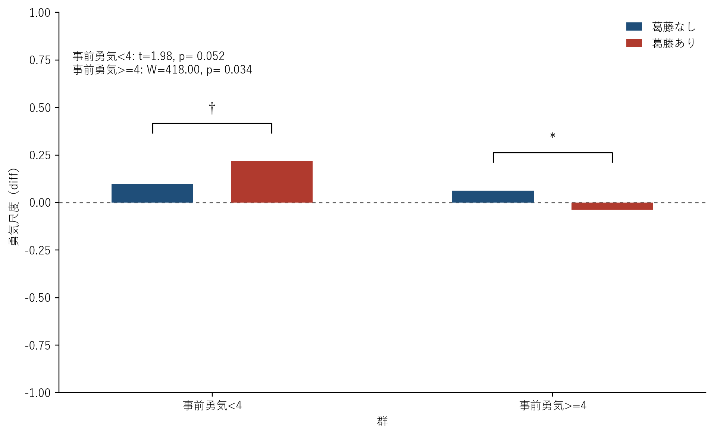
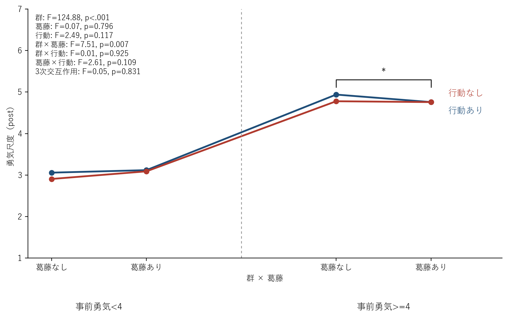
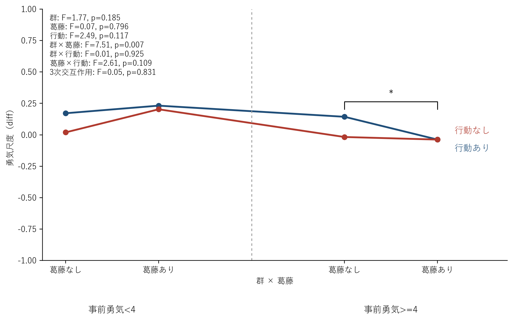
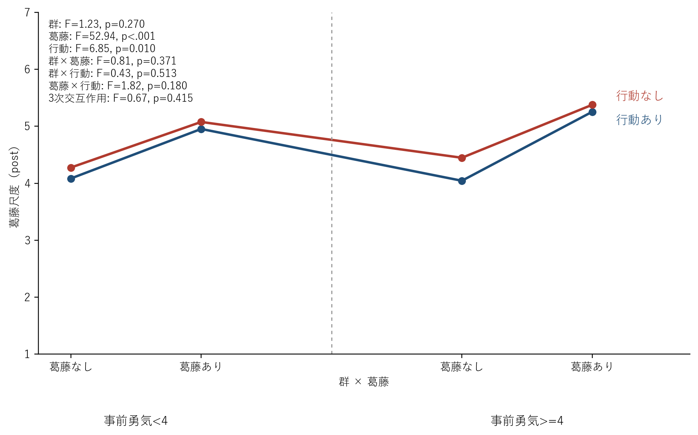

# 事前勇気4未満 vs 4以上に基づく3要因ANOVA結果資料

## 分析概要

- 分析デザイン: `Between-Within-Within` の3要因分散分析
- 被験者間要因: 事前勇気尺度群
  - `事前勇気 < 4` 群: 69名
  - `事前勇気 >= 4` 群: 57名
- 被験者内要因
  - 葛藤: `なし / あり`
  - 行動: `なし / あり`
- 従属変数
  - 勇気尺度（post）
  - 勇気尺度（diff）
  - 葛藤尺度（post）
- CZOは本分析から除外した。
- 主観評定指標に関する結果は本資料から除外した。

## 分析の要点

- 勇気尺度（post, diff）では、`群×葛藤` 交互作用が有意であった。
- 葛藤尺度（post）では、`葛藤主効果` と `行動主効果` が有意であった。
- 単純主効果検定では、各比較の対応差分に対して Shapiro-Wilk 検定を行い、正規性が満たされた場合は対応のある t 検定、満たされない場合は Wilcoxon 符号順位検定を用いた。
- 葛藤尺度は有意交互作用が認められなかったため単純主効果検定は行わず、解釈対象となる2水準主効果についてのみ対応差分の正規性を確認した。
- 等分散性は一部の群関連効果で満たされておらず、群を含む効果は注意して解釈する必要がある。

## 3要因ANOVA結果

| 従属変数 | 効果 | F(1, 124) | p | partial η² | 解釈 |
| --- | --- | ---: | ---: | ---: | --- |
| 勇気尺度（post） | group | 124.884 | .000 | .502 | 事前勇気高群の方が全体に高い |
| 勇気尺度（post） | group:conflict | 7.513 | .007 | .057 | 葛藤の効き方が群で異なる |
| 勇気尺度（diff） | group:conflict | 7.513 | .007 | .057 | 変化量でも葛藤の効き方が群で異なる |
| 葛藤尺度（post） | conflict | 52.939 | .000 | .299 | 葛藤あり条件の方が高い |
| 葛藤尺度（post） | action | 6.845 | .010 | .052 | 行動条件でも差がみられる |

## 解釈

### 勇気尺度

勇気尺度では、`群×葛藤` 交互作用が有意であった。これは、葛藤あり表現の影響が低群と高群で異なる方向に現れたことを示している。低群では葛藤あり条件でやや高い傾向がみられた一方、高群では葛藤なし条件の方が高い結果であった。

### 葛藤尺度

葛藤尺度では、主に刺激条件そのものの違いが反映されており、群差や群を含む交互作用は明確ではなかった。したがって、ロボットをどれだけ葛藤的に捉えたかは、事前勇気群よりも動画条件に依存していたと考えられる。

交互作用が有意でなかったため葛藤尺度について単純主効果検定は実施していない。ただし、ANOVAで有意であった2水準主効果に対して対応差分の正規性を確認したところ、`葛藤主効果` と `行動主効果` のいずれも正規性は満たされなかった。そのため補足的に Wilcoxon 符号順位検定で確認したところ、`葛藤主効果` は `W = 1128.0, p < .001`、`行動主効果` は `W = 2030.0, p = .003` であり、ANOVA と同じ結論であった。

## 単純主効果検定

### 勇気尺度における `群×葛藤` 交互作用の分解

| 指標 | 群 | 葛藤あり M | 葛藤なし M | 正規性p | 検定 | 統計量 | p | d | 解釈 |
| --- | --- | ---: | ---: | ---: | --- | ---: | ---: | ---: | --- |
| 勇気尺度（post） | 事前勇気 < 4 | 3.104 | 2.982 | .152 | paired t | 1.980 | .052 | .238 | 有意傾向 |
| 勇気尺度（post） | 事前勇気 >= 4 | 4.757 | 4.858 | .002 | Wilcoxon | 404.000 | .038 | -.271 | 有意 |
| 勇気尺度（diff） | 事前勇気 < 4 | 0.217 | 0.095 | .152 | paired t | 1.980 | .052 | .238 | 有意傾向 |
| 勇気尺度（diff） | 事前勇気 >= 4 | -0.038 | 0.063 | .002 | Wilcoxon | 418.000 | .034 | -.271 | 有意 |

低群では対応差分の正規性は棄却されず、対応のある t 検定を用いた。その結果、葛藤あり条件で勇気尺度がやや高まる傾向がみられたが、5%水準では有意に達しなかった。高群では差分の正規性が満たされなかったため Wilcoxon 符号順位検定を用い、葛藤あり条件の方が有意に低い結果であった。

## 図: 勇気尺度の単純主効果

## 参考図: 3要因ANOVAの交互作用プロット

## 等分散性に関する注意

- 群間の等分散性は一部のセルおよび群関連コントラストで満たされなかった。
- とくに群を含む効果については、Levene検定の結果を踏まえて慎重に解釈する必要がある。
- したがって、本結果は群差の全否定を意味しないが、群を含む効果については補足的検証と併せて扱うのが望ましい。

## 葛藤尺度主効果の補足確認

| 効果 | level_a | level_b | 正規性p | 検定 | 統計量 | p | mean_a | mean_b |
| --- | --- | --- | ---: | --- | ---: | ---: | ---: | ---: |
| conflict主効果 | 葛藤あり | 葛藤なし | .000 | Wilcoxon | 1128.0 | .000 | 5.151 | 4.209 |
| action主効果 | 行動あり | 行動なし | .000 | Wilcoxon | 2030.0 | .003 | 4.577 | 4.783 |

## 結論

- 勇気尺度では、葛藤の効果は事前勇気群によって異なっていた。
- 低群では葛藤あり条件で勇気が高まる傾向がみられた一方、高群では逆方向の差が有意にみられた。
- 葛藤尺度では、群差よりも動画条件そのものの違いが強く反映された。
- したがって、勇気喚起表現の効果は一様ではなく、観察者の事前勇気水準によって修飾される可能性が示された。
