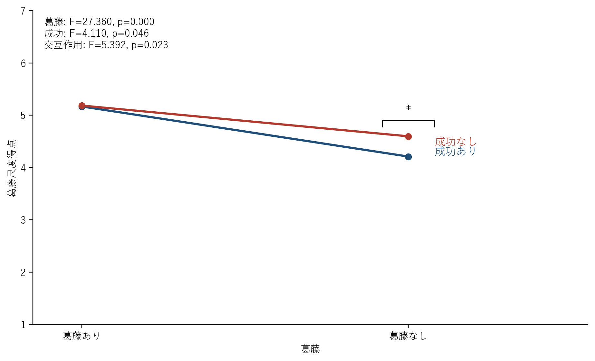
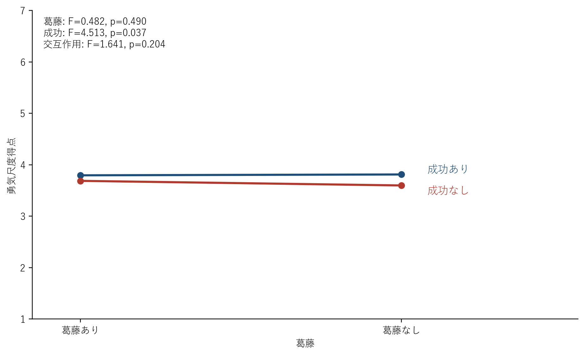
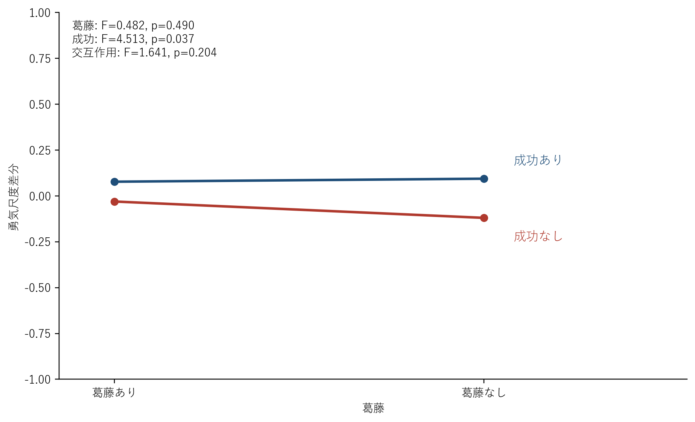
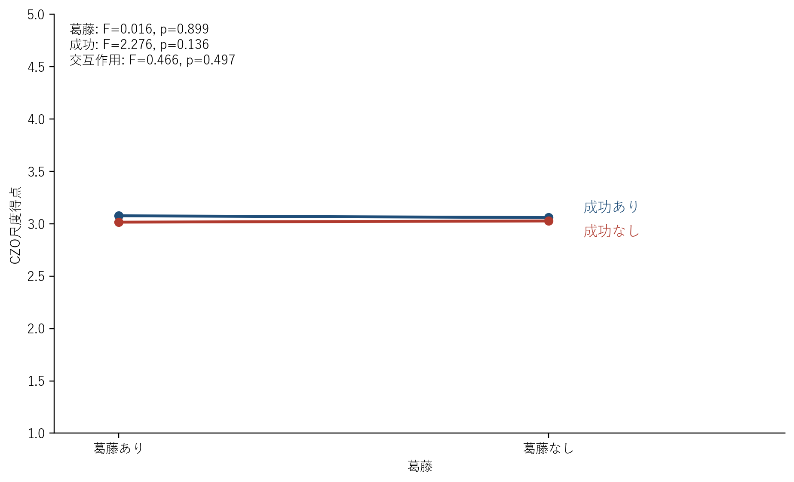
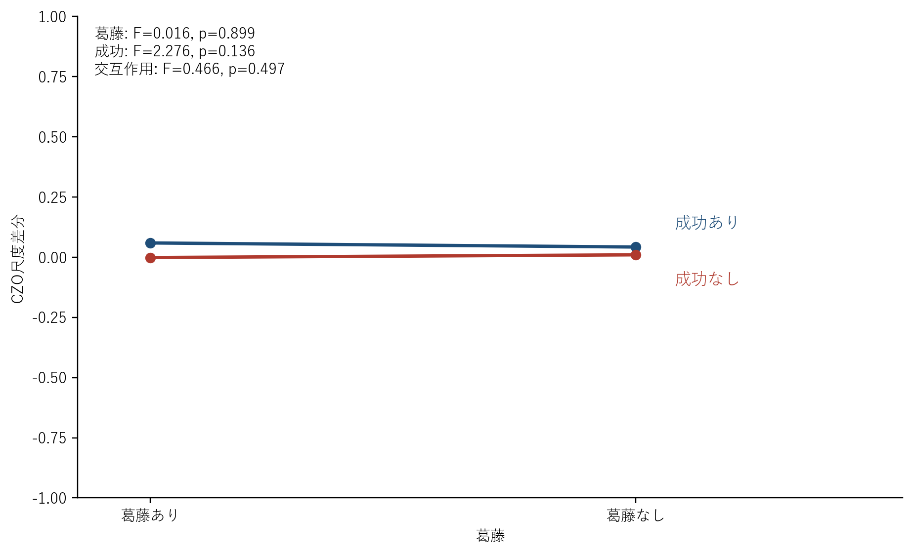
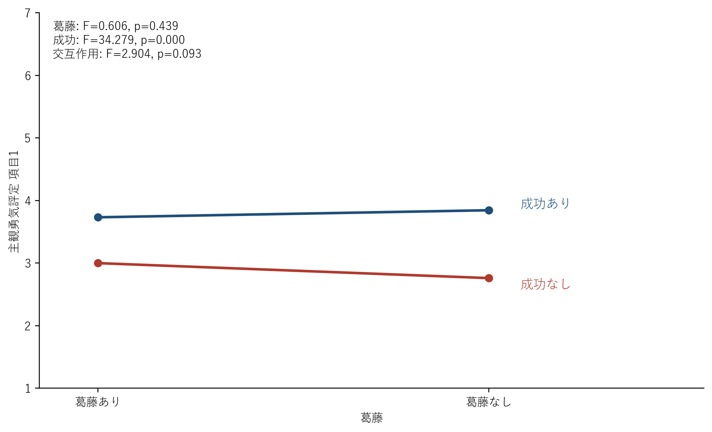
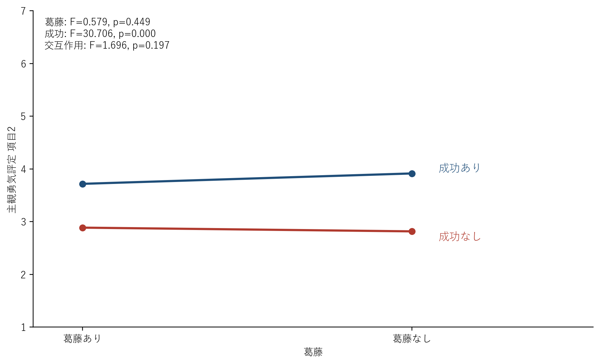
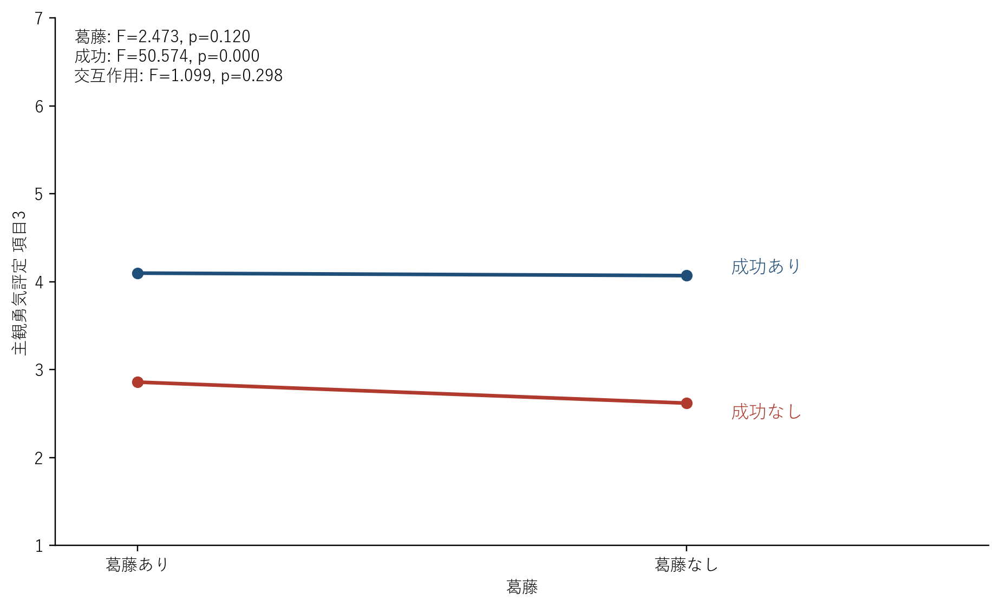

# 総合結果レポート

- 対象データ: `データ/きれいデータ.xlsx`
- 対象群: 女性
- 対象人数: 71

## 1. 尺度の内的一貫性

- CZO尺度: α = 0.873
- 主観の勇気評定: α = 0.940
- 勇気尺度: α = 0.937
- 葛藤尺度: α = 0.898

## 2. マニプレーションチェック: 葛藤尺度

- 葛藤の主効果: F(1, 70) = 27.360, p < .001, partial η² = 0.281
- 成功の主効果: F(1, 70) = 4.110, p = .046, partial η² = 0.055
- 交互作用: F(1, 70) = 5.392, p = .023, partial η² = 0.072

| conflict   | action   |   post_score_mean |
|:-----------|:---------|------------------:|
| 葛藤あり   | 成功あり |           5.16901 |
| 葛藤あり   | 成功なし |           5.18662 |
| 葛藤なし   | 成功あり |           4.21127 |
| 葛藤なし   | 成功なし |           4.59859 |

## 3. 勇気尺度

- 事後スコア 葛藤の主効果: F(1, 70) = 0.482, p = .490, partial η² = 0.007
- 事後スコア 成功の主効果: F(1, 70) = 4.513, p = .037, partial η² = 0.061
- 事後スコア 交互作用: F(1, 70) = 1.641, p = .204, partial η² = 0.023
- 差分スコア 葛藤の主効果: F(1, 70) = 0.482, p = .490, partial η² = 0.007
- 差分スコア 成功の主効果: F(1, 70) = 4.513, p = .037, partial η² = 0.061
- 差分スコア 交互作用: F(1, 70) = 1.641, p = .204, partial η² = 0.023

| conflict   | action   |   post_score_mean |   diff_score_mean |
|:-----------|:---------|------------------:|------------------:|
| 葛藤あり   | 成功あり |           3.79577 |         0.0774648 |
| 葛藤あり   | 成功なし |           3.68779 |        -0.0305164 |
| 葛藤なし   | 成功あり |           3.81221 |         0.0938967 |
| 葛藤なし   | 成功なし |           3.59859 |        -0.119718  |

## 4. CZO尺度

- 事後スコア 葛藤の主効果: F(1, 70) = 0.016, p = .899, partial η² = 0.000
- 事後スコア 成功の主効果: F(1, 70) = 2.276, p = .136, partial η² = 0.031
- 事後スコア 交互作用: F(1, 70) = 0.466, p = .497, partial η² = 0.007
- 差分スコア 葛藤の主効果: F(1, 70) = 0.016, p = .899, partial η² = 0.000
- 差分スコア 成功の主効果: F(1, 70) = 2.276, p = .136, partial η² = 0.031
- 差分スコア 交互作用: F(1, 70) = 0.466, p = .497, partial η² = 0.007

| conflict   | action   |   post_score_mean |   diff_score_mean |
|:-----------|:---------|------------------:|------------------:|
| 葛藤あり   | 成功あり |           3.07606 |        0.0591549  |
| 葛藤あり   | 成功なし |           3.01549 |       -0.00140845 |
| 葛藤なし   | 成功あり |           3.05915 |        0.0422535  |
| 葛藤なし   | 成功なし |           3.02676 |        0.00985915 |

## 5. 主観勇気評定

### 項目1

このロボットを見て、自分も挑戦しようと思った。

- 葛藤の主効果: F(1, 70) = 0.606, p = .439, partial η² = 0.009
- 成功の主効果: F(1, 70) = 34.279, p < .001, partial η² = 0.329
- 交互作用: F(1, 70) = 2.904, p = .093, partial η² = 0.040

### 項目2

このロボットを見た後に、難しいことにも一歩踏み出せそうだと感じた。

- 葛藤の主効果: F(1, 70) = 0.579, p = .449, partial η² = 0.008
- 成功の主効果: F(1, 70) = 30.706, p < .001, partial η² = 0.305
- 交互作用: F(1, 70) = 1.696, p = .197, partial η² = 0.024

### 項目3

このロボットから勇気をもらったと感じた。

- 葛藤の主効果: F(1, 70) = 2.473, p = .120, partial η² = 0.034
- 成功の主効果: F(1, 70) = 50.574, p < .001, partial η² = 0.419
- 交互作用: F(1, 70) = 1.099, p = .298, partial η² = 0.015

