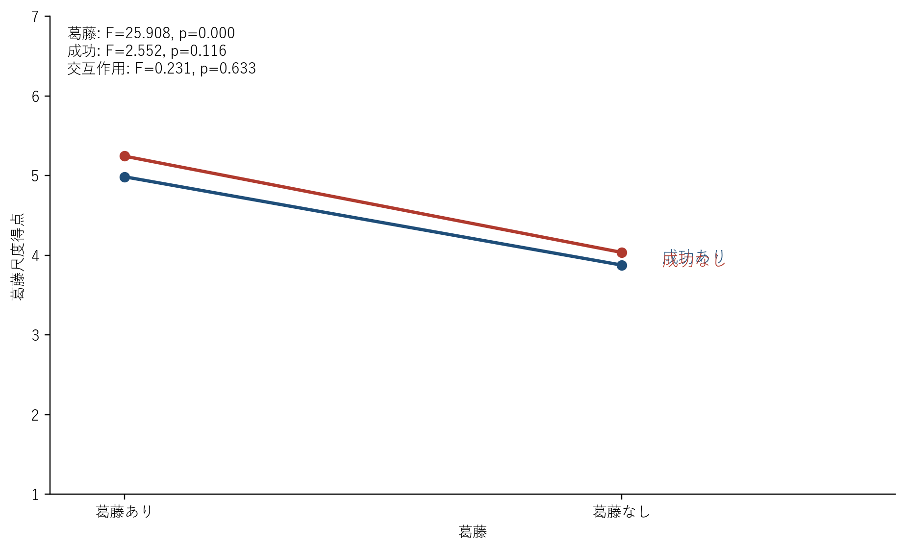
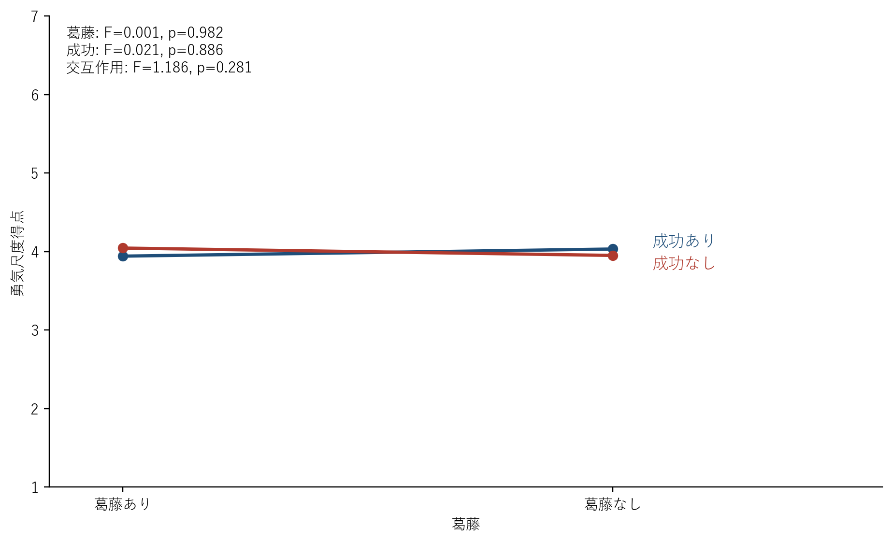
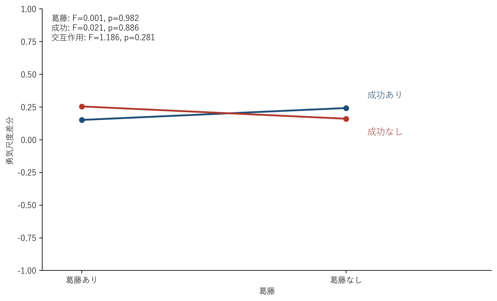
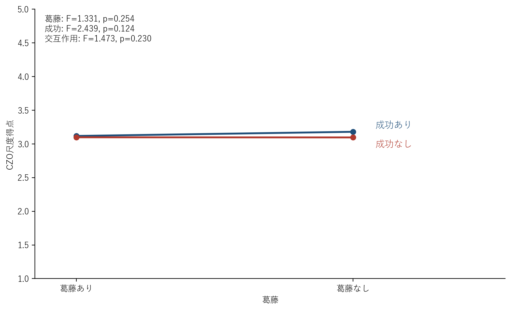
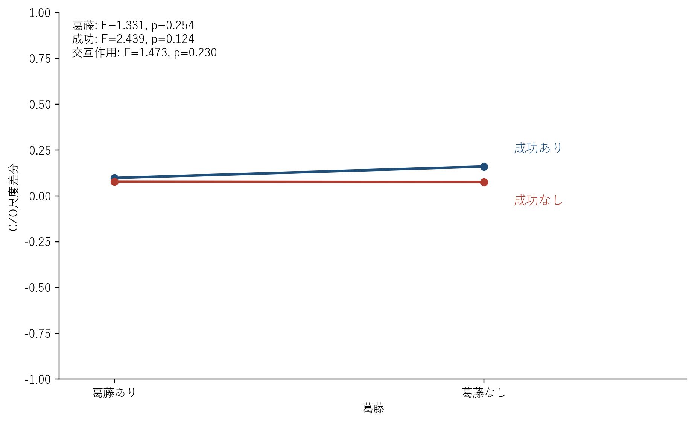
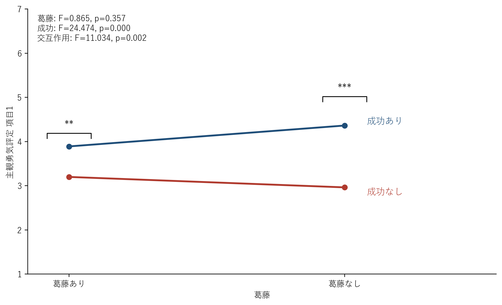
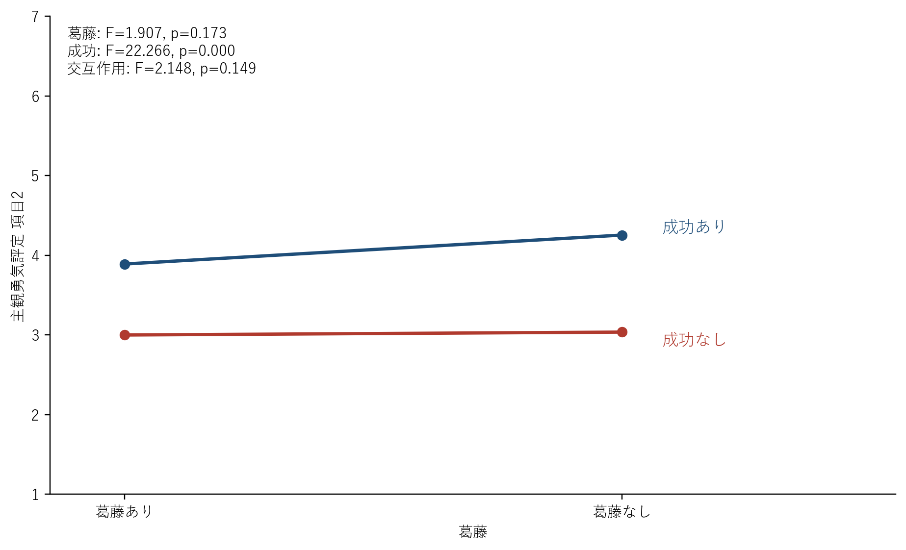
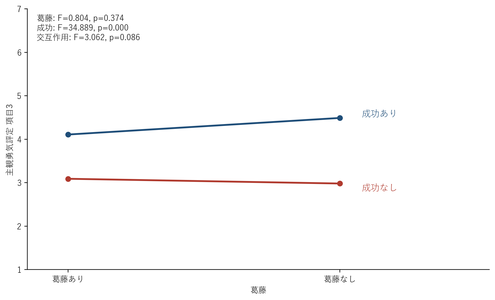

# 総合結果レポート

- 対象データ: `データ/きれいデータ.xlsx`
- 対象群: 男性
- 対象人数: 55

## 1. 尺度の内的一貫性

- CZO尺度: α = 0.795
- 主観の勇気評定: α = 0.933
- 勇気尺度: α = 0.958
- 葛藤尺度: α = 0.891

## 2. マニプレーションチェック: 葛藤尺度

- 葛藤の主効果: F(1, 54) = 25.908, p < .001, partial η² = 0.324
- 成功の主効果: F(1, 54) = 2.552, p = .116, partial η² = 0.045
- 交互作用: F(1, 54) = 0.231, p = .633, partial η² = 0.004

| conflict   | action   |   post_score_mean |
|:-----------|:---------|------------------:|
| 葛藤あり   | 成功あり |           4.98636 |
| 葛藤あり   | 成功なし |           5.24545 |
| 葛藤なし   | 成功あり |           3.87727 |
| 葛藤なし   | 成功なし |           4.03636 |

## 3. 勇気尺度

- 事後スコア 葛藤の主効果: F(1, 54) = 0.001, p = .982, partial η² = 0.000
- 事後スコア 成功の主効果: F(1, 54) = 0.021, p = .886, partial η² = 0.000
- 事後スコア 交互作用: F(1, 54) = 1.186, p = .281, partial η² = 0.021
- 差分スコア 葛藤の主効果: F(1, 54) = 0.001, p = .982, partial η² = 0.000
- 差分スコア 成功の主効果: F(1, 54) = 0.021, p = .886, partial η² = 0.000
- 差分スコア 交互作用: F(1, 54) = 1.186, p = .281, partial η² = 0.021

| conflict   | action   |   post_score_mean |   diff_score_mean |
|:-----------|:---------|------------------:|------------------:|
| 葛藤あり   | 成功あり |           3.94242 |          0.151515 |
| 葛藤あり   | 成功なし |           4.04545 |          0.254545 |
| 葛藤なし   | 成功あり |           4.03333 |          0.242424 |
| 葛藤なし   | 成功なし |           3.95152 |          0.160606 |

## 4. CZO尺度

- 事後スコア 葛藤の主効果: F(1, 54) = 1.331, p = .254, partial η² = 0.024
- 事後スコア 成功の主効果: F(1, 54) = 2.439, p = .124, partial η² = 0.043
- 事後スコア 交互作用: F(1, 54) = 1.473, p = .230, partial η² = 0.027
- 差分スコア 葛藤の主効果: F(1, 54) = 1.331, p = .254, partial η² = 0.024
- 差分スコア 成功の主効果: F(1, 54) = 2.439, p = .124, partial η² = 0.043
- 差分スコア 交互作用: F(1, 54) = 1.473, p = .230, partial η² = 0.027

| conflict   | action   |   post_score_mean |   diff_score_mean |
|:-----------|:---------|------------------:|------------------:|
| 葛藤あり   | 成功あり |           3.11818 |         0.0981818 |
| 葛藤あり   | 成功なし |           3.09818 |         0.0781818 |
| 葛藤なし   | 成功あり |           3.18    |         0.16      |
| 葛藤なし   | 成功なし |           3.09636 |         0.0763636 |

## 5. 主観勇気評定

### 項目1

このロボットを見て、自分も挑戦しようと思った。

- 葛藤の主効果: F(1, 54) = 0.865, p = .357, partial η² = 0.016
- 成功の主効果: F(1, 54) = 24.474, p < .001, partial η² = 0.312
- 交互作用: F(1, 54) = 11.034, p = .002, partial η² = 0.170

### 項目2

このロボットを見た後に、難しいことにも一歩踏み出せそうだと感じた。

- 葛藤の主効果: F(1, 54) = 1.907, p = .173, partial η² = 0.034
- 成功の主効果: F(1, 54) = 22.266, p < .001, partial η² = 0.292
- 交互作用: F(1, 54) = 2.148, p = .149, partial η² = 0.038

### 項目3

このロボットから勇気をもらったと感じた。

- 葛藤の主効果: F(1, 54) = 0.804, p = .374, partial η² = 0.015
- 成功の主効果: F(1, 54) = 34.889, p < .001, partial η² = 0.393
- 交互作用: F(1, 54) = 3.062, p = .086, partial η² = 0.054

