# ロボット動画印象評価実験 統合結果レポート

## 1. 目的

本レポートは、全体サンプル 126 名を対象とした主分析に加え、その後に行った層別分析・探索分析を一つにまとめたものである。主に次の問いを整理する。

- 行動の提示や葛藤の提示は、観察者の勇気や挑戦志向に影響するか
- その効果は、事前の勇気傾向や CZO 傾向によって異なるか
- 「葛藤あり条件で相対的に反応しやすい人」は、どのような特徴を持つか

元データは `データ/きれいデータ.xlsx`、対象者数は 126 名である。

## 2. 分析の前提

4本の動画は、以下の 2 × 2 条件として扱った。

- 動画1 = 葛藤あり × 行動あり
- 動画2 = 葛藤あり × 行動なし
- 動画3 = 葛藤なし × 行動あり
- 動画4 = 葛藤なし × 行動なし

事前測定は勇気尺度 6 項目と CZO 尺度 10 項目、事後測定は主観勇気評定 3 項目、勇気尺度 6 項目、CZO 尺度 10 項目、葛藤尺度 4 項目、葛藤確認項目 1 項目である。

主分析の詳細は [総合結果レポート.md](/c:/研究活動/博論/挑戦ロボット研究/分析/総合結果レポート.md) を参照。

## 3. 主分析

### 3.1 信頼性

各尺度の内的一貫性は全体として良好であった。

- 事前勇気尺度: α = .908
- 事前CZO尺度: α = .801
- 事後主観勇気評定: α = .938
- 事後勇気尺度: α = .947
- 事後CZO尺度: α = .844
- 事後葛藤尺度: α = .895

したがって、各尺度は本分析に用いる上で十分な内的一貫性を備えていると判断できる。

### 3.2 マニプレーションチェック: 葛藤尺度

葛藤尺度はマニプレーションチェックとして分析した。

- 葛藤の主効果: F(1, 125) = 52.257, p < .001, partial η² = .295
- 行動の主効果: F(1, 125) = 6.612, p = .011, partial η² = .050
- 交互作用: F(1, 125) = 1.633, p = .204, partial η² = .013

条件平均は以下のとおりであった。

- 葛藤あり × 行動あり: 5.089
- 葛藤あり × 行動なし: 5.212
- 葛藤なし × 行動あり: 4.066
- 葛藤なし × 行動なし: 4.353

この結果から、少なくとも本データでは葛藤あり条件の方が葛藤なし条件よりも高い葛藤評定を受けており、葛藤操作は概ね意図どおり知覚されていたと考えられる。

また、尺度得点から除外した確認項目「このロボットは、葛藤しているように見えた。」と 4 項目版葛藤尺度得点との相関は、動画1 で r = .746、動画2 で r = .691、動画3 で r = .790、動画4 で r = .839、全動画プールで r = .795 と、いずれも高い正の相関を示した。

  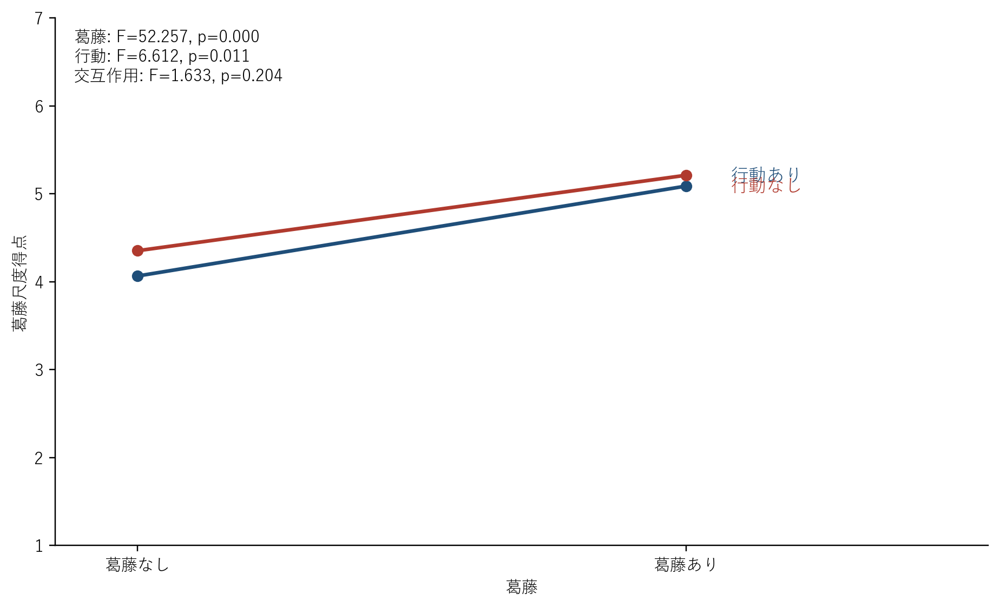

### 3.3 勇気尺度

勇気尺度については、事後得点と事前からの差分得点の両方で 2 要因分散分析を行った。

事後得点では、

- 葛藤の主効果: F(1, 125) = 0.260, p = .611
- 行動の主効果: F(1, 125) = 2.558, p = .112
- 交互作用: F(1, 125) = 2.591, p = .110

差分得点でも同じパターンであった。

- 葛藤の主効果: F(1, 125) = 0.260, p = .611
- 行動の主効果: F(1, 125) = 2.558, p = .112
- 交互作用: F(1, 125) = 2.591, p = .110

条件平均は以下のとおりであった。

- 葛藤あり × 行動あり: 事後 3.860, 差分 0.110
- 葛藤あり × 行動なし: 事後 3.844, 差分 0.094
- 葛藤なし × 行動あり: 事後 3.909, 差分 0.159
- 葛藤なし × 行動なし: 事後 3.753, 差分 0.003

勇気尺度では、行動の主効果も葛藤との交互作用も有意ではなかった。よって、仮説1および仮説2を勇気尺度ベースで明確に支持する結果は得られなかった。

  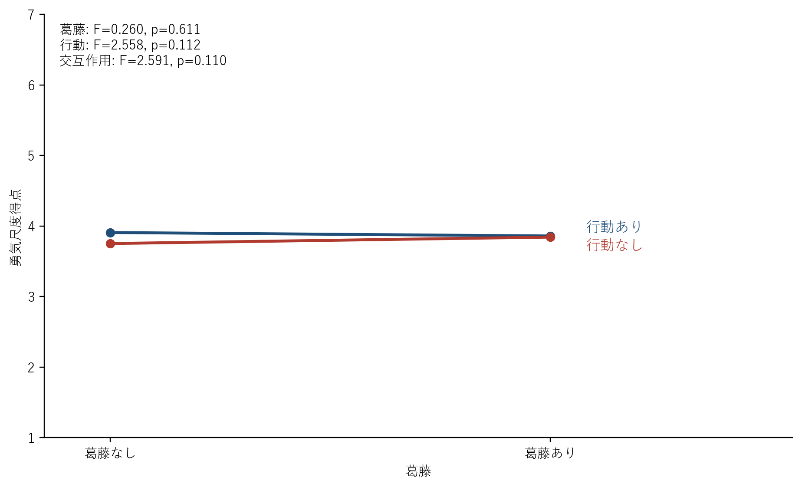
  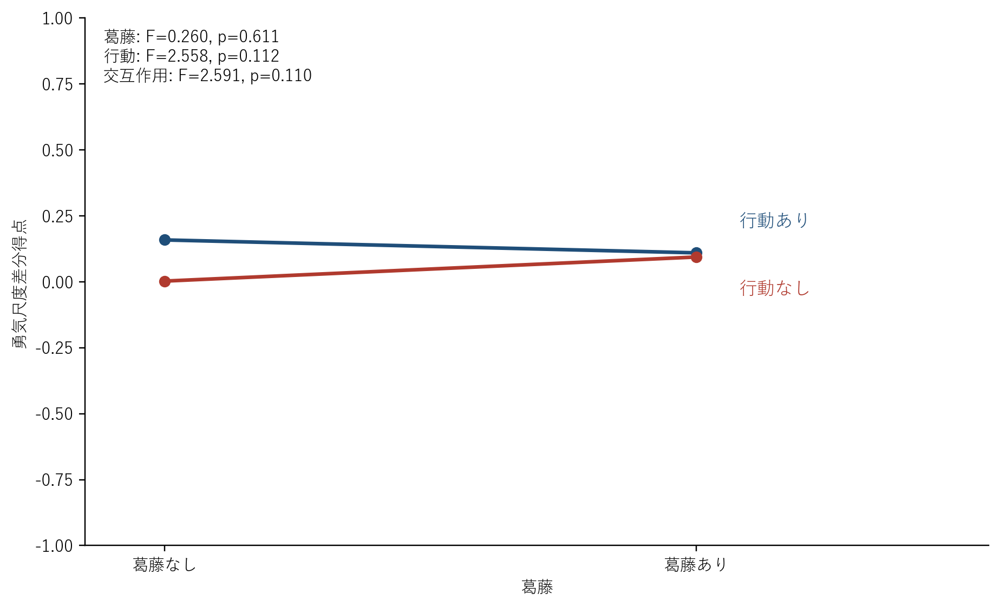

### 3.4 CZO尺度

CZO尺度についても、事後得点と差分得点で 2 要因分散分析を行った。

事後得点では、

- 葛藤の主効果: F(1, 125) = 0.468, p = .495
- 行動の主効果: F(1, 125) = 4.698, p = .032, partial η² = .036
- 交互作用: F(1, 125) = 0.132, p = .717

差分得点でも、行動の主効果のみが有意であった。

- 葛藤の主効果: F(1, 125) = 0.468, p = .495
- 行動の主効果: F(1, 125) = 4.698, p = .032, partial η² = .036
- 交互作用: F(1, 125) = 0.132, p = .717

条件平均は以下のとおりであった。

- 葛藤あり × 行動あり: 事後 3.094, 差分 0.076
- 葛藤あり × 行動なし: 事後 3.052, 差分 0.033
- 葛藤なし × 行動あり: 事後 3.112, 差分 0.094
- 葛藤なし × 行動なし: 事後 3.057, 差分 0.039

CZO尺度では、行動あり条件の方が高かった。したがって、勇気尺度そのものでは有意差が出なかったものの、「コンフォートゾーンの外に出ようとする傾向」に関しては、行動あり動画がより促進的に働いた可能性がある。

  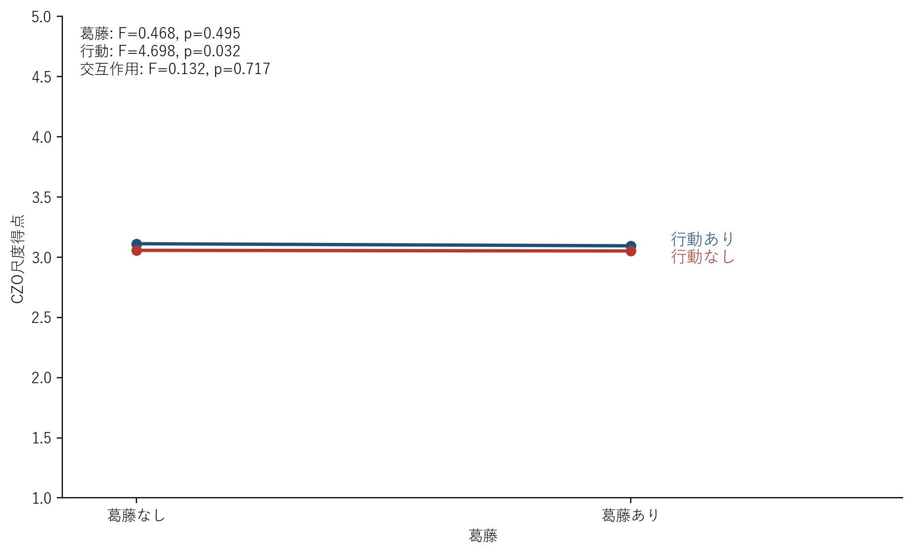
  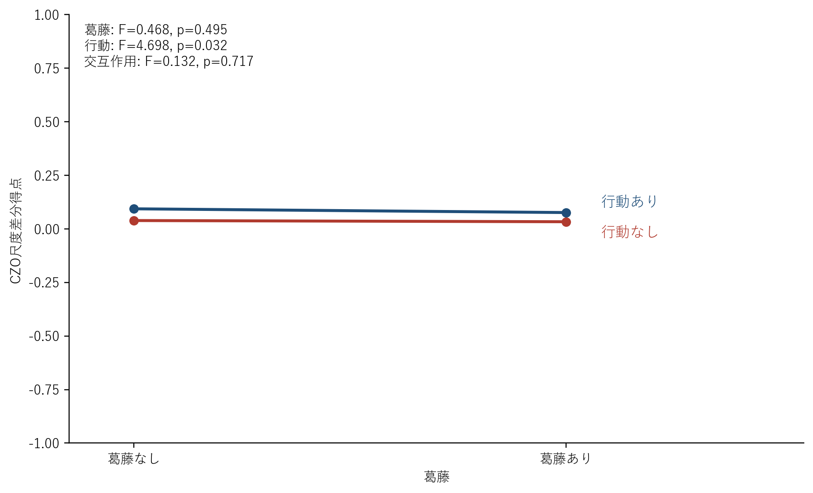

### 3.5 主観勇気評定 3項目

主観勇気評定は尺度化せず、各項目を個別に分析した。

項目1「このロボットを見て、自分も挑戦しようと思った。」では、

- 葛藤の主効果: F(1, 125) = 0.048, p = .826
- 行動の主効果: F(1, 125) = 58.392, p < .001, partial η² = .318
- 交互作用: F(1, 125) = 11.561, p < .001, partial η² = .085

であった。交互作用が有意であったため単純主効果を検討したところ、葛藤あり条件・葛藤なし条件のいずれでも、行動ありの方が行動なしより高かった。

- 葛藤あり条件での行動の単純主効果: t = 5.839, p < .001, d = 0.520
- 葛藤なし条件での行動の単純主効果: t = 7.265, p < .001, d = 0.647
- 行動あり条件での葛藤の単純主効果: t = -2.757, p = .007, d = -0.246
- 行動なし条件での葛藤の単純主効果: t = 2.174, p = .032, d = 0.194

項目2「このロボットを見た後に、難しいことにも一歩踏み出せそうだと感じた。」では、

- 葛藤の主効果: F(1, 125) = 2.448, p = .120
- 行動の主効果: F(1, 125) = 53.050, p < .001, partial η² = .298
- 交互作用: F(1, 125) = 3.792, p = .054

であり、行動の主効果は有意だったが、交互作用は .05 水準では有意ではなかった。

項目3「このロボットから勇気をもらったと感じた。」では、

- 葛藤の主効果: F(1, 125) = 0.037, p = .848
- 行動の主効果: F(1, 125) = 86.035, p < .001, partial η² = .408
- 交互作用: F(1, 125) = 3.995, p = .048, partial η² = .031

であった。交互作用が有意であったため単純主効果を検討したところ、葛藤あり条件・葛藤なし条件のいずれでも、行動ありの方が行動なしより高かった。

- 葛藤あり条件での行動の単純主効果: t = 7.383, p < .001, d = 0.658
- 葛藤なし条件での行動の単純主効果: t = 8.551, p < .001, d = 0.762
- 行動あり条件での葛藤の単純主効果: t = -1.331, p = .186, d = -0.119
- 行動なし条件での葛藤の単純主効果: t = 1.508, p = .134, d = 0.134

したがって、項目3でも全体としては行動の効果が強く、葛藤の効果は限定的であった。

  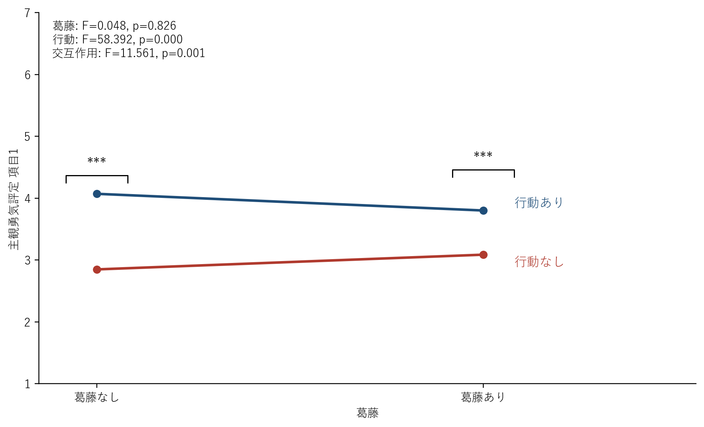
  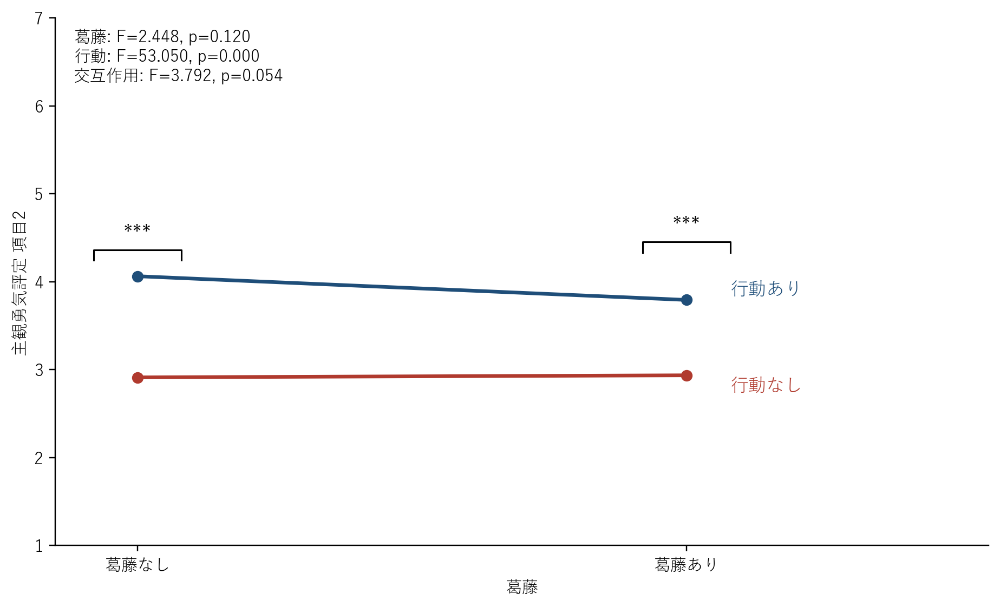

  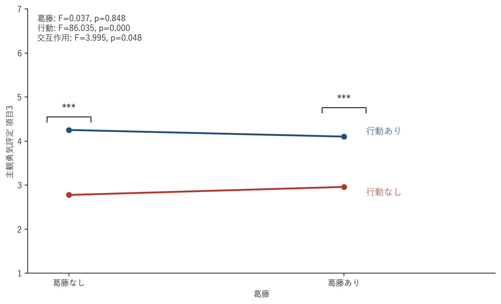

## 4. 追加の群別・探索分析

主分析ののち、葛藤が特定の参加者群に対して相対的に効いている可能性を検討するため、変化量ベースの群分けと、事前勇気を理論的中点 4 で区切った検証を追加で行った。詳細は [ANOVA/層別ANOVA](/c:/研究活動/博論/挑戦ロボット研究/分析/ANOVA/層別ANOVA) 以下を参照。

### 4.1 勇気変化量ベースの葛藤あり高群

勇気尺度差分について、

- 動画1（葛藤あり行動あり） > 動画3（葛藤なし行動あり）
- 動画2（葛藤あり行動なし） > 動画4（葛藤なし行動なし）

の両方を満たす参加者を「勇気変化量の葛藤あり高群」としたところ、22 名が該当した。

この群は、葛藤あり動画後の平均変化量そのものが有意に大きいわけではなかったが、事前特性は有意に低かった。

- 勇気尺度事前平均: 高群 M = 3.182, その他群 M = 3.870, p = .006
- CZO尺度事前平均: 高群 M = 2.695, その他群 M = 3.087, p = .003
- 葛藤あり動画後の平均変化量: 高群 M = 0.133, その他群 M = 0.090, p = .735

したがって、勇気変化量における葛藤あり高群は、「もともと勇気や挑戦志向が低い人の一部が、葛藤あり条件で相対的に高く反応した」群として理解するのが妥当である。

  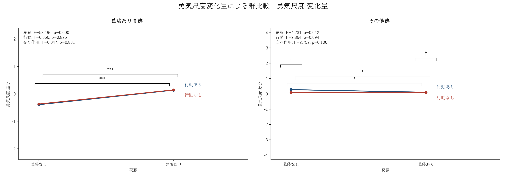
  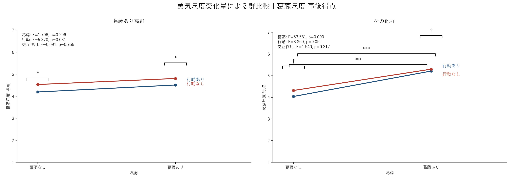

### 4.2 CZO変化量ベースの葛藤あり高群

同じ基準を CZO尺度差分に適用すると、21 名が「CZO変化量の葛藤あり高群」に分類された。

この群では CZO尺度 diff における葛藤主効果が非常に大きく、

- 葛藤あり高群: F(1, 20) = 141.415, p < .001, partial η² = .876
- その他群: F(1, 104) = 10.371, p = .0017, partial η² = .091

であった。したがって、CZO尺度については、葛藤反応性の強弱がかなり明瞭に分離されていると解釈できる。

  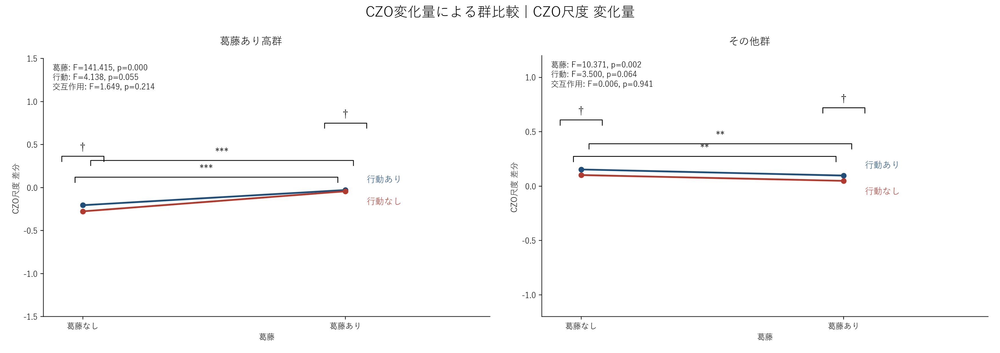
  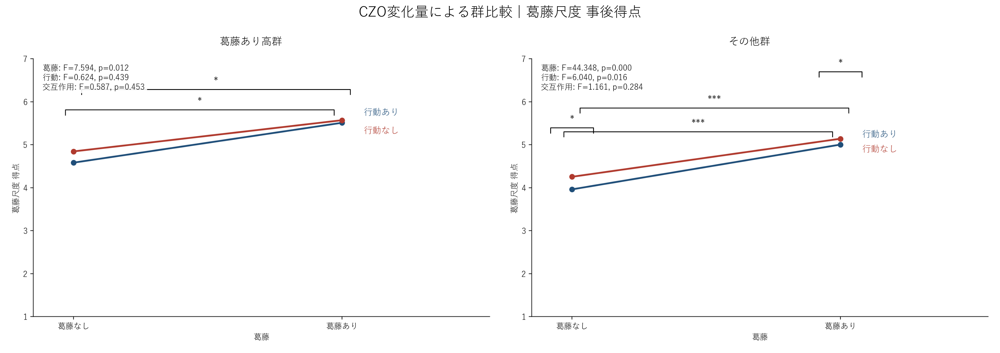

### 4.3 事前勇気 4 を境にした検証

「もともとの勇気傾向が、その後の反応パターンを変えるか」をより直接に検証するため、事前勇気を被験者間要因、葛藤と行動を被験者内要因とした 3 要因分散分析へ組み替えて再分析した。群分けはユーザー指定に従い、勇気尺度事前平均が `4未満` の群と `4以上` の群とした。

- 事前勇気<4: 69 名
- 事前勇気>=4: 57 名

今回の再分析では CZO は完全に除外し、主観勇気評定は項目ごとではなく、項目1と項目3の平均を統合指標として扱った。等分散性については Levene 検定を実施し、主観勇気評定の一部セルと勇気尺度 diff の一部コントラストで有意な不均一が見られたため、群が絡む効果については Welch 型の補足確認も行った。その結果、有意だった群関連効果の結論は変わらなかった。

勇気尺度では、post でも diff でも `群×葛藤` 交互作用が有意であった。

- 勇気尺度（post）: 群主効果 `F(1, 124) = 124.884, p < .001, partial η² = .502`
- 勇気尺度（post）: 群×葛藤 `F(1, 124) = 7.513, p = .007, partial η² = .057`
- 勇気尺度（diff）: 群×葛藤 `F(1, 124) = 7.513, p = .007, partial η² = .057`

条件平均を見ると、`事前勇気<4群` では勇気尺度 diff が葛藤なし条件の平均 `0.095` に対して葛藤あり条件で `0.218` とやや高かった一方、`事前勇気>=4群` では葛藤なし条件の平均 `0.063` に対して葛藤あり条件が `-0.038` であった。したがって、葛藤が勇気尺度の変化量にどう結びつくかは、事前勇気の高低で逆方向に近いパターンを示した。

主観勇気評定（項目1+3平均）では、群主効果と行動主効果に加えて、`葛藤×行動` と `群×葛藤×行動` が有意であった。

- 群主効果 `F(1, 124) = 14.253, p < .001, partial η² = .103`
- 行動主効果 `F(1, 124) = 83.827, p < .001, partial η² = .403`
- 葛藤×行動 `F(1, 124) = 11.875, p < .001, partial η² = .087`
- 群×葛藤×行動 `F(1, 124) = 5.454, p = .021, partial η² = .042`

つまり、主観的な勇気づけは全体として行動あり動画で高かったが、その差の出方は事前勇気群によっても変わっていた。Welch による補足確認でも、`群×葛藤×行動` に対応する比較は `p = .021` であり、解釈は維持された。

葛藤尺度では、群に関わる効果は有意でなく、主に動画条件の違いそのものが効いていた。

- 葛藤主効果 `F(1, 124) = 52.939, p < .001, partial η² = .299`
- 行動主効果 `F(1, 124) = 6.845, p = .010, partial η² = .052`
- 群関連の交互作用はいずれも有意でなかった

以上より、今回の再分析は「低勇気群だけが一様に強く上がる」という単純な話ではなく、「勇気尺度の変化量に対する葛藤の効き方」と「主観勇気評定における条件差の形」が事前勇気群によって異なることを示した。詳細な表は [summary.md](/c:/研究活動/博論/挑戦ロボット研究/分析/ANOVA/層別ANOVA/事前勇気4未満vs4以上_3要因ANOVA/summary.md) を参照。

### 4.4 CZO事前 3 以下 / 3 超を境にした検証

CZO尺度の事前平均は 1-5 尺度上で全体平均 `M = 3.018` であり、今回は中点に近い `3` を閾値として `3以下群` と `3超群` に分けて検討した。両群の人数はそれぞれ 63 名で均衡していたため、この分析ではクラスター分割は用いなかった。

尺度レベルでは、`CZO事前3以下群` では葛藤尺度 post の葛藤主効果が有意であり、`F(1, 62) = 14.720, p < .001, partial η² = .192` であった。

一方、CZO尺度 post / diff における葛藤主効果は `F(1, 62) = 3.282, p = .075` で、有意傾向にとどまった。

これに対して `CZO事前3超群` では、CZO尺度 post / diff の行動主効果が有意であり、`F(1, 62) = 6.289, p = .015, partial η² = .092` であった。

また、葛藤尺度 post でも葛藤主効果と行動主効果がともに有意であった。
- 葛藤主効果: `F(1, 62) = 43.149, p < .001, partial η² = .410`
- 行動主効果: `F(1, 62) = 6.702, p = .012, partial η² = .098`

主観勇気評定では `CZO事前3超群` の方で効果が明瞭であった。
- 項目1: 交互作用 `F(1, 62) = 15.284, p < .001`
- 項目2: 葛藤主効果 `F(1, 62) = 4.264, p = .043`、交互作用 `F(1, 62) = 5.158, p = .027`
- 項目3: 交互作用 `F(1, 62) = 5.937, p = .018`

対して `CZO事前3以下群` では、主観勇気評定 3 項目はいずれも行動主効果のみが有意で、交互作用や葛藤主効果は概ね見られなかった。

探索比較では、当然ながら `CZO事前3超群` の方が `事前CZO平均` と `事前勇気平均` の両方で高かった。
- 事前 CZO: `3以下群 M = 2.548`、`3超群 M = 3.489`、`p < .001`
- 事前勇気: `3以下群 M = 3.116`、`3超群 M = 4.384`、`p < .001`

一方で、指定して確認した `CZO の葛藤あり動画後の平均変化量` 自体は、`3以下群` と `3超群` のあいだで有意差はなかった（Welch の `p = .619`）。

  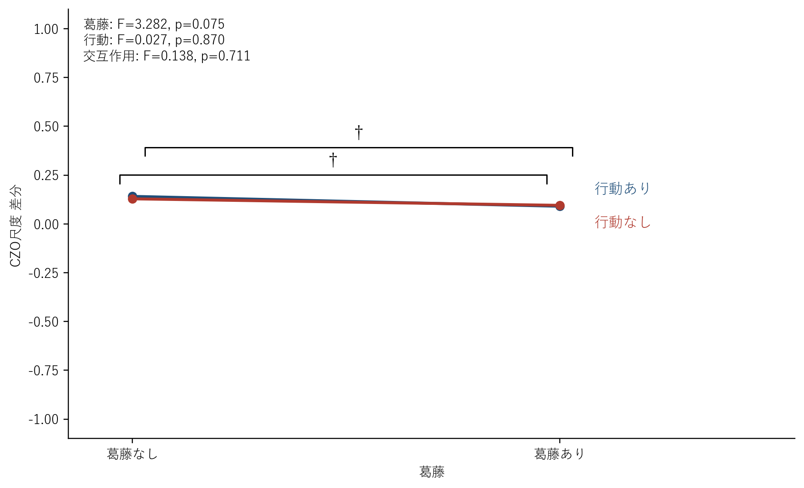
  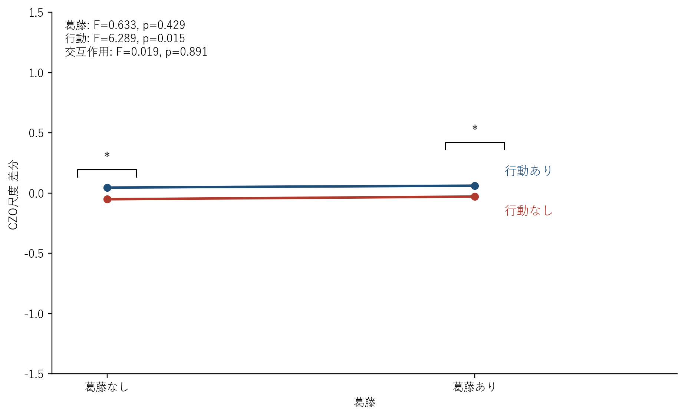

  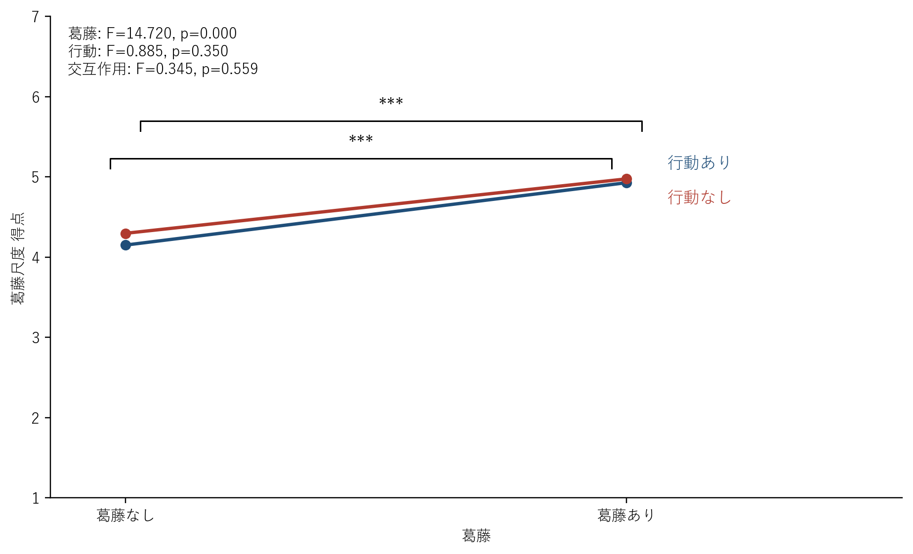
  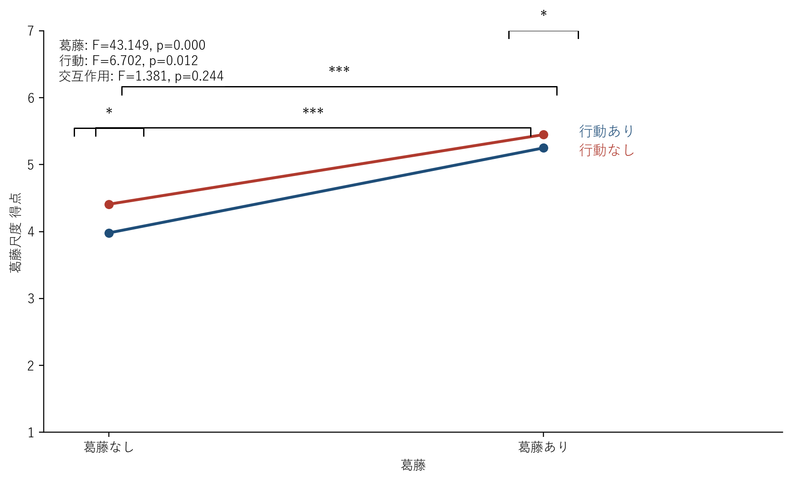

  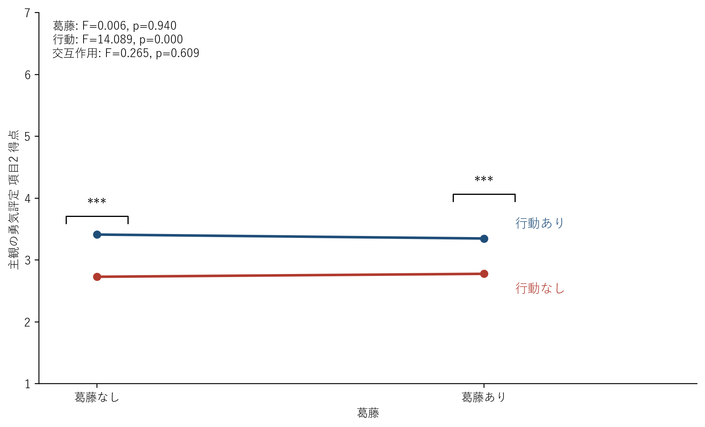
  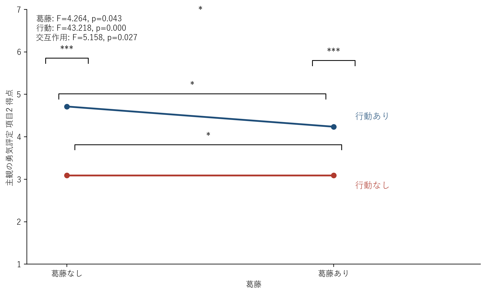

### 4.5 まとめ

追加の群別・探索分析を通じて一貫して見えてきたのは、「葛藤あり条件が全員に一様に効く」のではなく、もともとの勇気や挑戦志向が低い参加者の一部に対して相対的に強く働く可能性である。

特に、

- 勇気変化量の葛藤あり高群は事前勇気・事前CZOともに低かった
- 事前勇気を 4 で分けても、低勇気群の方が葛藤あり高群に入りやすかった

という 2 点は整合的であり、探索的ながら重要な示唆と考えられる。

## 5. 統合的な解釈

今回の再整理では CZO を以後の判断材料から外し、主観勇気評定は項目1と項目3の統合指標で扱った。そのうえで見ると、全体として「行動の提示」は主観勇気評定を明瞭に高めた一方、勇気尺度の平均的な上昇は一様ではなかった。

しかし追加分析を踏まえると、葛藤の役割が完全に無効だったわけではない。特に、事前勇気をあらかじめ要因化した 3 要因分散分析では、勇気尺度 post / diff の `群×葛藤` 交互作用が有意であり、葛藤が勇気尺度の変化量にどう結びつくかが事前勇気群によって異なっていた。

- 事前勇気<4群では、勇気尺度 diff が葛藤あり条件で相対的に高かったこと
- 事前勇気>=4群では、そのパターンが見られなかったこと

の 2 点から支持される。

一方で、主観勇気評定（項目1+3平均）では `群×葛藤×行動` 交互作用が有意であり、行動あり動画の優位さそのものは全体に共通しつつも、その差の出方は事前勇気群によって変化していた。つまり、事前勇気は「勇気尺度変化量における葛藤の効き方」と「主観的勇気づけの条件差の形」の両方に関わっていたと考えられる。

したがって、本研究から最も慎重かつ妥当な結論は次のようになる。

- 行動の提示は、全体として主観勇気評定を高めた
- 葛藤の提示は、全体平均では限定的だった
- ただし、事前勇気の高低によって、葛藤が勇気尺度変化量に及ぼす方向と、主観勇気評定の条件差パターンは変化した
- 群が絡む一部の比較では等分散性に注意が必要だったが、Welch による補足確認でも主要な有意効果の結論は維持された
- 今後の分析では CZO は除外し、事前勇気群をあらかじめ要因化した検証を優先する

## 6. 参照ファイル

- 主分析: [総合結果レポート.md](/c:/研究活動/博論/挑戦ロボット研究/分析/総合結果レポート.md)
- 事前勇気群の3要因ANOVA: [summary.md](/c:/研究活動/博論/挑戦ロボット研究/分析/ANOVA/層別ANOVA/事前勇気4未満vs4以上_3要因ANOVA/summary.md)
- 層別ANOVA一覧: [strata_index.csv](/c:/研究活動/博論/挑戦ロボット研究/分析/ANOVA/層別ANOVA/strata_index.csv)
- 勇気変化量の群差探索: [exploration_summary.md](/c:/研究活動/博論/挑戦ロボット研究/分析/ANOVA/層別ANOVA/勇気変化量_群差探索/exploration_summary.md)
- 勇気事前4群分析: [exploration_summary.md](/c:/研究活動/博論/挑戦ロボット研究/分析/ANOVA/層別ANOVA/勇気事前4群分析/群差探索/exploration_summary.md)
- CZO変化量群比較: [summary.md](/c:/研究活動/博論/挑戦ロボット研究/分析/ANOVA/層別ANOVA/CZO変化量_群比較/summary.md)
- 勇気変化量群比較: [summary.md](/c:/研究活動/博論/挑戦ロボット研究/分析/ANOVA/層別ANOVA/勇気変化量_群比較/summary.md)
