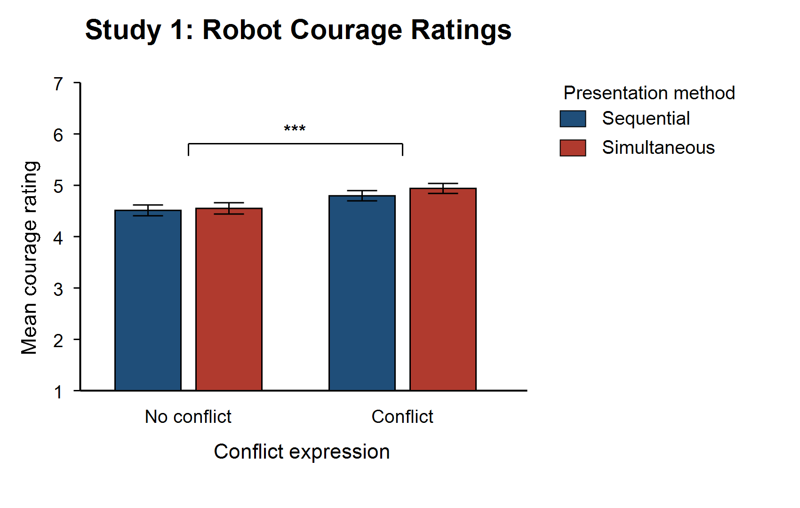
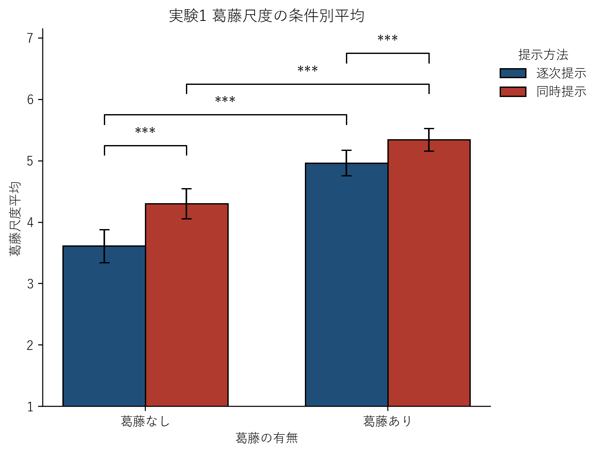
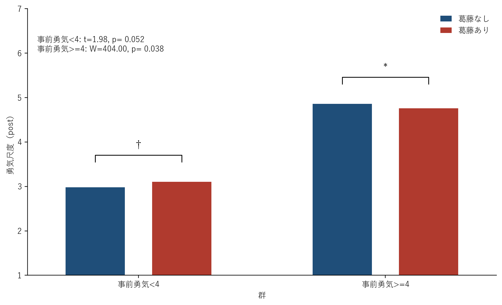

# 論文アウトライン

## 1. イントロダクション

人前で発言する、見知らぬ相手の振る舞いに声をかける、助けを求めるといった行動は、身体的な危険を伴わない一方で、評価の低下、拒絶、羞恥といった社会的・心理的リスクを抱えている。価値があると分かっていても、人はしばしばその一歩をためらう。そうした場面で踏み出すには、恐れやためらいを抱えながらも行動へ向かう勇気が必要になる（Rachman, 1984; Woodard & Pury, 2007）。

このような勇気は、必ずしも本人の内側だけから生じるものではない。他者が困難に向き合う姿の観察は、観察者の行動や自己効力感に影響しうることが示されている（Bandura, 1977; Schunk & Hanson, 1989）。しかし、そこで主に扱われてきたのは課題遂行、学習成績、自己効力感であり、恐れやリスクを伴う勇気が観察によって変化するかという問いは、まだ十分に検討されていない。

この問いが十分に検討されてこなかった背景には、勇気が内的状態に依存するため観察対象として扱いにくいという方法論的な理由があると考えられる。勇気、特にPuryら（2007）のいう個人的勇気は、行動そのものの客観的な困難さよりも、本人にとっての恐怖や葛藤という内的状態に依存している。したがって、観察を通じて勇気が伝わるためには、行動そのものだけでなく、行動に先立つ内的状態が観察者に届く必要がある。ところが人間の場合、他者の内的状態を外から直接観察することはできない。他者の心の中で何が起きているかは観察者の側で推測される以外になく、内的状態そのものを観察の対象として扱うことは難しい。

この制約を実験的に乗り越える手がかりとして、本研究ではロボットに注目した。社会的学習を実験的に検討するには、観察対象が「ある内的状態にある」と提示するだけではなく、その提示の有無や内容を条件として統制できることが必要である。しかし人間モデルでは、内的状態そのものが外から見えないことに加え、その提示の有無や強度を実験的に操作することも難しい。例えば、同じ「ためらい」を表現する場合でも、表情、声の震え、沈黙の長さなどが比較したい条件ごとに意図せず変化しうる。たとえ人間に葛藤を演じさせたとしても、本当に同じ強さの葛藤が各条件で再現されているかを外から確かめる手立ては残らない。

これに対してロボットでは、行動に先立つ内的過程を、観察者の目に届く形で外在化できる。さらに、その表現の有無や内容を条件として明示的に操作することもできる。すなわちロボットは、人間モデルでは外から見えず、統制も難しかった内的状態を、外から見え、統制可能な対象として実験に乗せることを可能にする。本研究でロボットを用いるのは、人間モデルの代替としてではなく、人間モデルでは扱いにくかった内的状態に注目した観察学習の問いを検討するためである。

ロボットの内的状態を観察者に伝える具体的な方法として、本研究ではプロジェクションマッピングによる吹き出し表現を用いる。ロボットの頭部付近に吹き出しを提示する方法は、ロボットがどこに注意を向けているかを観察者に伝える手段として有効であることが示されている（Nitada et al., 2021）。この知見は、ロボットの外からは見えにくい状態を、吹き出しによって観察者に伝達できる可能性を示している。そこで本研究では、プロジェクションマッピングによる吹き出しや動きによって、行動に先立つ内的過程を観察者に提示する。

本研究で可視化する内的状態としては、接近回避葛藤に注目した。接近回避葛藤とは、価値ある目的へ向かおうとする接近動機と、リスクや不利益を避けようとする回避動機が同時に生じる状態である（Lewin, 1931; Miller, 1944）。勇気は、恐れやリスクを伴いながらも価値ある行動へ向かうことに関わるため、接近動機と回避動機のせめぎ合いを示すことは、行動に先立つ恐れやためらいを観察者に伝えるうえで有効であると考えられる。

ただし、内的状態を可視化したロボットの表現が、すべての観察者に同じように作用するとは限らない。モデル観察の効果は、観察者がモデルを自己と類似した存在として受け取るかによって変わりうる（Bandura, 1977; Schunk & Hanson, 1989; Lucas et al., 2006）。また、個人的勇気は本人にとっての恐怖や葛藤に依存するため（Pury et al., 2007）、葛藤しながら進もうとする姿がどのように受け取られるかは、観察者がもともとどの程度勇気を出しやすいかによって異なる可能性がある。このため本研究では、主目的であるロボットの葛藤表現の効果を検討する際に、その効果の現れ方を理解する補助的な観点として、観察者のもともとの勇気傾向も扱う。

以上を踏まえ、本研究では、接近回避葛藤を可視化したロボットの観察が、観察者自身の勇気に影響するかを明らかにすることを主目的とした。この目的を検討する前提として、研究1では、ロボットの葛藤表現が観察者に葛藤として知覚され、その行動が勇気あるものとして評定されるかを確認した。研究2では、研究1で確認した刺激を用いて、ロボットの葛藤表現と行動表現の観察が観察者自身の勇気にどう影響するか、またその効果が観察者のもともとの勇気傾向によって異なるかを検討した。

## 2. 研究1：ロボットの葛藤表現は勇気として知覚されるか

研究1では、研究2で用いる刺激を選定するため、ロボットの接近回避葛藤表現が葛藤として知覚されるか、また勇気ある行動として評定されるかを検討した。あわせて、接近動機と回避動機を提示する形式として、逐次提示と同時提示のどちらがロボットの行動をより勇気あるものとして伝えるかを探索的に確認した。

### 2.1 方法

研究1の目的は、研究2で用いる刺激を選定することである。具体的には、設計した葛藤表現が実際に葛藤として受け取られるか、その表現を含む条件がロボットの行動を勇気あるものとして評定させるかを確認した。さらに、接近動機と回避動機を提示する形式として逐次提示と同時提示が考えられたため、どちらがロボットの行動をより勇気あるものとして伝えるかを探索的に確認した。

研究1のデザインは、葛藤の有無と提示方法を要因とする計画であった。提示方法には、逐次提示と同時提示を設定した。研究1では、最終的な行動の有無による影響を混入させないため、行動は全条件で固定した。

刺激動画では、ロボットは動画開始時から画面右下に配置されていた。まず、「ロボットは公園でごみをポイ捨てしている人を見かけました」という状況説明を提示した。その後、ロボットの右上に吹き出しを表示し、「あ、ごみをポイ捨てしている人がいる」「一般的にこれは注意すべき状況だな」という認知を順に提示した。

続いて、条件に応じて接近動機と回避動機を提示した。接近動機は「注意したら公園がきれいになるかもしれない」「注意したらあの人がポイ捨てをやめるきっかけになるかも」とした。回避動機は「注意して怒鳴られたらいやだな」とした。葛藤あり条件では接近動機と回避動機を提示し、葛藤なし条件では接近動機のみを提示した。

同時提示条件では、二つの気持ちを同時に表示し、交互に拡大縮小させることで動機の揺らぎを表現した。逐次提示条件では、二つの気持ちを順番に表示した。なお、葛藤あり・逐次提示条件では、最終的に行動へ移る流れと整合するように、回避動機の後に接近動機を提示した。最後に、全条件でロボットが「すみません、そこはごみを捨てる場所じゃありませんよ」と発話する行動を提示した。

指標として、ロボットへの勇気評定と葛藤評定を用いた。勇気評定は、日本語版勇気尺度（以下，CM-J；下司・吉野・小塩, 2023）の項目をロボット評定用に変更した項目の平均であった。CM-Jは、恐怖や不安を感じながらも行動に向かう傾向の個人差を測定する尺度として、信頼性・妥当性が確認されている。研究1では、観察者自身の勇気ではなく、ロボットがどの程度勇気あるように見えたかを測定した。そのため、項目の主語と語尾をロボット評定用に変更して用いた。葛藤評定は、自作した葛藤評定項目の平均であった。

研究1では、葛藤あり条件は葛藤なし条件よりも葛藤評定が高いと予測した。また、葛藤あり条件は葛藤なし条件よりもロボットへの勇気評定が高いと予測した。逐次提示と同時提示のどちらがロボットの行動をより勇気あるものとして伝えるかについては、探索的に検討した。

### 2.2 結果

勇気評定では、葛藤あり条件の方が葛藤なし条件より高かった。

葛藤の主効果は有意であった（F(1, 130) = 12.216, p = .000649, 一般化η² = .020）。一方、提示方法の主効果は有意ではなく（F(1, 130) = 2.657, p = .106）、交互作用も有意ではなかった（F(1, 130) = 0.906, p = .343）。

葛藤評定では、葛藤あり条件の方が高く、同時提示の方が逐次提示より高かった。交互作用も有意であった。

葛藤の主効果は有意であった（F(1, 130) = 79.558, p < .001, 一般化η² = .170）。また、提示方法の主効果も有意であり（F(1, 130) = 46.448, p < .001, 一般化η² = .039）、交互作用も有意であった（F(1, 130) = 4.924, p = .028）。

### 2.3 考察

研究1仮説1は支持された。設計した葛藤表現は、観察者に葛藤として知覚されていた。

研究1仮説2も支持された。葛藤あり条件では、ロボットがより勇気あるように評定された。これは、個人的勇気を第三者に伝える際に、行動そのものだけでなく、行動に先立つ接近回避葛藤を示すことで、その行動が本人にとって恐れやためらいを伴うものとして理解されやすくなるという本研究の前提と整合する。

提示形式については探索的に検討した。勇気評定では逐次提示と同時提示に差はなかったが、葛藤評定では同時提示の方が高かった。したがって、同時提示は「より勇気を感じさせる提示方法」ではなく、「葛藤をより明瞭に伝える提示方法」として研究2に採用することが妥当であると判断した。

以上より、研究1は、葛藤表現が葛藤として知覚され、ロボットの行動を勇気あるものとして評定させることを示した。また、研究2で用いる刺激形式として、葛藤をより明瞭に伝える同時提示を選定した。

ただし、研究1はロボットの表現が葛藤および勇気として知覚されるかを確認したものであり、その表現を観察することで観察者自身の勇気が高まるかまでは明らかにしていない。そこで研究2では、研究1で選定した同時提示を用い、ロボットの葛藤表現と行動表現が観察者の勇気に与える影響を検討した。

## 3. 研究2：ロボットの葛藤表現と行動表現は観察者の勇気を高めるか

研究2では、研究1で残された問い、すなわち勇気あるものとして知覚されるロボットの表現を観察することで、観察者自身の勇気が高まるかを検討した。さらに、その効果が観察者のもともとの勇気傾向によって異なるかを検討した。

### 3.1 方法

研究2の目的は、ロボットの勇気表現のうち、接近動機と回避動機の葛藤を示すこと、および実際に行動することが、観察者の勇気にどう影響するかを検討することである。あわせて、その効果が刺激提示前の勇気尺度得点によって異なるかを検討した。

研究2では、研究1で葛藤をより明瞭に伝えた同時提示を採用した。刺激動画では、研究1と同様に、ロボットは動画開始時から画面右下に配置されていた。まず、「ロボットは公園でごみをポイ捨てしている人を見かけました」という状況説明を提示した。その後、ロボットの右上に吹き出しを表示し、「あ、ごみをポイ捨てしている人がいる」「一般的にこれは注意すべき状況だな」という認知を順に提示した。

研究2では、葛藤の有無と行動の有無を操作した。接近動機は「注意したら公園がきれいになるかもしれない」「注意したらあの人がポイ捨てをやめるきっかけになるかも」とした。回避動機は「注意して怒鳴られたらいやだな」「注意しても無視されて相手にされないかも」とした。

葛藤あり条件では、接近動機と回避動機を同時に表示し、交互に拡大縮小させることで動機の揺らぎを表現した。葛藤なし・行動あり条件では、接近動機のみを同時に表示した。葛藤なし・行動なし条件では、回避動機のみを同時に表示した。

行動あり条件では、動機提示後にロボットが「すみません、そこはごみを捨てる場所じゃありませんよ」と発話した。行動なし条件では、動機提示後にロボットは発話せず、行動しない状態を提示した。

従属変数は、刺激提示後の観察者の勇気であった。本研究では、観察者の勇気をCM-J得点によって操作的に定義した。CM-Jは本来、恐怖や不安を感じながらも行動に向かう傾向の個人差を測定する尺度である（下司・吉野・小塩, 2023）。本研究では、刺激提示前のCM-J得点を観察者のもともとの勇気傾向を表す指標として用いた。刺激提示後のCM-J得点は、長期的な勇気特性そのものの変化ではなく、刺激提示直後における観察者の勇気の自己評価として扱った。

分析では、刺激提示前のCM-J得点による勇気傾向群を参加者間要因、葛藤の有無と行動の有無を参加者内要因とする3要因混合計画を用いた。この分析計画を採用したのは、研究2の問いが、ロボットの葛藤表現の効果、行動表現の効果、そしてそれらの効果が観察者のもともとの勇気傾向によって異なるかという三つの要素から成るためである。葛藤と行動はロボット刺激として操作した要因であり、勇気傾向群は観察者側の個人差を表す要因である。したがって、3要因混合計画を用いることで、葛藤表現と行動表現それぞれの主効果だけでなく、両者の組み合わせによる効果、さらにその効果が観察者の勇気傾向によって変化するかを同時に検討できる。

主観評定指標は別分析で扱うため、本提出版の主結果からは除外した。

研究2では、ロボットの葛藤表現と行動表現が観察者の勇気を高めると予測した。また、葛藤表現と行動表現をともに含む条件では、観察者の勇気が最も高まりやすいと予測した。さらに、葛藤表現の効果は刺激提示前の勇気尺度得点によって異なると予測した。

### 3.2 結果

観察者の勇気では、葛藤表現の効果が一様ではなく、刺激提示前の勇気尺度得点によって異なっていた。

群と葛藤の交互作用は有意であった（F(1, 124) = 7.513, p = .007, 偏η² = .057）。

単純主効果では、刺激提示前の勇気尺度得点が低い群において、葛藤あり条件で観察者の勇気が高くなる傾向がみられた（葛藤あり M = 3.104, 葛藤なし M = 2.982, t = 1.980, p = .052, d = .238）。

一方、刺激提示前の勇気尺度得点が高い群では、葛藤あり条件で観察者の勇気が有意に低かった（葛藤あり M = 4.757, 葛藤なし M = 4.858, W = 404.0, p = .038, d = -.271）。

行動の有無は、観察者の勇気に有意な効果を示さなかった。

葛藤評定では、葛藤あり条件の方が葛藤なし条件より高く、研究2でも葛藤操作は成立していた。

葛藤の主効果は有意であった（F(1, 124) = 52.939, p < .001, 偏η² = .299）。補足的な確認でも、葛藤あり条件は葛藤なし条件より高かった（W = 1128.0, p < .001, 葛藤あり M = 5.151, 葛藤なし M = 4.209）。

### 3.3 考察

研究2仮説1と研究2仮説2は、単純な形では支持されなかった。ロボットの葛藤表現や行動表現が、観察者全体の勇気を一様に高めるとはいえなかった。特に、行動の有無は有意な効果を示さなかったため、ロボットが実際に行動したかどうか自体が、観察者の勇気を左右したとはいえない。

一方で、研究2仮説3は支持された。葛藤表現の効果は、刺激提示前の勇気尺度得点によって異なっていた。刺激提示前の勇気尺度得点が低い群では、葛藤しながら進もうとするロボットの姿が、自己と類似したモデルとして受け取られた可能性がある。そのため、「不安やためらいがあっても行動できるかもしれない」という観察者の勇気を高める方向に働いたと解釈できる。ただし、この効果はp = .052であり、有意傾向として慎重に扱う必要がある。

一方、刺激提示前の勇気尺度得点が高い群では、葛藤表現がためらいや自信のなさとして受け取られた可能性がある。そのため、葛藤あり条件では観察者の勇気が低下したと考えられる。

以上から、葛藤表現は「誰に対しても有効な勇気表現」ではなく、観察者のもともとの勇気傾向によって、勇気づけにも逆効果にもなりうる表現であることが示唆された。

ただし、本研究では自己効力感、共感、自己類似性を直接測定していない。そのため、低群で葛藤表現が有効に働いた理由や、高群で逆方向に働いた理由については、可能な解釈にとどまる。今後は、これらの心理過程を測定し、葛藤表現がどのようなメカニズムで観察者の勇気に影響するかを検討する必要がある。

## 4. 総合考察

本研究は、社会的・心理的リスクを伴う場面での勇気を支える方法として、ロボットの勇気表現を観察することに注目した。研究1では、ロボットの接近回避葛藤表現が葛藤として知覚されるか、またロボットの行動が勇気あるものとして評定されるかを検討した。研究2では、研究1で選定した提示形式を用いて、ロボットの葛藤表現と行動表現が観察者の勇気に与える影響を検討した。

研究1では、葛藤あり条件のロボットは葛藤なし条件よりも勇気あるように評定された。さらに、接近回避葛藤表現が観察者に葛藤として知覚されることも確認された。提示形式については、勇気評定では逐次提示と同時提示に差はなかったが、葛藤評定では同時提示の方が高かった。したがって、同時提示は「より勇気を感じさせる提示方法」ではなく、「葛藤をより明瞭に伝える提示方法」として研究2に採用された。

研究2では、ロボットの葛藤表現と行動表現が観察者全体の勇気を一様に高めるという結果は得られなかった。特に、行動の有無は有意な効果を示さなかった。一方で、葛藤表現の効果は刺激提示前の勇気尺度得点によって異なっていた。低群では葛藤表現が観察者の勇気を高める方向に働く傾向があり、高群では逆方向に働いた。

以上を踏まえると、本研究の結果は、ロボットが勇気ある行動を見せれば誰でも勇気づけられる、という単純な見方を支持するものではない。むしろ、ロボットの勇気表現において重要なのは、単に行動を示すことではなく、行動に至るまでの内的過程をどのように示すか、そしてそれをどのような観察者に提示するかである。接近回避葛藤を示すことは、ロボットの行動を勇気あるものとして知覚させるうえで有効な手がかりになりうる。また、社会的・心理的リスクを前に行動をためらいやすい観察者に対しては、葛藤しながらも進もうとするロボットの姿が、勇気を支える間接的支援として働く可能性がある。

ただし、本研究には残された課題がある。第一に、CM-Jは本来、勇気の特性的個人差を測定する尺度であるため、本研究の刺激後得点は、長期的な勇気特性の変化ではなく、刺激提示直後の観察者の勇気の自己評価として解釈する必要がある。今後は、実際の行動選択や行動接近課題を含めて、ロボットの葛藤表現が観察者の行動にどの程度つながるかを検討する必要がある。

第二に、本研究では自己効力感、共感、自己類似性を直接測定していない。そのため、低群で葛藤表現が有効に働いた理由や、高群で逆方向に働いた理由については、可能な解釈にとどまる。今後は、これらの心理過程を測定し、葛藤表現がどのようなメカニズムで観察者の勇気に影響するのかを検討する必要がある。

第三に、研究2における低群の単純主効果は有意傾向であったため、低群に対する葛藤表現の促進効果については追加検証が必要である。今後は、観察者の勇気傾向に応じて葛藤表現の強さや提示方法を調整することで、どのような表現がどの観察者に有効なのかを明らかにする必要がある。この課題を検討することにより、勇気を支えるロボット表現を、一律の表現ではなく、観察者に応じた適応的な支援として設計できる可能性がある。

## 5. 結論

本研究の主目的であった、接近回避葛藤を可視化したロボットの観察が観察者自身の勇気に影響するかという問いに対して、本研究は、その効果が一様ではなく、観察者のもともとの勇気傾向によって異なることを示した。もともとの勇気傾向が低い観察者では、葛藤しながらも進もうとするロボットの姿が、勇気を支える表現として働く可能性がある。一方で、もともとの勇気傾向が高い観察者では、同じ葛藤表現が逆方向に働く可能性が示された。

また、ロボットの行動表現は、観察者全体の勇気に有意な効果を示さなかった。したがって、社会的・心理的リスクを伴う場面での勇気を支えるロボット表現では、単に行動を示すことよりも、行動に至るまでの葛藤をどのように可視化し、どのような観察者に提示するかが重要である。

なお、この結論の前提として、研究1では、接近回避葛藤を示すロボットの表現が観察者に葛藤として知覚され、ロボットの行動を勇気あるものとして評定させることが確認された。つまり、本研究は、内的状態を可視化したロボットの観察が観察者の勇気に影響しうることを示すとともに、その効果が観察者の特性に依存することを示した。
