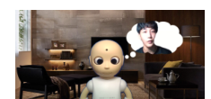

<!--
_class: title
_paginate: false
-->

# 内的状態としての接近回避葛藤を示すロボットの観察が観察者の個人的勇気に及ぼす影響

---

## 問題：価値ある行動へ向かえない場面

- 人前で発言する
- 見知らぬ相手の振る舞いに声をかける
- 助けを求める

これらは身体的危険が大きい行動ではない。  
しかし、評価低下、拒絶、羞恥といった**社会的・心理的リスク**を伴う。

このような場面では、何をすべきかを理解していても、恐れや困難によって価値ある行動へ向かえないことがある。  
本研究では、このような場面に関わる**個人的勇気**に注目する。

本研究で扱う個人的勇気：本人にとって恐れや困難を伴う状況で、それでも価値ある行動へ向かうこと。 
[Pury et al. 2007; 下司・吉野・小塩 2023]

---

<!-- _class: obs-learning -->

## 観察学習から個人的勇気への影響を考える

社会的・心理的リスクによって価値ある行動へ向かえない人は、自ら行動し、経験を得ることも難しい。  
そこで、自分が行動する前に、他者が同様の場面に向き合う姿を観察することに注目する。

観察学習では、他者の姿を観察することで代理経験が得られ、観察者の行動や行動に関する見込みが変化しうる。  
そのため、同様のリスク場面に向き合う他者の姿の観察は、観察者自身の個人的勇気にも影響する可能性がある。  
[Bandura 1977; Schunk & Hanson 1989]

本研究で扱う個人的勇気は、本人にとって恐れや困難を伴う状況で、それでも価値ある行動へ向かうこととして捉えられる。 
[Pury et al. 2007; 下司・吉野・小塩 2023]

しかし、従来の観察学習研究は主に課題遂行を扱っており、社会的・心理的リスクを伴う個人的勇気が他者の観察によって変化するかは十分に検討されていない。

<strong>⇒ では、なぜ個人的勇気は観察学習の対象として扱いにくかったのか。</strong>

---

## 個人的勇気は内的状態に依存するため観察しにくい

本研究で扱う個人的勇気：本人にとって恐れや困難を伴う状況で、それでも価値ある行動へ向かうこと。 
[Pury et al. 2007; 下司・吉野・小塩 2023]

- 個人的勇気は、行動そのものの客観的な困難さだけでは決まらない
- 行動に先立ち、恐れや困難を伴いながらも、価値ある行動へ向かう内的状態も重要である
- しかし、人間の場合、他者の内的状態を外から直接観察することはできない
- そのため、個人的勇気を観察学習の対象にするには、行動前の内的状態を観察者に届く形で示す必要がある

この内的状態を観察させることで、観察者自身の個人的勇気にも影響する可能性がある。

---

<!-- _class: robot-benefit -->

## ロボットなら内的状態を統制して見せられる

### 人間モデルの制約

- 内的状態が直接見えない
- 表情、声、沈黙などが条件ごとに変わりうる
- 行動前の内的状態を同じ形で再現できたか確かめにくい

### ロボットの利点

- 内的過程を外在化できる
- 表現の有無や内容を条件として操作できる
- 行動前の過程を統制して提示できる

ロボットを用いることで、内的状態を「見えるもの」「条件として操作できるもの」として扱える。 
では、個人的勇気に関わるどの内的状態を外在化するのか。

---

## 吹き出しでロボットの内的状態を伝える

本研究では、プロジェクションマッピングによる吹き出しを用いて、ロボットの行動前の内的状態を提示する。

- ロボットの頭部付近に吹き出しを提示する方法は、ロボットの注意状態を観察者に伝える手段として有効である
- この知見は、ロボットの外からは見えにくい状態を、吹き出しによって観察者に伝達できる可能性を示している

[Nitada et al. 2021]

この吹き出し表現によって、個人的勇気に関わる行動前の内的状態を観察者に届く形で提示する。

---

## 吹き出しで提示する内的状態：接近回避葛藤

本研究では、吹き出しで提示する内的状態として**接近回避葛藤**に注目する。  
接近回避葛藤とは、接近動機と回避動機が同時に生じる状態である。[Lewin 1931; Miller 1944]
Chowkase et al. (2024) は、勇気を、価値ある行動へ向かう理由と恐れや困難を避ける理由の間で判断し、行動するかを決める過程として説明している。

### 接近動機

- 価値ある行動へ向かおうとする

### 回避動機

- 恐れや困難を避けようとする

接近回避葛藤は、価値ある行動へ向かおうとする接近動機と、恐れや困難を避けようとする回避動機が併存する内的状態に対応する。そこで本研究では、この内的状態を吹き出しによって観察者に提示する。

---

## 本研究の目的

内的状態として接近回避葛藤を示すロボットの観察が、観察者自身の個人的勇気に影響するかを明らかにする。

<strong>あわせて検討する点</strong> 
この効果は、観察者のもともとの勇気傾向によって異なる可能性がある。 
モデル観察の効果は、観察者がモデルを自己と類似した存在として受け取るかによって変わりうる。 
[Bandura 1977; Schunk & Hanson 1989; Lucas et al. 2006]

 
⇒したがって本研究では、観察者のもともとの勇気傾向の違いも考慮する。

---

## 研究全体の構成

観察者自身の個人的勇気への影響を検討するには、まず、内的状態として接近回避葛藤を示すロボットが、勇気ある姿として知覚されるかを確認する必要がある。

### 研究1：勇気ある姿として知覚されるかを確認

研究2で用いる提示が、 勇気ある姿として 知覚されるかを確認する。

→

### 研究2：主目的の検証

研究1で確認した提示を用いて、 観察者自身の個人的勇気への影響と、 事前勇気傾向による違いを検討する。

---

<!-- _class: study-compact -->

## 研究1：目的と実験条件

<strong>主目的</strong>：研究2で用いる提示が、勇気ある姿として知覚されるかを確認する。具体的には、内的状態として接近回避葛藤を示すロボットが、葛藤なし条件よりも勇気ある姿として知覚されるかを検討する。 
<strong>補助的検討</strong>：葛藤評定で操作を確認し、研究2で用いる提示方法を探索的に選定する。

<h3 class="factor-title">独立変数</h3>
<table class="cond-table">
<thead>
<tr><th></th><th>葛藤の有無</th><th>提示方法</th></tr>
</thead>
<tbody>
<tr><td>①</td><td>葛藤なし</td><td>逐次表示</td></tr>
<tr><td>②</td><td>葛藤なし</td><td>同時表示</td></tr>
<tr><td>③</td><td>葛藤あり</td><td>逐次表示</td></tr>
<tr><td>④</td><td>葛藤あり</td><td>同時表示</td></tr>
</tbody>
</table>

<h3>葛藤の有無</h3>

<strong>葛藤なし</strong>：接近動機のみが表示される

<strong>葛藤あり</strong>：接近動機と回避動機が表示される

<h3>提示方法</h3>

<strong>逐次表示</strong>：接近動機と回避動機が連続的に表示される

<strong>同時表示</strong>：接近動機と回避動機の関係性が同時に表示される

<h3>固定要素</h3>

全条件で、ロボットが注意する発話を提示した。

---

<!-- _class: study-measure study1-hypothesis -->

## 研究1：仮説と従属変数

### 仮説

<strong>仮説</strong> 葛藤あり条件は、葛藤なし条件よりもロボットの勇気評定が高い。

<strong>操作チェック</strong> 提示した内的状態が接近回避葛藤として知覚されるかを葛藤評定で確認する。

<strong>探索的検討</strong> 逐次表示・同時表示のうち、どちらが勇気ある姿として知覚されるかを探索的に比較する。

### 従属変数

<strong>ロボットの勇気評定</strong> ロボットが勇気ある姿として見えた程度。 日本語版勇気尺度をロボット評定用に変更 [下司・吉野・小塩 2023]

<strong>葛藤評定</strong> ロボットが接近動機と回避動機の葛藤を示しているように見えた程度。 自作の葛藤評定項目

<strong>探索的検討の位置づけ</strong> 
接近回避葛藤は、接近動機と回避動機が同時に働く状態として説明される。[Gray & McNaughton 2000] 一方で、葛藤の経験は時間的な揺れとしても生じうる。[Vaccaro et al. 2020] そのため両提示を候補とした。研究1では勇気評定を優先し、差がない場合に葛藤評定を参照して研究2の提示方法を選定する。

---

<!-- _class: study1-result -->

## 研究1：結果

<strong>分析手法</strong>：2要因分散分析（W-W）

葛藤あり条件の方が、葛藤なし条件よりも勇気評定が高かった。

<ul>
<li>葛藤の主効果 <strong>F(1, 130) = 12.216, p = .000649</strong></li>
<li>提示方法の主効果は有意ではなかった</li>
<li>交互作用も有意ではなかった</li>
</ul>

<figure class="study1-result-figure">

</figure>

> 仮説：葛藤あり条件は、葛藤なし条件よりもロボットの勇気評定が高い。  
> ⇒ 支持された。一方、ロボットの勇気評定では、逐次表示と同時表示の差はみられなかった。

---

<!-- _class: study1-result -->

## 研究1：結果

<strong>分析手法</strong>：2要因分散分析（W-W）

葛藤あり条件の方が、葛藤なし条件よりも葛藤評定が高かった。

<ul>
<li>葛藤の主効果 <strong>F(1, 130) = 79.558, p &lt; .001</strong></li>
<li>提示方法の主効果 <strong>F(1, 130) = 46.448, p &lt; .001</strong></li>
<li>交互作用 <strong>F(1, 130) = 4.924, p = .028</strong></li>
</ul>

<figure class="study1-result-figure">

</figure>

> 操作チェック：葛藤あり条件は、葛藤なし条件よりも接近回避葛藤を示していると評定された。  
> 加えて、同時表示では、逐次表示よりも接近回避葛藤として知覚されやすかった可能性がある。

---

<!-- _class: study1-conclusion -->

## 研究1：結論

<strong>研究1の目的</strong> 
主目的：研究2で用いる提示が、勇気ある姿として知覚されるかを確認する。 
補助的検討：葛藤評定で操作を確認し、研究2で用いる提示方法を探索的に選定する。

<strong>目的への答え</strong>：葛藤あり条件では、葛藤なし条件よりもロボットの勇気評定が高かった。 
⇒ 内的状態として接近回避葛藤を示したロボットは、より勇気ある姿として知覚された。

<strong>操作チェック</strong>：葛藤あり条件では、葛藤なし条件よりも葛藤評定が高かった。 
⇒ 提示した内的状態は、接近回避葛藤として知覚されることが確認された。

<strong>提示方法の選定</strong>：勇気評定では、逐次表示と同時表示の差はみられなかった。 
⇒ 研究2では、接近回避葛藤としてより高く評定された同時表示を用いる。

以上より、研究2では、同時表示によって接近回避葛藤を示すロボットの観察が、観察者自身の個人的勇気に及ぼす影響を検討する。

---

<!-- _class: study2-combined -->

## 研究2：目的と実験条件

<strong>目的</strong>：内的状態として接近回避葛藤を示すロボットの観察が、観察者自身の個人的勇気にどう影響するかを検討する。あわせて、その影響が事前勇気傾向によって異なるかを検討する。

<h3 class="factor-title">独立変数</h3>

<strong>参加者間要因（B）</strong>：事前勇気傾向群（低群／高群）

参加者内要因（W-W）：葛藤の有無 × 行動の有無

<table class="cond-table">
<thead>
<tr><th></th><th>葛藤の有無</th><th>行動の有無</th></tr>
</thead>
<tbody>
<tr><td>①</td><td>葛藤なし</td><td>行動なし</td></tr>
<tr><td>②</td><td>葛藤なし</td><td>行動あり</td></tr>
<tr><td>③</td><td>葛藤あり</td><td>行動なし</td></tr>
<tr><td>④</td><td>葛藤あり</td><td>行動あり</td></tr>
</tbody>
</table>

<h3>葛藤の有無</h3>

<strong>葛藤なし</strong>：行動方向に対応する一方の動機のみを表示する

<strong>葛藤あり</strong>：接近動機と回避動機を同時表示する

<h3>行動の有無</h3>

<strong>行動なし</strong>：注意の発話を提示しない

<strong>行動あり</strong>：注意の発話を提示する

<strong>行動の有無を操作する理由</strong> 
個人的勇気は、恐れや困難を伴う内的状態だけでなく、それでも価値ある行動へ向かう行動選択を含む。[Chowkase et al. 2024] 
したがって、接近回避葛藤だけを示す条件では「内的過程の観察」の効果、行動だけを示す条件では「行動結果の観察」の効果に留まる可能性がある。葛藤の有無と行動の有無を分けて操作することで、接近回避葛藤のみ、行動のみ、両方がそろった場合の違いを切り分ける。

---

<!-- _class: study-measure study2-hypothesis -->

## 研究2：仮説と従属変数

<strong>仮説</strong> 接近回避葛藤と行動の有無が観察者自身の個人的勇気に及ぼす影響は、事前勇気傾向によって異なる。特に低群では、葛藤あり・行動あり条件で観察後の個人的勇気得点が高い値を示すと予測した。

<strong>根拠</strong> 個人的勇気は、恐れや困難を伴う状況下で価値ある行動へ向かうことであり [Pury et al. 2007; 下司・吉野・小塩 2023]、接近動機と回避動機の併存および行動の選択が関わる [Chowkase et al. 2024]。 勇気の自己評価が低い低群は、葛藤場面において行動を起こすことに困難を感じている群である。先行研究によれば、困難を抱える観察者には、容易に成功するモデルよりも、困難を示しながら対処するモデルの方が有効に働く [Schunk & Hanson 1989; Lucas et al. 2006]。 葛藤あり・行動あり条件は、回避動機と接近動機の併存を示しつつ、行動へ向かう選択を提示する。すなわち、低群が直面する困難に寄り添いながらそれを乗り越える過程を提示できるため、低群において観察後の個人的勇気得点が最も高い値を示すと予測した。

### 従属変数

<strong>勇気尺度</strong> 観察者自身の個人的勇気の自己評価を測定する。

---

<!-- _class: study2-result -->

## 研究2：結果

<strong>分析手法</strong>：3要因分散分析（B-W-W）

仮説で想定した、低群における葛藤あり・行動あり条件での高い値は支持されなかった。一方、観察者自身の個人的勇気では、事前勇気傾向群と接近回避葛藤の交互作用が有意であった。

<ul>
<li>交互作用 <strong>F(1, 124) = 7.513, p = .007</strong></li>
<li><strong>低群</strong>：葛藤あり条件で高い傾向（p = .052）</li>
<li><strong>高群</strong>：葛藤あり条件で有意に低い（p = .038）</li>
</ul>

<figure class="study2-result-figure">

</figure>

<ul>
<li>仮説で想定した<strong>低群における葛藤あり・行動あり条件での高い値</strong>は支持されなかった。</li>
<li><strong>行動の有無</strong>は、観察後の個人的勇気得点に有意な効果を示さなかった。</li>
<li>一方で、接近回避葛藤の影響は<strong>事前勇気傾向によって異なった</strong>。</li>
<li><strong>低群</strong>では葛藤あり条件で高い傾向がみられた。</li>
<li><strong>高群</strong>では葛藤あり条件で低い値を示した。</li>
</ul>

---

<!-- _class: study2-discussion process-dependence -->

## 研究2：考察1　なぜ行動の有無が効かなかったのか

勇気の2重過程モデルによれば、勇気を要する状況において、主体は直感的で迅速な「タイプ1思考」と、熟慮的で分析的な「タイプ2思考」のいずれか、あるいは両方を用いて事象を処理する。このうち、多くの個人的勇気を伴う意思決定はタイプ2思考に依存しており、その中心的な構成要素が「接近回避葛藤」であると位置づけられている [Chowkase et al. 2024]。

### 勇気は行動結果だけではない

<ul>
<li>勇気とは、恐怖や脅威が存在する状況下において、それを意図的に統制し、価値ある行動へ向かうプロセスとして定義される [Pury et al. 2007; 下司・吉野・小塩 2023]。</li>
<li>すなわち、勇気の根幹を成すのは、主体が抱くリスク認知と、それを乗り越えようとする動機づけとの間の相互作用である。</li>
<li>行動選択とは、接近回避葛藤という複雑な内的情報処理を経た後に出現する「最終的な結果」に過ぎない [Chowkase et al. 2024]。</li>
</ul>

### 行動の有無が効果を持たなかった理由

<ul>
<li>行動の有無が効果を持たなかった理由は、観察者が他者の振る舞いから個人的勇気を読み取る際の「プロセス依存性」にあると考えられる。</li>
<li>観察者にとって最も重要な情報は「その主体がどれほど強い回避動機を抱え、それといかに対峙したか」という内的プロセスそのものである。</li>
<li>ロボットが内的状態としての接近回避葛藤を示した時点で、接近動機が回避動機と拮抗しているという心理的文脈が伝達される。</li>
</ul>

この内的葛藤の表出自体が、勇気生起のための「タイプ2思考の処理プロセス」の提示として完結してしまい、その後に実際にロボットが物理的な注意行動を起こしたか否か（結果）は、追加的な情報価値を持たなかった（<strong>情報の天井効果</strong>）と解釈できる。

---

<!-- _class: study2-discussion -->

## 研究2：考察2　低群で葛藤あり条件が高い値を持つ傾向にある理由

### 低群に効きやすい理由

<ul>
<li>観察学習では、モデルの効果は観察者の事前特性によって変わる。[Bandura 1977]</li>
<li>困難を抱える観察者には、容易に成功する熟練モデルよりも、困難を示しながら対処する対処モデル（coping model）が影響しやすい。[Schunk & Hanson 1989]</li>
<li>主観的に困難な場面では、自己評価が低い観察者ほど他者情報の影響を受けやすい。[Lucas et al. 2006]</li>
</ul>

### 葛藤あり条件が示したもの

<ul>
<li>低群は、恐れや困難を伴う場面で価値ある行動へ向かう自己評価が相対的に低い群である。</li>
<li>接近回避葛藤の提示は、対処モデルに含まれる「困難を抱えている」側面を外在化したものと位置づけられる。</li>
<li>そのため、低群にとって葛藤あり条件は、回避動機があっても価値ある行動へ向かいうることの手がかりになった可能性がある。</li>
</ul>

つまり、低群では接近回避葛藤の提示が、困難を抱えながら価値ある行動へ向かう過程の手がかりとなり、観察後の個人的勇気得点が高い値を示した可能性がある。

---

<!-- _class: study2-discussion high-group-compact -->

## 研究2：考察3　高群で葛藤なし条件が高い値を示した理由

### 行動ありの場合

<ul>
<li>観察学習では、安定して成功する熟練モデルが、観察者の事前特性と合うと影響しやすい。[Bandura 1977; Schunk & Hanson 1989]</li>
<li>葛藤なし・行動あり条件は、回避動機を示さず、価値ある行動へ向かう姿を示す。</li>
<li>そのため高群では、自身の高い自己評価と合う熟練モデルとして受け取られた可能性がある。[Braaksma et al. 2002]</li>
</ul>

### 行動なしの場合

<ul>
<li>下方比較とは、自分より低く見える対象と比較することで、自己評価を維持・向上させる過程である。[Wills 1981]</li>
<li>葛藤なし・行動なし条件は、接近動機を示さず、価値ある行動へも向かわない姿を示す。</li>
<li>そのため高群では、自分はその対象より価値ある行動へ向かえるという相対的な手がかりになった可能性がある。</li>
</ul>

つまり高群では、葛藤なし条件が、行動ありでは熟練モデルとして、行動なしでは下方比較の対象として、観察後の個人的勇気得点を高く保つ方向に働いた可能性がある。

---

<!-- _class: study2-discussion -->

## 研究2：考察のまとめ

### 仮説との対応

<ul>
<li>葛藤あり・行動あり条件で低群が最も高い値を示す、という仮説は支持されなかった。</li>
<li>行動要因の主効果・交互作用は有意ではなかった。</li>
<li>一方で、事前勇気傾向群と接近回避葛藤の交互作用は有意であった。</li>
</ul>

### 本研究からの示唆

<ul>
<li>注意行動は行動結果として知覚され、追加的な手がかりになりにくかった可能性がある。</li>
<li>低群では、接近回避葛藤が、困難を抱えながら価値ある行動へ向かう過程の手がかりになった可能性がある。</li>
<li>高群では、葛藤なし条件が、熟練モデルや下方比較の対象として親和的だった可能性がある。</li>
</ul>

まとめると、研究2は仮説全体を支持しなかったが、<strong>行動結果よりも行動前の内的過程が主要な手がかりとなり、その意味が事前勇気傾向によって異なる可能性</strong>を示した。

---

<!-- _class: conclusion-compact -->

## 総合結論：本研究の目的への答え

<strong>本研究の目的</strong> 
内的状態として接近回避葛藤を示すロボットの観察が、観察者自身の個人的勇気に影響するかを明らかにする。あわせて、その影響が事前勇気傾向によって異なるかを検討する。

<strong>本研究の目的への答え</strong> 

本研究では、ロボットの吹き出し表現によって、個人的勇気に関わる行動前の内的過程を観察者に届く形で外在化した。

<strong>観察学習の対象としての提示</strong>

研究1では、接近回避葛藤を示すロボットが、より勇気ある姿として知覚された。これは、内的過程を外在化することで、個人的勇気を観察学習の対象として提示できる可能性を示す。

<strong>観察者自身への影響</strong>

研究2では、その観察が観察者自身の個人的勇気に関わりうることが示された。ただし、行動の有無の効果は確認されず、その意味は事前勇気傾向によって異なった。

したがって、本研究は、ロボットによって個人的勇気に関わる内的過程を外在化し（研究1）、その観察が観察者自身の個人的勇気に一様に影響するのではなく、事前勇気傾向によって異なる形で関わりうること（研究2）を示した。

---

<!-- _class: future-slide -->

## 限界と今後の展望1　本研究でまだ示していないこと

### 行動選択

本研究では、観察者自身の個人的勇気の自己評価を測定した。一方で、観察者が実際に価値ある行動へ向かうかは測定していない。

### ロボットならではの効果

本研究では、ロボット、映像、人間モデル、物語を直接比較していない。そのため、ロボット固有の効果があるかはまだ言えない。

### 考察した理由の検証

本研究では、低群では対処モデルとして、高群では熟練モデルや下方比較の対象として働いた可能性を考察した。一方で、これらの解釈を直接検証する測定は行っていない。今後は、モデルとの対応、自己効力感、下方比較、行動情報の追加価値を測定し、交互作用が生じる過程を検討する必要がある。

特に、接近回避葛藤の意味づけが事前勇気傾向によって異なる可能性があるため、実際に用いるには、<strong>誰に、どの場面で、どのように内的状態を提示するか</strong>を検討する必要がある。

---

<!-- _class: future-slide future-two-vector -->

## 今後の展望：基礎的アプローチ

上記の限界を踏まえ、今後は「どのような心理的しくみで効果が生じるのかを調べる研究」と、「具体的な支援場面で実際の行動選択まで測定する研究」の二方向に発展させる必要がある。

### 基礎的アプローチ

今後の基礎研究では、接近回避葛藤の提示が個人的勇気に与える影響を、観察者の事前勇気傾向との関係からさらに検討する必要がある。

特に、観察者がロボットの姿をどの程度「自分にも関係するもの」として受け取るのかを測定し、人間ではないロボットでも観察学習が成立する条件を明らかにする必要がある。

さらに、同一のシナリオを用いて、目の前にいるロボット、映像内のロボット、人間モデル、アニメーションを比較する。これにより、同じ空間にロボットがいることや、実物のロボットが動くことに、ロボットならではの効果があるかを検証する。

---

<!-- _class: future-slide future-two-vector -->

## 今後の展望：応用的アプローチ

### 応用的アプローチ

応用面では、本手法を漠然と「社会実装」すると主張するのではなく、効果が見込まれる事前勇気傾向が低い者に対象を絞り、具体的な支援場面を設定する必要がある。

例えば、教育現場では、新たな学習課題に強い不安や回避動機を抱きやすい児童生徒への支援が考えられる。カウンセリング場面では、対人関係の構築や社会復帰に向けて葛藤を抱えるクライアントに、段階的な対処モデルを提示する支援ツールとして用いることが考えられる。

さらに、他者を助けるなどの向社会行動が求められる日常場面で、ロボットが同じ場にいて接近回避葛藤を外在化することで、価値ある行動へ向かうことを後押しする使い方が考えられる。

これらの具体的場面で、事前勇気傾向が低い者を対象とし、観察後の自己評価だけでなく、実際に価値ある行動へ向かうかを継続的に測定することが今後の課題である。

